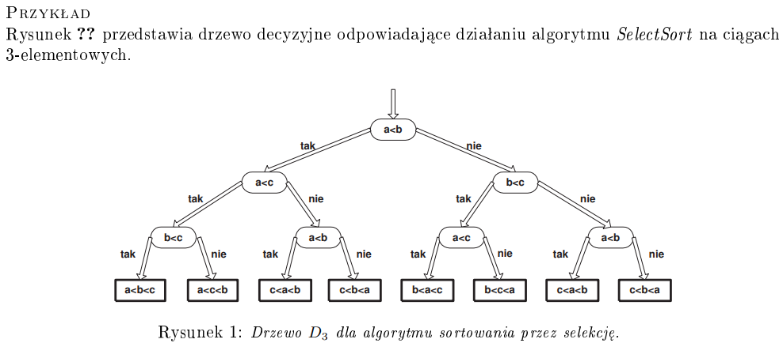
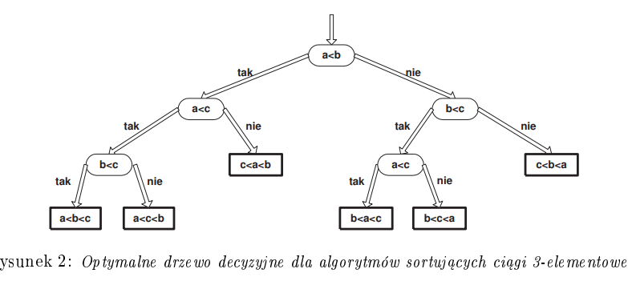
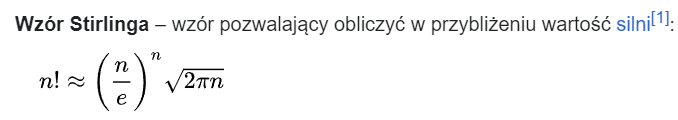
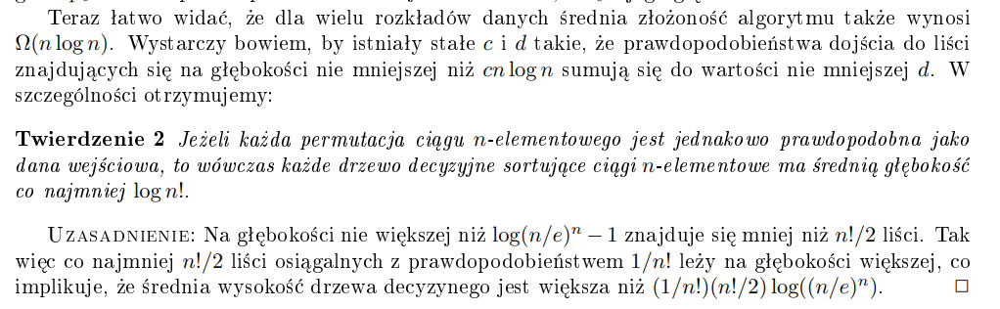

# Opis

Dowodzenie dolnych granic na złożoność jest dużo trudniejsze niż dowodzenie granic górnych. W przypadku granic górnych, czasem jest ciężko czasem nie. Wtedy musimy pokazać, że algorytm wykonuje co najwyżej ileś operacji. W przypadku tej notatki, będziemy dowodzić, że algorytm wykonuje **nie mniej** niż ileś operacji. Ta notatka w sumie będzie w dużej części po prostu przepisaniem notatki Lorysia, chociaż jak się uda coś zchłoporozumować to się postaram.

# Sortowanie

Ograniczamy się do klasy algorytmów, które wykonują jedynie porównania na elementach z wejścia. Działanie takich algorytmów możemy rezprezentować drzewami decyzyjnymi. Niżej jest przykład, który łatwo zrozumieć, tutaj nieformalny opis: To takie drzewa binarne, które w węzłach mają porównania, a w liściach wyniki obliczeń. Krawędzie to wyniki porównań (tak/nie).

Naturalnie, wielkość takiego drzewa decyzyjnego zależy od wielkości danych na których działa algorytm. Jako że do naszego algorytmu możemy pakować różne dane, o różnych długościach, to możemy powiedzieć, że algorytm jest reprezentowany przez nieskończoną rodzinę drzew decyzyjnych !!\\{D_i\\}\_{i=1}^{\infty}!!, gdzie !!D_n!! odpowiada działaniu algorytmu na danych o rozmiarze !!n!!.

Przykład z notatek KLo:  

A tutaj drzewo optymalne:  

Fakt: dla algorytmu sortującego, drzewo decyzyjne !!D_n!! ma co najmniej !!n!!! liści. A to dlatego, że każda permutacja ciągu wejściowego może być wynikiem, a każdy liść !!D_n!! odpowiada jednemu wynikowi.  
Korzystając z tego faktu możemy powiedzieć, że !!D_n!! ma wysokość co najmniej !!\Omega(n\log{n})!!. To dlatego, że drzewo binarne o !!n!!! liściach ma wysokość co najmniej !!log\{n!}!!. Ze wzoru Stirlinga:  
  
!!n!!! możemy z dołu oszacować przez !!(n/e)^n!!, mamy więc
!!\log{n!} \geq n \cdot \log(n/e) = n(\log(n)-\log(e)) = n \cdot \log n - n \cdot \log e \geq n \cdot \log n - 1.44n!!

**Wniosek**:  
Każdy algorytm sortujący za pomocą porównań ciąg !!n!!-elementowy wykonuje co najmniej !!cn \log n!! porównań dla jakiejś stałej !!c > 0!!.

### Ograniczenie na średnią złożoność

Możemy zauważyć, że działanie algorytmów sortujących bazujących na porównaniach zależy od porządku między elementami. Możemy zatem ograniczyć się do zachowania algorytmu na permutacjach zbioru !!\\{1, 2, \dots , n \\}!!, a średnia złożoność algorytmu na danych rozmiaru !!n!! może być policzona jako suma:  
$$ \sum\_{\sigma \in S_n} P[\sigma]c(\sigma) $$

gdzie !!S_n!! to zbiór permutacji, !!P[\sigma]!! to prawdopodobieństwo jego wystąpienia, a !!c(\sigma)!! to liczba porównań potrzebna, żeby posortować tą permutację. W języku drzew decyzyjnych będzie to
$$ \sum\_{v\text{ - liść } T} p_v d_v$$  
gdzie !!p_v!! to prawdopodobieństwo dojścia do liścia !!v!!, a !!d_v!! to jego głębokość.

# Liniowe drzewa decyzyjne

a do dupy z tym, co ja matematyk algebraista  
ogólnie to mamy drzewo gdzie node ma 3 gałęzie , <, = i >  
TODO

# Redukcje

w notatce brakuje + algebraistyczne ;(, TODO

# Gra z adwersarzem

Pokażemy tutaj, że granica górna którą wyliczyliśmy w Dziel i Zwyciężaj dla problemu minmax, tj. !!\lceil \frac{3}{2} n -2 \rceil!! jest także dolną granicą (to znaczy, że wykonuje przynajmniej tyle porównań).

Gra polega na tym, że algorytm mówi: ja to jestem spryciarz i potrafię znaleźć minimum i maksimum w mniej niż !!\lceil \frac{3}{2} n -2 \rceil!! porównań.  
Adwersarz mówi: ha ha, prosze bardzo to ja mam tu zbiorek i daj mi jego minimum i maksimum w mniej niż !!\lceil \frac{3}{2} n -2 \rceil!!. Pytaj o porównania, ja twierdzę że nie dasz rady.

I tak: algorytm pyta o porównanie dwóch elementów w zbiorze adwersarza, a adwersarz szczerze odpowiada na to pytanie. Gra kończy się, kiedy algorytm wskaże minimum i maksimum.  
Udowodnimy, że adwersarz zawsze posiada strategię wygrywającą.

Strategia adwersarza:  
dzielimy S na 4 rozłączne zbiory:  
!!A!! - zbiór elementów, o które algorytm nie pytał  
!!B!! - zbiór elementów, które wygrały jakieś porównanie i nie przegrały żadnego porównania  
!!C!! - zbiór elementów, które przegrały jakieś porównanie i nie wygrały żadnego  
!!D!! - zbiór elementów, które wygrały i przegrały jakieś porównanie

Dodakowo, w trakcie gry adwersarz będzie modyfikował sobie wartości w tych zbiorach, tak aby spełniony był warunek:  
$$\forall\_{a \in A} \forall\_{b \in B} \forall\_{c \in C} \forall\_{d \in D} \space b > d > c \text{ oraz } b > a > c$$

W tym celu wystarczy zwiększać wartości elementów z B i zmniejszać wartości z C. Takie zmiany adwersarz może robić, bo w żaden sposób nie zmienia to poprawności jego odpowiedzi na dotychczasowe pytania. To dlatego, że skoro B wygrał wszystkie dotychczasowe porównania, to jak zwiększymy te wartości to nadal te porównania byłyby wygrane, tak samo ze zmniejszaniem w C.

Dowód, że adwersarz zawsze wygra:  
W trakcie gry wszystkie elementy przechodzą z A, do B lub C, następnie do D. Dla danych spełniających dodatkowy warunek (ten dziwny), to:

-   jedno porównanie może usunąć co najwyżej dwa elementy ze zbioru A (jeśli spyta o dwa elementy z A),
-   dodanie jednego elementu do zbioru D wymaga jednego porównania (musi zapytać o elementy ze zbiorów B/C - muszą pochodzić z tych samych zbiorów, bez sensu pytać o jeden z B a drugi C bo ten z B wygra a ten z C przegra),
-   porównania, w których bierze udział element z A nie zwiększy mocy zbioru D (bo elementy z A są większe od wszystkich elementów z C i mniejsze od wszystkich elementów z B, zatem porównanie z C zawsze wygra i trafi do B, vice versa z porównaniem z B).

Zatem, żeby zakończyć grę, zbiór A musi być pusty, a zbiory B i C zawierać po jednym elemencie.

Opróżnienie zbioru !!A!! - co najmniej !!\lceil n/2 \rceil !!  
W tym momencie !!|B| + |C| = n!!.  
Aby opróżnić zbiór !!B!!, potrzebujemy !!|B|-1!! porównań.  
Aby opróżnić zbiór !!C!!, potrzebujemy !!|C|-1!! porównań.  
Zatem wymagana liczba porównań to: !!\lceil n/2 \rceil + (|B|-1) + (|C|-1) = \lceil n/2 \rceil + n - 2 = \lceil 3n/2 \rceil - 2!!
