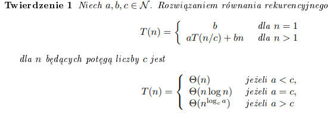
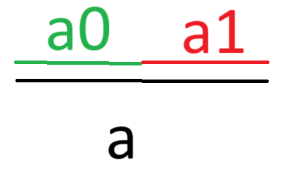
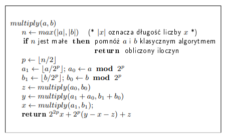
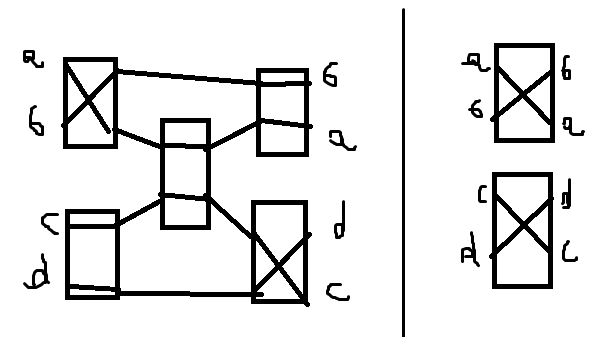
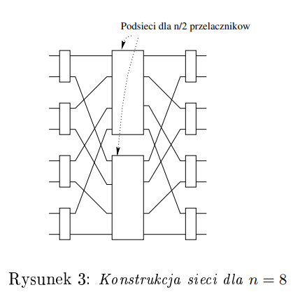
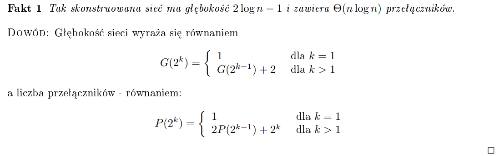

# Opis

To są takie algorytmy, że dzielą problem na mniejszy aż staje się trywialny do rozwiązania. Na przykład quick sort czy merge sort, które zostaną szerzej opisane w sekcji z sortowaniem.

# Złożoność

Tutaj w notatkach Lorysia jest dowód, że algorytmy dziel i zwyciężaj mają nawet spk złożoność, ale nie kumam czaczy więc mam nadzieję, że nie będzie na egzaminie.

# Merge Sort

Prosta sprawa - dzielimy tablicę na pół, sortujemy połówki i scalamy (O(n)). Całość - O(n log n).

# Quicksort

Informacje o tym algorytmie znajdują się w sekcji związanej z algorytmami sortującymi.

# Mnożenie bardzo dużych liczb

[filmik który łatwo zrozumieć :)](https://www.youtube.com/watch?v=JCbZayFr9RE)

Mamy liczby a i b, które są bardzo duże, w systemie binarnym. Załóżmy, że są długości n.
Liczbę a możemy zapisać jako:  
  
$$ a = a_0 \cdot 2^\frac{n}{2} + a_1 $$
tj. !!a_0!! i !!\frac{n}{2}!! zer paddingu, dodajemy !!a_1!!, co daje nam a. Robimy dokładnie to samo z b.  
i teraz $$ ab = (a_0 \cdot 2^\frac{n}{2} + a_1)(b_0 \cdot 2^\frac{n}{2} + b_1) = a_0b_0\cdot2^n + a_0b_1\cdot 2^\frac{n}{2} + a_1b_0 \cdot 2^\frac{n}{2} + a_1b_1 = $$ $$a_0b_0 \cdot 2^n + 2^\frac{n}{2}(a_0b_1 + a_1b_0) + a_1b_1 $$

!!a_0b_0!! - wyliczamy rekurencyjnie  
!!a_1b_1!! - wyliczamy rekurencyjnie  
!!a_0b_1 + a_1b_0!! - obserwacja: !!a_0b_1 + a_1b_0 = (a_0b_0 + a_0b_1 + a_1b_0 + a_1b_1) - a_0b_0 - a_1b_1 = (a_0(b_0+b_1) + a_1(b_0+b_1)) - ...!! = !!((a_0 + a_1)(b_0+b_1)) - a_0b_0 - a_1b_1 !!  
no i to co musimy odjąć mamy już wyliczone, a !!(a_0 + a_1)(b_0+b_1)!! też wyliczamy rekurencyjnie :)

Algorytm realizujący ideę z notatek Lorysia:

### Złożoność

O(!!n ^ {\log\_{2}{3}}!!)  
Dowodzi się to przez pokazanie, że czas działania algorytmu to mniej więcej !!T(n) = 3T(\frac{n}{2}) + \theta(n)!!, co ma sens bo 3 wyrazy liczymy rekurencyjnie.

# Równoczesne znajdowanie minimum i maksimum w zbiorze

1. Podejście trywialne, tj. znalezienie min i max osobno - 2n - 2 porównań.
2. Podejście nieco sprytniejsze, jeszcze nie dziel i zwyciężaj - iteracyjnie porównujemy 1 i ostatni element zbioru, później 2 i przedostatni itd., mniejszy z tym elementów dodajemy do zbioru min, wiekszy do zbioru max. Po zakończeniu pętli wywołujemy klasyczne min/max na zbiorze min i max. Ten algorytm wykonuje !!\lceil{\frac{3}{2}n - 2}\rceil!! porównań.
3. Podejście dziel i zwyciężaj:  
   TODO wykminić przy robieniu zadanek, w notatkach Lorysia jest coś gorszego od punktu 2

# Sieci przełączników

Czym jest sieć przełączników? Czym jest przełącznik?  
Przełącznik (dwustanowy) - urządzenie, które ma dwa porty wejściowe (!!a_0!! i !!b_0!!) i dwa porty wyjściowe (!!a_1!! i !!b_1!!), a także ma dwa stany:

1.  !!a_0 => a_1!!, !!b_0 = > b_1!!
2.  !!a_0 => b_1!!, !!b_0 => a_1!!

Sieć przełączników - połączone przełączniki, które poprzez różne podłączenia/stany dają na wyjściu różne permutacje danych wejściowych.
Przykład dwóch równoważnych sieci, realizujących permutację (a b c d) -> (b a d c)

Problem który chcemy rozwiązać:  
konstrukcja sieci takiej, która realizuje wszystkie permutacje n elementów, taka że liczba przełączników i głębokość sieci (tj. liczba przełączników przez które musimy przejść w najdłuższej ścieżce od wejścia do wyjścia) jest minimalna.

I to chyba robimy tak, że mamy sobie n przełączników i one są połączone z dwiema podsieciami z !!\frac{n}{2}!! przełącznikami i łączymy to tak, że z każdego przełącznika wejściowego jedno wyjście idzie do jednej podsieci, a drugie do drugiej.  

TODO: ogarnąć dowód jak bedzie chec na wrzucenie mozgu na wysokie obroty

# Para najbliżej położonych punktów

Co trzeba zrobić to wiadomo z nazwy. Mamy zbiór punktów P i musimy znaleźć dwa punkty których odległość od siebie jest najmniejsza. Brutem to jest !!n^2!!, dziel i zwyciężaj !!\theta(n \log{n})!!

Przebieg algorytmu:

1. i. Sortujemy punkty z P po x i zapamiętujemy w tablicy X,  
   ii. Sortujemy punkty z P po y i zapamiętujemy w tablicy Y  
   iii. Znajdujemy prostą l, która dzieli P na dwa równoliczne podzbiory i punkty z lewej dodajemy do !!P_L!! a z prawej do !!P_R!!
2. No i tera jajca: rekurencyjnie tak robimy aż !!|P_L| = 2!! i !!|P_R| = 2!! i mamy sobie parę najbliższych punktów.
3. Teraz, przy łączeniu mamy jeszcze coś do sprawdzenia, bo wiemy tylko że nasze najbliższe punkty są najbliżej w !!P_L!! i !!P_R!!, ale nie wiemy czy kombinacja punktów jeden z !!P_L!! i jeden z !!P_R!! nie będzie lepsza. Oznaczmy jako d krótszą z odległości znalezionych w punkcie 2. Sprwadzamy czy istnieje jakaś para punktów odległych o mniej niż d takich, że jeden należy do !!P_L!!, a drugi do !!P_R!!. Jeśli tak, to zwracamy ją jako najkrótszą odległość, inaczej zwracamy d.

Przy tym ostatnim kroku dla każdego punktu, który jest w <!!x_l -d!!, !!x_l + d!!> wystarczy sprawdzić prostokąt o odległości d w dół, d w lewo i d w prawo. Co więcej, jeżeli rozważamy jakiś punkt p to jest najwyżej 8 punktów w tym jego prostokącie. :O To dlatego, że jak mamy prostokąt !! 2 \cdot d !! na !!d!!, to jak zerkniemy sobie na przykład na lewą część tego prostokąta (!!d!! na !!d!!), to wiemy że punkty które tam są muszą być od siebie oddalone o przynajmniej d - bo gdyby były bliżej, to d byłoby mniejsze, jako że ta lewa część była już divided and conquered, i minimalną wartością z lewej strony jest wartość d. Zakładam oczywiście tutaj, bez straty ogólności, że z kroku 2 krótsza wartość była z lewej strony prostej. Zatem mamy maksymalnie 4 punkty w lewym kwadracie i maksymalnie 4 punkty w prawym kwadracie. Sprawdzenie wszystkich punktów przy łączeniu to zatem maksymalnie 8n, więc O(n).

Podsumowując cały algorytm:  
w kroku pierwszym sortowania to O(!!n \log{n}!!),  
w kroku drugim mamy !!2 \cdot T(\frac{n}{2})!!  
w kroku trzecim mamy szukanie pary O(!!n!!).

Całość to zatem !!T(n) = 2 \cdot T(\frac{n}{2}) + \theta(n) = \theta(n \log{n})!!, pod warunkiem że sortujemy tylko raz na początku, a nie w każdym wywołaniu algorytmu - wtedy logarytm się zkwadraci.
