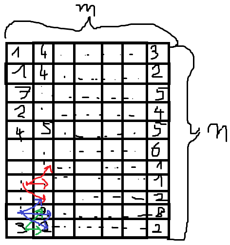
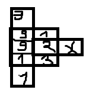

# Opis

Dziel i zwyciężaj jest fajne, kiedy rozwiązywane podproblemy są od siebie niezależne. Kiedy są, to niestety się nie sprawdza. Potrzebujemy strategii, która wykorzystuje spamiętywanie - czyli przechowywanie rozwiązanych podproblemów w pamięci. I to nie jest problemowanie dynamiczne. To stosujemy, kiedy problem przestrzeń wszystkich podproblemów jest niewielka. Strategia ta polega na rozwiązaniu wszystkich podproblemów, rozpoczynając od najprostszego.

# Problemy

## Wyliczanie !!{n\choose k}!!

Dziel i zwyciężaj nie ma sensu - tam wszystkie podproblemy są rozwiązywane osobno, na żywca. Tutaj będziemy wiele razy potrzebować danych, które zostaną wyliczone. W notatkach pokazane są dwa rozwiązania tego problemu:

### Spamiętywanie

Korzystamy z zależności, której dowód kiedyś się tutaj pojawi, bo chyba był na ćwiczeniach:
$$ {n \choose k} = { n-1 \choose k-1 } + { n-1 \choose k } $$

```python
def npok(n, k):
    tab = [[None] * (k + 1) for _ in range(n + 1)]

    def calc(n, k):
        if k == 0 or k == n:
            return 1

        if tab[n][k] is not None:
            return tab[n][k]

        tab[n][k] = calc(n - 1, k - 1) + calc(n - 1, k)
        return tab[n][k]

    return calc(n, k)
```

Jest to metoda top-down - zaczynamy od góry, schodzimy rekurencyjnie w doł.

### Dynamik

```python
def npok(n, k):
    tab = [[1]*(k+1) for _ in range(n+1)]

    for j in range(1, k+1):
        tab[j][j] = 1
        for i in range(j+1, n+1):
            tab[i][j] = tab[i-1][j-1] + tab[i-1][j]

    return tab[n][k]
```

Tutaj używana jest strategia bottom-up - zaczynamy od najmniejszych i wyliczamy sobie w górę. Dlatego nic złego się nie dzieje z powodu, że na początku wypełniłem tablicę 1, podczas gdy 1 powinna być wypełniona tylko 1 kolumna - jest to przypadek bazowy, a kolejne są wyliczane na podstawie poprzednich. Dynamikiem możemy oszczędzić pamięć, ja tego tutaj nie robię - obliczamy na podstawie przekątnej trójkąta Pascala, więc wcale nie potrzebujemy tablicy n x k - wystarczyłaby n x 2, a nawet n x 1 - według notatek Lorysia, ja intuicyjnie tego nie widzę, może było zadanie na ćwiczeniach żeby to tak zoptymalizować to kiedyś się tutaj pojawi.

## Znalezienie najkrótszej ścieżki w tablicy 2d

  
Mamy taką sytuację, zaczynamy w pierwszej kolumnie, możemy się poruszać tylko w prawo, prawo górę i prawo dół, tak jak pokazują strzałki. Chcemy dojść do ostatniej kolumny tak, żeby suma tych wartości z okienek przez które przechodzimy była minimalna.

No i podejście pierwsze - brute force. Złożoność wykładnicza. To trzeba usiąść i pomyśleć.

Usiadłem i pomyślałem. Intuicja, która pozwoliła mi znaleźć rozwiązanie - pomyślmy, skąd możemy wiedzieć jaka jest najkrtósza ścieżka np. dla tab[3][3]. Może sprawdzanie do tyłu najmniejszego elementu? Nie działa :(
  
No to sobie pomyślałem, skąd możemy wiedzieć jaka jest najkrótsza ścieżka do dotarcia do tych 1/2/3? No i sobie pomyślałem, że tak będziemy się musieli cofać cały czas do tyłu. Natomiast wiemy jaka jest najkrótsza ścieżka w 1 kolumnie - bo to jedyne ścieżki. Następnie możemy przejść do 2 kolumny i zmienić wartość z tego co tam jest, na to co tam jest + wartość najkrótszej ścieżki do poprzedniej kolumny. No i mamy najkrótsze ścieżki dla drugiej kolumny! Lecimy sobie tak po kolei z kolejnymi kolumnami i mamy najkrótsze ścieżki do każdego z elementów tablicy. Teraz, żeby znaleźć samą ścieżkę, to wybieramy najmniejszą wartość w ostatniej kolumnie i tworzymy ścieżkę do tyłu, po najkrótszych wartościach do których mają dostęp. Na pewno przyszliśmy z tej najmniejszej wartości, bo gdybyśmy przyszli z tej większej, to ta mniejsza + ostatnia dałaby krótszą ścieżkę. xD Zatem !!3nm!!, a nawet trochę mniej obliczeń żeby znaleźć te najkrótsze ścieżki, a później 3m żeby się cofnąć. Chyba nawet spoko. :) Implementacja tego jest dosyć prosta, więc pozostawię ją jako ćwiczenie dla czytelnika (można też zaglądnąć do notatek pana Lorysia, tam jest pseudokod).

## Najdłuższy wspólny podciąg
