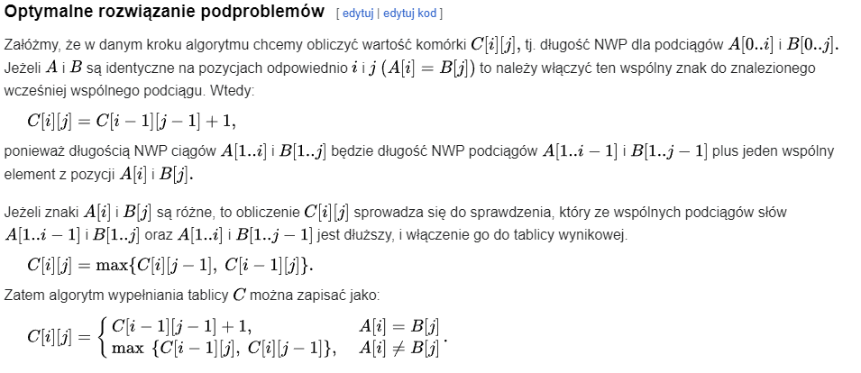
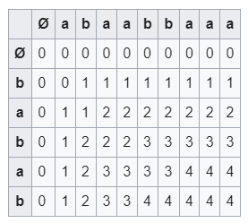
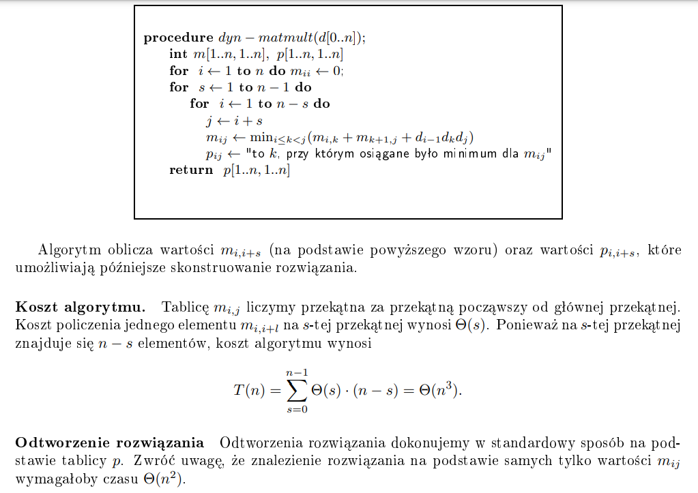
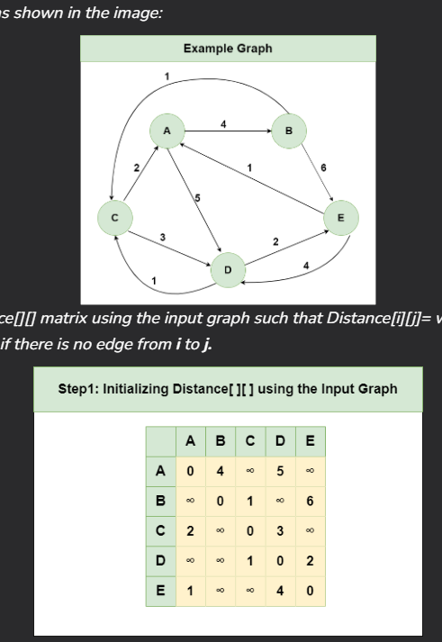
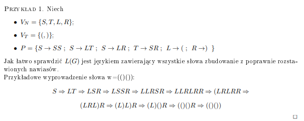
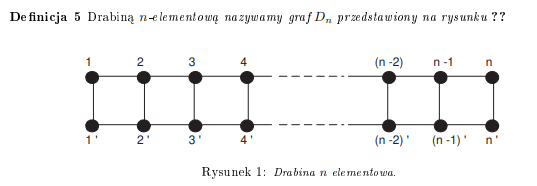

# Opis

Dziel i zwyciężaj jest fajne, kiedy rozwiązywane podproblemy są od siebie niezależne. Kiedy są, to niestety się nie sprawdza. Potrzebujemy strategii, która wykorzystuje spamiętywanie - czyli przechowywanie rozwiązanych podproblemów w pamięci. I to nie jest problemowanie dynamiczne. To stosujemy, kiedy problem przestrzeń wszystkich podproblemów jest niewielka. Strategia ta polega na rozwiązaniu wszystkich podproblemów, rozpoczynając od najprostszego.

# Problemy

## Wyliczanie !!{n\choose k}!!

Dziel i zwyciężaj nie ma sensu - tam wszystkie podproblemy są rozwiązywane osobno, na żywca. Tutaj będziemy wiele razy potrzebować danych, które zostaną wyliczone. W notatkach pokazane są dwa rozwiązania tego problemu:

### Spamiętywanie

Korzystamy z zależności, której dowód kiedyś się tutaj pojawi, bo chyba był na ćwiczeniach:
$$ {n \choose k} = { n-1 \choose k-1 } + { n-1 \choose k } $$

```python
def npok(n, k):
    tab = [[None] * (k + 1) for _ in range(n + 1)]

    def calc(n, k):
        if k == 0 or k == n:
            return 1

        if tab[n][k] is not None:
            return tab[n][k]

        tab[n][k] = calc(n - 1, k - 1) + calc(n - 1, k)
        return tab[n][k]

    return calc(n, k)
```

Jest to metoda top-down - zaczynamy od góry, schodzimy rekurencyjnie w doł.

### Dynamik

```python
def npok(n, k):
    tab = [[1]*(k+1) for _ in range(n+1)]

    for j in range(1, k+1):
        tab[j][j] = 1
        for i in range(j+1, n+1):
            tab[i][j] = tab[i-1][j-1] + tab[i-1][j]

    return tab[n][k]
```

Tutaj używana jest strategia bottom-up - zaczynamy od najmniejszych i wyliczamy sobie w górę. Dlatego nic złego się nie dzieje z powodu, że na początku wypełniłem tablicę 1, podczas gdy 1 powinna być wypełniona tylko 1 kolumna - jest to przypadek bazowy, a kolejne są wyliczane na podstawie poprzednich. Dynamikiem możemy oszczędzić pamięć, ja tego tutaj nie robię - obliczamy na podstawie przekątnej trójkąta Pascala, więc wcale nie potrzebujemy tablicy n x k - wystarczyłaby n x 2, a nawet n x 1 - według notatek Lorysia, ja intuicyjnie tego nie widzę, może było zadanie na ćwiczeniach żeby to tak zoptymalizować to kiedyś się tutaj pojawi.

## Znalezienie najkrótszej ścieżki w tablicy 2d

  
Mamy taką sytuację, zaczynamy w pierwszej kolumnie, możemy się poruszać tylko w prawo, prawo górę i prawo dół, tak jak pokazują strzałki. Chcemy dojść do ostatniej kolumny tak, żeby suma tych wartości z okienek przez które przechodzimy była minimalna.

No i podejście pierwsze - brute force. Złożoność wykładnicza. To trzeba usiąść i pomyśleć.

Usiadłem i pomyślałem. Intuicja, która pozwoliła mi znaleźć rozwiązanie - pomyślmy, skąd możemy wiedzieć jaka jest najkrtósza ścieżka np. dla tab[3][3]. Może sprawdzanie do tyłu najmniejszego elementu? Nie działa :(
  
No to sobie pomyślałem, skąd możemy wiedzieć jaka jest najkrótsza ścieżka do dotarcia do tych 1/2/3? No i sobie pomyślałem, że tak będziemy się musieli cofać cały czas do tyłu. Natomiast wiemy jaka jest najkrótsza ścieżka w 1 kolumnie - bo to jedyne ścieżki. Następnie możemy przejść do 2 kolumny i zmienić wartość z tego co tam jest, na to co tam jest + wartość najkrótszej ścieżki do poprzedniej kolumny. No i mamy najkrótsze ścieżki dla drugiej kolumny! Lecimy sobie tak po kolei z kolejnymi kolumnami i mamy najkrótsze ścieżki do każdego z elementów tablicy. Teraz, żeby znaleźć samą ścieżkę, to wybieramy najmniejszą wartość w ostatniej kolumnie i tworzymy ścieżkę do tyłu, po najkrótszych wartościach do których mają dostęp. Na pewno przyszliśmy z tej najmniejszej wartości, bo gdybyśmy przyszli z tej większej, to ta mniejsza + ostatnia dałaby krótszą ścieżkę. xD Zatem !!3nm!!, a nawet trochę mniej obliczeń żeby znaleźć te najkrótsze ścieżki, a później 3m żeby się cofnąć. Chyba nawet spoko. :) Implementacja tego jest dosyć prosta, więc pozostawię ją jako ćwiczenie dla czytelnika (można też zaglądnąć do notatek pana Lorysia, tam jest pseudokod).

## Najdłuższy wspólny podciąg

Dobra, to ten problem polega na tym, że chcemy znaleźć jak najwięcej literek które występują w tej samej kolejności w dwóch słowach. Przykłady:

1. ababaa i barnaba - aba
2. pies i kot - nic :(
3. dominiki i dożynki - donki

Rozwiązujemy to od malutkich podproblemów, tj. jaki jest najdłuższy wspólny podciąg dla ciągu A[0..1] i B[0..1]? Później bazując na tym lecymy dalej:


Pseudokod z wikipedii:  
A[1..n], B[1..m]

```
    for i := 0 to n do   // wypełnienie stanów początkowych
        C[i][0] := 0;
    for j := 0 to m do
        C[0][j] := 0;

    for i := 1 to n do
        for j := 1 to m do
            if A[i] = B[j] then
                C[i][j] := C[i-1][j-1] + 1  // znaleziono kolejny element NWP
            else
                C[i][j] := max(C[i-1][j], C[i][j-1]);
```

I to nam daje takie coś:  
  
Teraz żeby to odtworzyć idziemy od końca, tj. C[n][m] i jeśli C[i-1][j-1] != C[i][j] to dodajemy A[i] (lub B[j]) do wyniku, inaczej idziemy do max z C[i-1][j] i C[i][j-1]. No i zakładając że tak zrobiliśmy to przerywamy jak C[i][j] == 0 lub i == 0 i j == 0, w wyniku jak robiliśmy normalnie pusha do tablicy to najdłuższy wspólny podciąg to ta tablica od tyłu.

O(!!n \cdot m!!)

## Wyznaczanie optymalnej kolejności mnożenia macierzy

Okazuje się, że jak mamy n macierzy i chcemy je wymnożyć, to jakieś kolejności są lepsze od innych. Mnożenie macierzy jest łączne, możemy zacząć od obojętnie którego mnożenia i dostaniemy ten sam wynik. Zakładamy, że liczba kolumn !!M_i!! jest równa liczbie wierzy !!M\_{i+1}!!. No i jest taka własność, że jak mnożenie macierzy jest określone, to zachodzi !!(m \times n)(n \times k) = (m \times k)!!. I teraz jak mamy macierze o wymiarach !!d \times 1, 1 \times d, 1 \times d!!, to jak wymnożymy najpierw dwie pierwsze to dostaniemy !! d \times d !!, a jak drugą i trzecią to dostaniemy !! 1 \times 1 !!. Zatem w pierwszym przypadku mamy !!d^2!! w pierwszym mnożeniu i !!d^2!! w drugim, a w drugim przypadku mamy !!d!! za każdym razem. Trzeba wierzyć na słowo, nie znam żadnych algorytmów mnożenia macierzy, ale tak napisał pan Loryś.

Założenie:  
Koszt pomnożenia macierzy o wymiarach !!a \times b!! i !!b \times c!! wynosi !!abc!!.

No i teraz właściwy problem - w jakiej kolejności najlepiej mnożyć macierze, żeby wyszło najoptymalniej?

1. Brute - wychodzi nam złożoność w postaci liczby Catalana (nie jest kolorowo)
   !!S(n) = \sum\_{i=1}^{n-1} S(i)S(n-i)!! dla n > 1  
   a to dlatego, że każde z n-1 mnożeń może być tym ostatnim - a więc mamy mnożenia lewej strony od k-tej macierzy (S(i)) i z prawej (S(n-i)).

2. Dynamik  
   Przyjmujemy typową dynamiczną strategię - chcemy obliczyć optymalny koszt obliczenia macierzy na indeksach od i do j, rozpoczynając od najmniejszych części.

!!m\_{i, j} =!! minimalny koszt obliczenia !! M\_{i} \times M\_{i+1} \times ... \times M_j!!

!!m\_{i, j} = \min\limits\_{i \leq k < j} (m\_{i, k} + m\_{k+1, j} + d\_{i-1}d_kd_j)!!

!!m\_{i,k}!! - koszt obliczenia macierzy z "lewej strony"  
!!m\_{k+1, j}!! - koszt obliczenia macierzy z "prawej strony"  
!!d\_{i-1}d_kd_j!! - koszt obliczenia iloczynu powstałych macierzy

No i jak to podejście mogłoby wyglądać + złożoność od Lorysia:


## Problem plecakowy

Problem polega na tym, że robimy napad na wille bogacza i tam jest dużo bogatych rzeczy. Możemy unieść maksymalnie 50kg w plecaku, jak wybrać co kradniemy tak żeby zarobić najwięcej? (formalniej: znajdź podzbiór zbioru elementów, dla których znana jest waga i wartość, tak żeby maksymalizować sumę wartości nie przekraczając maksymalnej wagi)

To dynamicznie robimy to tak, że definujemy sobie funkcję !!K(w, j)!!, która zwraca nam jaki jest największy zarobek, mając do dyspocyzji !!w!! kg, i wybierając przedmioty od 1 do !!j!!. I po prostu liczymy to rekurencyjnie - jak !!w!!/!!j!! jest zerem to zwracamy 0, bo jak nie mamy miejsca lub przedmiotów to nic nie zarobimy. A w przeciwnym wypadku, zwracamy sobie maksa z (bierzemy ten przedmiot, nie bierzemy tego przedmiotu): !!max(K(w - w_j, j-1), K(w, j-1))!!.

Działa to w !!O(nW)!!.

## Najkrótsze ścieżki między wszystkimi parami wierzchołków

U Pana Lorysia jest do uzupełnienia, a ja se sam uzupełnie.
Problem polega na tym, że mamy sobie graf skierowany z wagami na krawędziach, i chcemy znaleźć najkrótsze ścieżki z każdego wierzchołka do każdego innego. Zakładam że taka ścieżka istnieje, chyba, nie wiem czy trzeba.
Z mojego researchu wynika, że stosujemy do tego algorytm **Floyda Warshalla**.

No to zaczynamy od tego, że robimy sobie tablicę 2d z odległościami takie jakie mamy, tzn. jak jest krawędź z B do C to tab[B][C] = waga tej krawędzi.

  
I teraz heca jest taka, że dla kolejnych wierzchołków, obliczamy najmniejszą drogę z !!v_i!! do !!v_j!! przez !!v_k!!. Tzn. dla wierzchołka !!k!!-tego przechodzimy przez tablicę, zakładając, że ścieżka prowadzi przez !!v_k!!. Przykładowo, jak dotrzeć z C do B? Analizujemy teraz wierzchołek A. Czyli to będzie albo najkrótsza ścieżka która jest tam wyznaczona, bo np. mają ze sobą krawędź, albo jest już jakaś inna, albo będzie to ścieżka z C do A do B. Zatem przy każdym kroku algorytmu analizując wierzchołek k-ty, !!d\_{i,j} = \min(d\_{i,j}, d\_{i,k} + d\_{k,j})!!.

Dla każdego wierzchołka przechodzimy calutką tablicę, więc złożoność to około !!O(n^3)!!, gdzie !!n!! to liczba wierzchołków.

## Przynależność do języka bezkontekstowego

### Przypomnienie

Przypomnienie gramatyk bezkontekstowych. W notatkach Lorysia jest dla jakichś mądralińskich, tutaj dla studenta głupka. To zaraz będzie jaśniejsze przy przykładzie, można sobie przejść prosto do niego i zaglądać co znaczą te zbiorki.

Gramatyka bezkontekstowa !!G = <V_N, V_T, P, S\>!!  
!!V_N!! - jeden zbiór symboli  
!!V_T!! - drugi zbiór symboli, rozłączny z !!V_N!!  
!!P!! - zbiór tego co możemy zrobić z naszymi literkami, bierzemy coś z !!V_N!! i zwracamy coś innego z !!V_N \cup V_T!!  
!!S!! - należy do !!V_N!!, symbol początkowy  
język !!L(G)!! generowany przez !!G!! - taki zbiór słów, do których możemy dojść stosując jakiekolwiek produkcje z !!P!! tak długo, że już więcej nie będziemy mogli ich stosować

Jeśli wszystkie produkcje z !!P!! są w formie coś z !!V_N!! -> (coś z !!V_N!!, coś z !!V_N!!) lub !!V_N!! -> coś z !!V_T!!, to mówimy że G jest w normalnej postaci Chomsky'ego.

**Przykład z notatek KLo**


### Problem

Dostajemy gramatykę w normalnej postaci Chomsky'ego oraz słowo. Mamy zwrócić czy istnieje ono w języku !!L(G)!!.

Brut oczywiście lipny, jak chyba zawsze na AiSD.

Idea:  
Podejście dynamiczne polega na znalezieniu produkcji, które mogły wyprodukować najmniejsze podsłowa i tak sie rozpychamy z tym jak to zawsze w dynamikach jest. Jak mamy słowo !!w = a_1, a_2, ... a_n!!, to te !!a_1, a_2...!! musiały powstać z produkcji coś (A) -> !!a_i!!.
Takich produkcji może być jednak wiele, więc elementami naszej tablicy będą zbiory. :O

!!m\_{i,i} = \\{ A \mid A \text{ można wyprodukować z } a_i \\}!!

!!m\_{i,j} = { \bigcup\_{k=i}^{j-1} \\{ A \mid (A \rightarrow BC) \in P \\} }!! dla !!B \in m\_{i,k}!! i !!C \in m\_{k+1,j}!!

To trzeba sobie rozrysować ten wcześniejszy przykład i zastosować algorytm jak sie tego nie widzi, mnie niestety goni czas ;(  
Można też zajrzeć do [AiSD Dla Opornych](https://github.com/Ph0enixKM/AiSD-Dla-Opornych/blob/master/4%20Programowanie%20Dynamiczne.pdf)

Złożoność: !!O(n^3)!!

## Drzewa rozpinające drabin



### Problem

W tej drabince kolorujemy sobie któreś krawędzie na czerwono. Dajmy na to, że jest to C = ciąg par !!\\{ u_i, v_i \\}!! danych na wejściu. Naszym zadaniem jest znaleźć liczbę drzew rozpinających naszej drabinki, w których jest dokładnie k krawędzi z C.

Zastanówmy się, w jaki spsób możemy obliczyć liczbę drzew rozpinających w !!D_n!!
TODO - nie kumam czaczy co to las rozpinający
