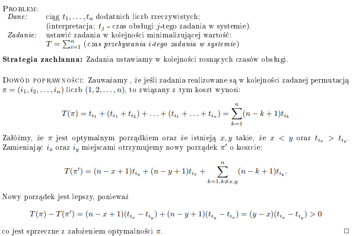
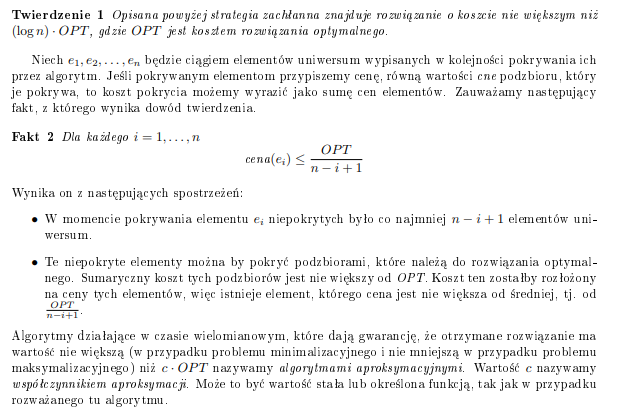

# Opis

Za pomocą takich algorytmów możemy rozwiązujemy zazwyczaj zadania optymalizacyjne. Przykładowo, mamy jakiś skończony zbiór X, a odpowiedzią jest jakiś podzbiór zbioru X.

Algorytmy zachłanne to na przykład [algorytmy wyznaczające MST](https://aisd-notatki.readthedocs.io/en/latest/mdl/md/).

# Dowody

Poprawność algorytmów zachłannych praktycznie zawsze (nie znam innych przypadków) rozwiązuje się poprzez wzięcie optymalnego rozwiązania (zawsze jakieś istnieje) i porównanie tego, co wypluł nasz algorytm z rozwiązaniem optymalnym. Pokazujemy, że jest to takie samo lub tak samo optymalne rozwiązanie. Intuicja co do wyboru kryterium optymalizacji jest taka, że powinno być ono proste - np. bierzemy tylko najmniejsze elementy, tylko największe, najbardziej opłacalne, coś prostego do sprawdzania.

# Problem wydawania reszty

Przykładem zadania, które pokazuje czym jest strategia zachłanna jest problem wydawania reszty. Rozwiązaniem tego zadania dla zbioru nominałów C = {1, 2, 5, 10, 20, 50, 100} jest wybieranie największego nominału, który nie przekracza kwoty pozostałej do wydania.

Dowód dla sportu:

Fakt:
C[i] >= C[i-1]/2 dla i >= 1 (zbiór indeksowany od 0)

1. pokażemy, że algorytm zawsze zwraca rozwiązanie
2. pokażemy, że rozwiązanie algorytmu jest takie samo/tak samo dobre jak rozwiązanie optymalne

ad 1. W każdym kroku algorytmu, zmniejsza się pozostała do wydania kwota. Algorytm nie zakończy działa, kiedy ta kwota > 0, bo dopchałby jedynkami. Kwota nie spadnie poniżej 0, ponieważ algorytm wybiera nominały <= kwota wydania  
ad 2. Opt = { o1, o2, ... o_k }  
 Alg = { a1, a2, ... a_l }  
 bez straty ogólności, zakładamy że zbiory te są posortowane nierosnąco  
 a) l < k => sprzeczność, Opt nie jest optymalny  
 b) l = k => rozwiązanie algorytmu jest optymalne  
 c) l > k => weźmy pierwszy indeks, na którym rozwiązania się różnią, niech będzie to j.  
 o_j = a_j => sprzeczność, mały się różnić  
 o_j > a_j => sprzeczność, algorytm zawsze wybiera największy mieszczący się nominał, zatem rozwiązanie optymalne byłoby błędne (za dużo wydanej reszty)  
 o_j < a_j => wiemy, że o_j jest co najmniej 2 razy mniejszy od a_j. zakładając, że mamy do wydania Q i możemy użyć do tego a_j, a tego nie robimy, to znaczy że rozwiązanie optymalne używa co najmniej dwóch nominałów, aby pokryć wartość a_j i nie więcej, tj. dwa mniejsze nominały dają nam najwyżej a_j. to znaczy, że rozwiązanie optymalne może być prostsze, używając a_j. próba optymalniejszego pokrycia reszty nie używając a_j byłaby nieoptymalna - dwa nominały dają nam najwyżej a_j, a próbę pokrycia większej wartości, tj. 2 nominały + coś, łatwiej zapisać jako a_j + coś. sprzeczność.  
Zatem l = k, nasze rozwiązanie jest optymalne.

Nie wiem czy ten ostatni podpunkt jest dobrze udowodniony, ale to będzie coś w tym stylu. Musimy użyć jakiejś własności tego zbioru w dowodzie, bo algorytm zachłanny nie zawsze daje optymalne rozwiązanie problemu wydawania reszty, jednak w przypadku naszego zbioru daje. Pewnie dałoby się udowodnić, że dla każdego zbioru, gdzie C[0] = 1 i C[i+1] >= 2\*C[i] ten algorytm daje wynik optymalny. W sumie to chyba nawet ten dowód to udowadnia, jakby ładnie go dupnąć w formie dowodu indukcyjnego.

# Problem szeregowania zadań

Problem 1:  
Mamy taski i chcemy zminimalizować czas przebywania tych tasków w systemie, tzn. wykonać jak najwięcej jak najszybciej. Intuicyjnie, taski wykonujemy od najkrótszego.

Dowód z notatek Lorysia, uwaga bo u niego t oznacza czas wykonania taska, np t1 to czas wykonania 1 zadania.

Problem 2:
Mamy taski, które mają swoje terminy i za wykonanie każdego dostajemy jakieś pieniążki. Za wykonanie po terminie nie dostajemy nic. Chcemy ustawić te zadania w takiej kolejności, żeby zmaksymalizować zarobione pieniążki.

Strategia:
Zawsze bierzemy zadanie, które daje nam najwięcej pieniążków i nie jest po terminie. Intuicja, żeby wpaść na ten pomysł jest taka, że nie musimy się martwić o to, czy jak wybierzemy to zadanie a nie jakieś inne to minie nam termin jakiegoś innego, które mogło dawać lepszy ciąg - to zadanie dałoby nam mniej pieniążków, niech se mija.

Dowód (w notatkach Lorysia jest szkic, tu bardziej na chłopski rozum):
Jak zwykle, mamy nasz zbiór Alg i istnieje jakiś zbiór Opt. Jak zwykle, pokażemy że dla obydwu zbiorów zysk jest ten sam.
Udowodnimy, że:

1. W wyniku operacji przestawiania zadań (zamiany miejscami) w Alg, wszystkie wspólne zadania (część wspólna Alg i Opt) wykonują się w tym samym czasie (tzn. te zadania, które zostały wybrane zarówno przez algorytm i są w rozwiązaniu optymalnym zostaną wykonane w tym samym czasie, czyli część wspólna daje ten sam zysk)
1. w pozostałych jednostkach czasu Alg i Opt mają zaplanowane wykonanie zadań o tym samym zysku (tzn. że te zadania które nie są w części wspólnej dadzą taki sam zysk zarówno w Alg i Opt)

ad. 1. Weźmy zadanie, które znajduje się na różnych pozycjach w Alg i Opt. Załóżmy, że w Alg jest ono na pozycji i, a w Opt na j. Załóżmy sobie, że i < j, bez straty ogólności. Po zamianie miejscami tych zadań w Alg, Alg nadal będzie poprawny i nic nie będzie po terminie, bo:

-   task i-ty jest na pozycji j-tej w Opt
-   i < j, więc wstawienie go na i-tą pozycje nie sprawi że wykona się po terminie

W ten sposób liczba zadań na różnych miejscach zmniejsza się, powtarzamy ile trzeba i dostajemy tezę.

Pokazaliśmy sobie, że zadania które są jednocześnie w Opt i Alg możemy ustawić na tych samych miejscach w Alg. Co z pozostałymi zadaniami?

ad. 2. Ustawiami sobie wspólne zadania na tych indeksach które są w Opt i bierzemy pierwszy indeks, na którym rozwiązania Opt i Alg się różnią, niech będzie to i. Loryś tutaj jeszcze tłumaczy, że na pozycji i-tej na pewno coś jest, bo gdyby była dziura to w Alg zachłannie byśmy coś tam wrzucili, a w Opt moglibyśmy dorzucić jakieś zadanie i byłby optymalniejszy. Popatrzmy sobie teraz na a = Alg[i] i b = Opt[i]. Jeżeli b > a, to nasz algorytm zachłanny wrzuciłby tam b, sprzeczność. Jeżeli b < a, to Opt - b + a byłby optymalniejszy, sprzeczność.

# Problem pokrycia zbioru

NP-trudny! Możemy jednak stworzyć algorytm aproksymacyjny korzystając ze strategii zachłannej, który będzie bliski optymalnemu.

Problem: mamy rodzinę podzbiorów (zbiór zbiorów) n-elementowego uniwersum U (to znaczy - jakiś zbiór w którym jest n elementów). Mamy też funkcję kosztu, która mówi nam ile będzie kosztować użycie podzbioru do pokrywania.
S = { S1, S2, ..., Sk} - rodzina podzbiorów
c: funkcja c[Si] -> koszt

To co mamy zrobić, to znaleźć najtańszą podrodzinę S (wyznaczyć podzbiory ze zbioru S), która pokrywa uniwersum U, tzn. znaleźć taki podzbiór S, że jak dodamy do jednego zbioru wszystkie elementy tego podzbioru, to dostaniemy zbiór U i żaden inny podzbiór S nie daje tego samego efektu taniej.

Ciężko tu chyba wymyślić intuicyjnie strategię zachłanną, więc intuicyjnie ja bym wymyślał strategie i próbował wymyślić kontrprzykład:

-   podzbiór pokrywający najwięcej elementów (ale co jak mamy podzbiór, który pokrywa np. wszystkie elementy za koszt 10000000 i mamy dwa podzbiory które pokrywając wszystkie elementy, jest ich mniej w tym podzbiorze, a koszt to 1? :( )
-   najtańszy podzbiór (ale co jak mamy n jednoelementowych zbiorów o koszcie 1 i podzbiór n-elementowy o koszcie 2?)
-   podzbiór, który najtaniej pokrywa elementy (!! to bedzie to)

Co oznacza "najtaniej pokrywa elementy"? Zróbmy sobie funkcję cne - cena na element, niech to będzie koszt pokrycia podzbioru dzielony na liczbę elementów które pokrywa, ale tylko tych, które jeszcze nie są pokryte. Formalniej:

cne(Si) = c(Si) / (|Si \ C|),  
gdzie C to zbiór pokrytych dotychczasowo elementów.

Nasz algorytm będzie:

1. za każdym razem obliczał cne(Si) - bo to się będzie zmieniać w zależności od C
2. wybierać podzbiór, którego cne jest najmniejsze

  
To oczywiście z notatek Pana Lorysia.
