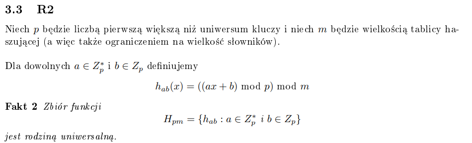

# Opis

Haszowanie to jedna z metod realizacji słowników, ale na tyle prosta, a notatka jest na tyle teoretyczna i skupiająca się na funkcjach haszujących (bardziej matma niż procedury), że wrzucam do innych. Idea jest prosta - jeżeli uniwersum jest niewielkie, to możemy wykorzystać tablicę bitów, gdzie !!tab[i] = 1!! wtw. gdy !!i!!-ty element uniwersum należy do zbioru. Wtedy możemy w czasie stałym wykonywać operacje słownikowe.

Funkcja haszująca to takie coś, co przyjmuje element uniwersum jako argument, a zwraca indeks z tablicy T w którym pamiętane są elementy !!U!! (!!h \space \colon \space U \rightarrow \\{0 , \dots , m-1 \\}!!)

# Funkcje haszujące

dfh - dobra funkcja haszująca
Powinna ona spełniać następujący warunek:
$$ \forall\_{j=0, \dots, m-1} \sum\_{k:h(k)=j} P(k) = \frac{1}{m} $$

gdzie !!P(k)!! to prawdopodobieństwo, że !!k \in U!! będzie paramterem którejś z operacji słownikowych. Powinna być szybkoobliczalna. Przykłady funkcji haszujących.

Przykłady funkcji haszujących:  
!!h(k) = k \mod m!! - działa fajnie, jak !!m!! jest liczbą pierwszą neizbyt bliską potęgom liczby 2.  
!!h(k) = \lfloor m(kA - \lfloor kA \rfloor))\rfloor!! - !!A!! to jakaś ustalona liczba z przedziału !!(0, 1)!!.

# Kolizje

Kolizją nazywamy sytuację, kiedy !!h(y) = h(x) \land y \neq x!!. Jest to sytuacja niefajna, oczywiście. Oto jak sobie z nią radzić:

Po pierwsze, możemy użyć **listy elementów**. Oznacza to, że w tablicy nie trzymamy elementów, a listę elementów, gdzie !!i!! jest wskaźnikiem na pierwszy element listy. Jak mamy kolizje, to po prostu dołączamy element do listy. Średnio, wszystko nadal wykonuje się w czasie stałym.

Drugim sposobem jest **adresowanie otwarte**. W przypadku kolizji, szukamy innego wolnego miejsca. Robimy sobie jakąś funkcję haszującą dwuargumentową, element i liczba z przedziału !![0, m-1]!!. Jak !!h(k, 0)!! jest zajęte, to próbujemy !!h(k, 1)!! i tak dalej, aż znajdziemy wolne miejsce. Chcemy też, żeby ta funkcja za każdym razem zwracała nam inny indeks (tzn. przy każdej zmianie tego drugiego argumentu), tak żeby wolne miejsce nie zostało znalezione dopiero jak faktycznie tablica jest całkowicie zapełniona.

Przykłady takich funkcji haszujących:

1. liniowa:  
   !!h(k, i) = (h'(k) + 1) \mod m!!  
    gdzie !!h'!! jest funkcją haszującą z poprzedniej sekcji
2. kwadratowa:  
   !!h(k, i) = (h'(k) + c_1i + c_2\*i^2)!!  
   !!c_1!! oraz !!c_2!! powinne zostać dobrane tak, żeby zachodził ten warunek, że funkcja nam dla każdego indeksu zwraca co innego.
3. podwójne haszowanie:  
   !!h(k, i) = (h_1(k) + ih_2(k)) \mod m!!  
   !!h_2(k)!! musi być względnie pierwsze z !!m!! dla każdego k z uniwersum

Podwójne jest najfajniesze.

# Haszowanie uniwersalne

Żeby pozbyć się problemu - istnieją dane, które powodują długi czas wykonywania operacji słownikowych - funkcje haszujące będziemy wybierać losowo, na początku działania programu.

Rodzinę funkcji spośród której będziemy losować naszą funkcję haszującą nazywamy uniwersalną, kiedy ich prawdopodobieństwo kolizji
ze sobą jest nie większe niż !!\frac{1}{m}!!.
$$ |\\{h \in H \space \colon \space h(x) = h(y)\\}| \leq \frac{|H|}{m} $$

Przykłady takich rodzin:

1. R1  
   !!m!! - liczba pierwsza, !!|U| < m^{r+1}!!. Dla każdego !!0 \leq a < m^{r+1}!! definujemy !!h_a!!:
   $$ h_a(x) = \sum\_{i=0}^{r} a_ix_i \mod m $$
   !!a_i!! oraz !!x_i!! reprezentują liczby !!a!! i !!x!! w systemie !!m!!-arnym.
2. R2  
    KLo:  
   
   Jeżeli na egzaminie będzie trzeba to udowodnić, pomijamy to zadanie i z pokorą przyjmujemy bombę.
