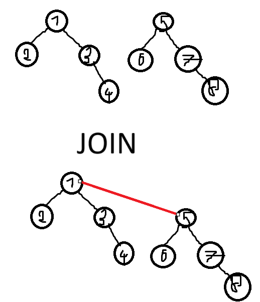
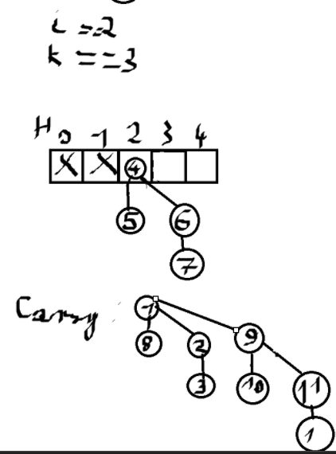

# Opis

To taki kopiec, który jest "łatwy" do złączenia z innym takim kopcem, jest to możliwe w czasie logarytmicznym.

Jest implementowany przy użyciu **drzew dwumianowych**. Są to drzewa zdefiniowane indukcyjnie: !!i!!-te drzewo dwumianowe !!B_i!! składa się z korzenia oraz !!i!! poddrzew: !!B_0!!, !!B_1!!, ..., !!B\_{i-1}!!.


Ile !!B_i!! zawiera wierzchołków? !!B_0!! ma 1, !!B_1!! ma 2, !!B_2!! ma 4, !!B_3!! ma 8, !!B_i!! ma !!2^i!!.

Kopiec dwumianowy jest **zbiorem drzew dwumianowych**. Pamiętają one elementy zgodnie z porządkiem kopcowym.  


Rzędem wierzchołka w drzewie dwumianowym nazywamy liczbę jego dzieci. Tutaj widzimy kopiec dwumianowy z drzewami rzędów 0, 2, 3. Każdy kopiec dwumianowy ma najwyżej 1 drzewo danego rzędu. Ciekawa zależność: ten kopiec ma 13 wierzchołków, 13 w binarce to !!1101!!, co mówi nam jakich rzędów będą drzewa tego kopca - 0, 2, 3.

# Operacje

Zakładamy sobie dla przyspieszenia implementacji, że dzieci każdego wierzchołka są cykliczną listą dwukierunkową, a ojciec pamięta wskaźnik do jednego z nich.

### join

Zawsze łączymy drzewa tego samego rzędu. Robimy to tak, że jedno drzewo staje się synem korzenia drugiego. Robimy to tak, że ostatecznym ojcem staje się korzeń tego z drzew, które w korzeniu ma mniejszą wartość (żeby zachować własność kopca minimalnego). Powstaje nam drzewo dwumianowe o rzędzie 1 większym (!!B_i!! join !!B_i!! = !!B\_{i+1}!!)


Koszt: !!O(1)!!

### makeheap(!!i!!)

Nie wiem co ma znaczyć to !!i!!, jeżeli chcemy zrobić heapify to musimy albo insertować do pustego heapa, albo traktować każdy element tablicy jako jednowęzłowe drzewo dwumianowe i mergować na potęge. Podobno koszt o !!O(1)!!. Chyba przy podejście insertowym, zakładając że insert jest w !!O(1)!!, bo merge są logarytmiczne.

### find-min

Każdy kopiec dwumianowy ma wskaźnik MIN wskazujący na minimalny element. Odczytujemy go. !!O(1)!!

### meld (merge)

Przed omówieniem insert/deletemin omówimy sobie melda, jako że te operacje będą go używać.

##### Sposób pierwszy - eager meld:

W tej wersji kopca drzewa są dostępne przez tablicę wskaźników, każdy kopiec ma co najwyżej jedno drzewo danego rzędu, więc !!i!!-ty element tablicy wskazuje albo na drzewo !!i!!-tego rzędu, albo są pustym wskaźnikiem. !!meld(h_1, h_2)!! tworzy nowy kopiec, stare likwidujemy. All my homies hate mutations.

```python
def eagermeld(h, h2, H):
    # h, h2 - heapy które mergujemy
    # H - pusty nowy heap dwumianowy
    H.MIN = min(h.MIN, h2.MIN)
    carry = None

    for i in range(MAXHEAPSIZE):
        k = filter(lambda x: x != None, [carry, h[i], h2[i]]).length #liczba niepustych wskaźników z carry, h[i], h2[i]

        if k == 0:
            H[i] = None
        if k == 1:
            H[i] = x # niepusty wskaźnik z k
        if k == 2:
            H[i] = None
            carry = join(B1, B2) # join dwa niepuste wskaźniki
        if k == 3:
            H[i] = h[i]
            carry = join(h2[i], carry)
```

Przykład:

Mamy na początku takie drzewka i chcemy je zmeldować.

Krok 1:  
  
i = 0, mamy h1[0] i h1[0], zatem k = 2. Według algorytmu H[0] = None i przekazujemy zjoinowane h[0] i h2[0] dalej.

Krok 2:  


Krok 3:  


Krok 4:  


Tutaj jak coś se zrobiłem za dużą tablicę na H więc skróciłem o 1 ;)

Koszt: !!O(\log n)!!

Operacja deletemin(h):
Wskaźnik MIN wskazuje na drzewo dwumianowe B, którego korzeń jest minimalny w kopcu. Usuwamy B z h. Następnie usuwamy z B korzeń (czyli to minimum które chcemy usunąć) i otrzymujemy rodzinę drzew o rzędzie o 1 mniejszym. Drzewa te traktujemy jako kopiec i meldujemy h (które ma usunięte B) z tym nowym kopcem, który otrzymaliśmy przez usunięcie korzenia z B.

Operacja insert(i, h):
Maksymalnie !!O(\log n)!!, np. gdy h jest "pełne", tzn. zawiera drzewa każdego rzędu. Da się osiągnąć !!O(1)!! (ćwiczenie).

##### Sposób drugi - lazy meld:

Chcemy, by wszystkie operacje poza deletemin były w !!O(1)!! czasu zamortyzowanego, czyli chyba takiego średniego/oczekiwanego w większości przypadków. Teraz kopiec reprezentujemy nie jako tablicę wskaźników, drzewa kopca łączymy w cykliczną listę dwukiernkową. Lazymeld polega na połączeniu list dwóch kopców i aktualizacji wskaźnika MIN. Robimy to w czasie !!O(1)!!. Teraz jednak kopiec może zawierać wiele drzew tego samego rzędu. :(

Operacja deletemin(h):
usuwamy korzeń drzewa wskazywanego przez MIN, dołączamy poddrzewa usuwanego wierzchołka do listy drzew kopca, po czym redukujemy liczbę drzew w kopcu. Niestety nie wiem jak. Deletmin może zająć nawet !!O(n)!!, ale zamortyzowany czas da się ograniczyć przez !!O(\log n)!!.
