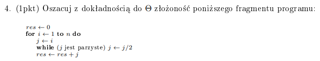
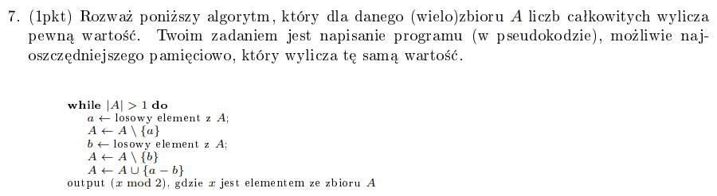

# Zadanie 3


Algorytm mnożenia liczb po rosyjsku: licząc !!n \cdot m!!, jeden z czynników mnożymy razy dwa, a drugi dzielimy przez 2. Jeżeli drugi czynnik jest nieparzysty, to pierwszy dodajemy do wyniku.

```python
def russian_mult(n, m):
    w = 0
    while m > 0:
        if m % 2 == 1:
            w += n
        n *= 2
        m //= 2
    return w
```

Obserwacja: to co tak naprawdę się dzieje, to !!\sum\_{i=0}^{\log_2m} n \* 2^i \* m_i!!, gdzie !!m_i!! to i-ty bit m. Z tego mamy !!n \* \sum\_{i=0}^{\log_2m} 2^i \* m_i = n \* m!!. Zatem nasz algorytm faktycznie wykonuje zadane mnożenie.

Kryterium jednorodne:

-   czas: !!O(log_2m)!! - tyle razy przechodzimy przez pętlę while
-   pamięć: !!O(1)!!

Kryterium logarytmiczne:

-   czas: !!\log_2m!! - pętle, a !!\log_2n \cdot m!! - dane, w najgorszym przypadku. !!O(\log_2n \log_2m)!!
-   pamięć - !!O(\log_n \cdot m)!! - tyle bitów maks może mieć wynik !!n \cdot m!!

# Zadanie 4


Połowa liczb (te parzyste) będzie wymagała dzielenia - mamy więc !!n/2!! dzieleń. Następnie połowa z tych liczb będzie wymagała kolejnego mnożenia. Mamy zatem kolejne !!n/4!! dzieleń, itd. Zatem łączna ilość wymaganych dzieleń to jakoś !!\sum\_{i=0}^{\log_2 n} \frac {n}{2^i}!!. Czas !!\Theta(n)!!.

# Zadanie 5


Nazwa rozwiązywanego problemu: Matrix Exponentation.  
Rozwiąznie mocno inspirowane rozwiązaniem [Kamila Matuszewskiego](https://github.com/Arsenicro/University/blob/master/Materia%C5%82y/aisd/r0.pdf)

Macierzowy sposób obliczania Fibonacciego polega na tym, że znamy sposób na szybkie potęgowanie macierzy (w czasie logarytmicznym). Wygląda to podobnie jak w zwykłym szybkim potęgowaniu. Zapiszmy ten sposób formalniej, szukamy początkowej macierzy którą będziemy potęgować.

!!F\_{n} = a \cdot F\_{n-1} + b \cdot F\_(n-2)!!  
Oczywiście w przypadku Fibonacciego, !!a = 1!! i !!b = 1!!.


Innymi słowy, chcemy znaleźć taką macierz !!A!!, która wygeneruje nam kolejną wartość liczby Fibonacciego. Taką macierzą jest, można sprawdzić:


Wyliczyliśmy macierz, która potęgowana, będzie nam zwracać kolejne wyrazy ciągu Fibonacciego. Uogólnijmy to podejście:
!!G_n = \alpha_0 G\_{n-1} + \alpha_1 G\_{n-2} + ... + \alpha\_{k-1} G\_{n-k}!!


Pierwszy wiersz to współczynniki, kolejne wiersze służą do wyboru który element chcemy przenieść dalej - tzn. pierwszy wiersz wylicza !!G_n!!, kolejne przepisują wyliczone już !!G\_{n-1}!! itd.

Jest to odpowiedź na pierwszą część zadania, teraz druga, tzn. funkcja G będzie zależna od wielomianu W.  
!!G_n = \alpha_0 G\_{n-1} + \alpha_1 G\_{n-2} + ... + \alpha\_{k-1} G\_{n-k} + W(n)!!

!!W(n) = \beta_0 n^0 + \beta_1 n^1 + ... + \beta_l n^l!!

Zatem !!G_n = (\alpha_0 G\_{n-1} + \alpha_1 G\_{n-2} + ... + \alpha\_{k-1} G\_{n-k}) + (\beta_0 n^0 + \beta_1 n^1 + ... + \beta_l n^l)!!


W naszym przypadku będzie to: !!(n+1)^l = \sum\_{j=0}^{l} \binom{l}{j} n^j!!

Ostatecznie, naszą macierzą !!B!! będzie taki potwór zestawiony z 4 macierzy, rozdzielonych czerwonymi kreskami:


# Zadanie 6


Weźmy np. !!x^{70}!!

!!70 = 1000110_2!!

!!x^1 = x!!  
!!x^2 = x \cdot x!!  
!!x^4 = x^2 \cdot x^2!!  
!!x^8 = x^4 \cdot x^4!!  
!!x^{16} = x^8 \cdot x^8!!  
!!x^{32} = x^{16} \cdot x^{16}!!  
!!x^{64} = x^{32} \cdot x^{32}!!  
!!x^{128} =!! - nieważne, !! 128 > n !!

Jeśli 70 bitowo ma na pozycji !!i!!-tej jedynkę, to do zmiennej wyjściowej (zainicjalizowanej jako 1) w trakcie obliczania domnażamy !!x^i!!.

Pseudokod:

```python
def fast_pow(x, n):
    bit_n <- bitowo(n)

    res = 1

    i = 1
    current_pow = x

    while i < bit_n.length:
        if bit_n[i] == 1:
            res = res * current_pow
        current_pow = current_pow * current_pow
        i += 1

    # najbardziej znaczący bit zawsze będzie 1
    res = res * current_pow

    return res
```

Liczba mnożeń to:
!!d(n) = 2\lfloor \log_2{n} \rfloor!!

Teraz musimy udowodnić, że !!\forall\_{k \in N} \space \exists {n} \space \colon x^n!! może być obliczone przy użyciu nie więcej niż !!d(n) - k!! mnożeń. Innymi słowy, musimy znaleźć dla dowolnego !!k!! takie !!n!!, że !!x^n!! da się obliczyć wykonując maksymalnie !!d(n) - k!! mnożeń. Zakładając, że !!d(n)!! jest ok, to możemy wziąć !!n = 2^k!!. Wtedy !!d(n) = 2k!!, !!d(n) - k!! = k, a !!x^{2^k}!! obliczamy właśnie w !!k!! mnożeń. Idk czy to dobrze, nie do końca kumam zamysł tego podpunktu.

# Zadanie 7


Algorytm ten sprawdza parzystość sumy elementów w zbiorze. Zauważmy, że jeśli !!a!! i !!b!! są obydwie parzyste lub nieparzyste, to ich różnica jest parzysta. Wstawiamy więc zamiast dwóch parzystych liczb jedną parzystą, co nie zmienia parzystości sumy. Zamiast dwóch nieparzystych, wstawiamy jedną parzystą, co też nie zmienia parzystości zbioru. Jeśli !!a!! i !!b!! są różnej parzystości, to wyrzucamy liczbę parzystą i nieparzystą, a dodajemy nieparzystą, co też nie zmienia parzystości zbioru. Tak robimy aż zostanie jeden element i sprawdzamy jego parzystość. Trywialnym rozwiązaniem tego zadania byłoby zsumowanie wszystkich elementów zbioru i sprawdzenie parzystości, nie jest to jednak optymalne rozwiązanie pamięciowo, szczególnie, że liczby w !!A!! mogą być np. !!MAXINT!!. Możemy po prostu kolejno porównywać parzystość liczb:

```
procedure zad_7(A):
    parzystość = true
    for each element in A:
        if a_i % 2:
            parzystość = not parzystość
```

W ten sposób, rozważamy po kolei każdy element, jeśli rozważany element jest parzysty to nie zmieniamy parzystości, jeśli jest nieparzysty to ją zmieniamy. Jest to program możliwie oszczędny pamięciowo - potrzebujemy z "dodatkowej pamięci" tylko 1 bit na parzystość

# Zadanie 8


No to ja bym to zrobił tak, że przeszedłbym od korzenia do liści i gdzieś na boku zapisywał, przez które wierzchołki musi przejść jakiś !!v!!, żeby trafić do korzenia. Tzn. dla korzenia to będzie pusta tablica, później dla dziecka to jest [lista ojca, ojciec]. Nie jest to raczej rozwiązanie najlepsze pamięciowo, ale w !!O(n)!! przechodzimy drzewo, a później sprawdzamy wszystkie pary które przyjdą w !!O(1)!!. Pamięciowo to będzie chyba jakieś !!O(nh)!!, gdzie h to wysokość drzewa. Algorytmów nie chce mi się pisać.

# Zadanie 9


[Analizka na Stacku](https://stackoverflow.com/questions/9755721/how-can-building-a-heap-be-on-time-complexity)

Mogłoby się wydawać, że to !!O(n \log n)!!, bo przechodzimy przez pętlę n/2 razy, a przesun_nizej przesuwa o maksymalnie !!\log n!! w dół. Przyjrzyjmy się jednak naszej strukturze. Kopiec jest w postaci drzewa binarnego. Zatem n/2 wierzchołków jest na najniższym poziomie, n/4 na przedostatnim, n/8 na przed-przedostatnim. Kiedy wywołamy przesuń niżej na wierzchołku na najniższym poziomie, potrzebuje on 0 operacji przesunięcia w dół. Jak na przedostatnim, to maksymalnie jedno przesunięcie. Generalnie, przesunięć wykonać trzeba maksymalnie !!h!! - poziom na którym jest wierzchołek. Zatem na tych ostatnich poziomach, gdzie wywołanie przesuń niżej to 1/2 operacje, mamy n/2+n/4+n/8 wierzchołków, czyli 0,875. Zdecydowana większość. Dlatego budowanie od dołu działa szybciej - w zdecydowanej większości przypadków, nie musimy robić prawie nic. Budując od góry, sytuacja jest przeciwna - większość wierzchołków potrzebuje giga dużo roboty - dlatego jest wolniej. To tak dla wyrobienia intuicji.

Przesunięć niżej potrzebujemy zatem !!0 \cdot \frac{n}{2} + 1 \cdot \frac{n}{4} + 2 \cdot \frac{n}{8} + ... + h \cdot 1 = \sum\_{i=1}^h \frac{ni}{2^{i+1}} = n \sum\_{i=1}^{h} \frac {i}{2^{i+1}}!!

Jak udowodnić że ta suma to !!O(n)!!? Tak o:


[(cały dokument)](https://www.cs.umd.edu/%7Emeesh/351/mount/lectures/lect14-heapsort-analysis-part.pdf)

# Zadanie 10


Ponownie, mocno inspirowane rozwiązaniem Kamila.

Zdefiniujmy sobie ten ciąg wielomianów:  
!!W_0(x) = x!!  
!!W_k(x) = (W\_{k-1}(x) - 2)^2!!  
!!W_n(x) = !! to co w zadaniu

Chcemy wiedzieć co stoi przy !!x^2!!. W takim razie do obliczeń będziemy potrzebować tylko współczynników przy !!x^2!!, !!x!! i wyrazu wolnego, jako że tylko te mogą wpłynąć na współczynnik przy !!x^2!!. Wyrazy gdzie potęga !!x!! jest większa niż 2 możemy ignorować.

!!W_k(x) = a_k x^2 + b_k x + c_n!!  
!!W\_{k+1}(x) = (a_k x^2 + b_k x + c_k - 2)^2 = x^2(2a_kc_k - 4a_k + b_k^2) + x(2b_kc_k - 4b_k) + (c_k^2 - 4c_k + 4)!!

Takie coś wychodzi po wymnożeniu, można sprawdzić, pominąłem potęgi wyższe niż 2. To co jest w nawiasach to nic innego jak współczynniki do !!W\_{k+1}(x)!!.

Mamy więc:  
!!c\_{k+1} = (c_k^2 - 4c_k + 4) = (c_k - 2)^2!!  
Obserwacja: !!c_1 = (0 - 2)^2 = 4, c_2 = (4-2)^2 = 4, ...., c_k = 4!!  
!!b\_{k+1} = (2b_kc_k - 4b_k) = (8b_k - 4b_k) = 4b_k!!  
Obserwacja: !! b_1 = -4, b_2 = -4\*4, ..., b_k = -4^k !!  
!!a\_{k+1} = (2a_kc_k - 4a_k + b_k^2) = 4a_k + 16b^k!!

No i mamy wzór ogólny na !!a_k!!, który zależy tylko od poprzedniego !!k!!. Zatem możemy użyć tego co pokazaliśmy w zadaniu 5 dla ogólnego przypadku i szybko wyliczać współczynniki. Nie będę wyliczał tej tablicy, jest u Kamila, a zadanie tego nie wymaga.
