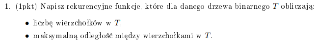

# Zadanie 1



Liczba wierzchołków w drzewie binarnym to wierzchołek, który właśnie sprawdzamy + liczba wierzchołków w prawym i lewym poddrzewie.

```python
def count_vertices(T):
    if T == None:
        return 0
    return 1 + count_vertices(T.left) + count_vertices(T.right)

```

A maksymalna odległość to będzie wysokość lewego poddrzewa + wysokość prawego poddrzewa.

```python
def height(T):
    if T == None:
        return 0
    return max(height(T.left), height(T.right)) + 1

def max_distance(T):
    return height(T.left) + height(T.right) + 1

```

# Zadanie 2


Będziemy działać na kopcu numer 2 z [notatki](https://aisd-notatki.readthedocs.io/en/latest/heaps/min-max/min-max-heap/).

Tablica będzie taka jak przy zwykłym kopcu. Czy jesteśmy na poziomie minimalnym czy maksymalnym będziemy determinować poprzez sprawdzenie !!\lfloor \log_2 i \rfloor \mod 2!!.

Zaczniemy sobie od przywracania porządku w kopcu. Będziemy potrzebować do tego procedur `przesuń_niżej`, rozbitej na dwie procedury w zależności od parzystości poziomu: `przesuń_niżej_min`, `przesuń_niżej_max`.

```python
# build heap jak w normalnym heapie, porządek przywrócamy przez przesuń_niżej jak coś zrobimy

def przesuń_niżej(K, i):
    if i jest na parzystym pietrze:
        przesuń_niżej_min(K, i)
    else:
        przesuń_niżej_min(K, i)

def przesuń_niżej_min(K[1..n], i):
    if i is not leaf:
        m = min(K[1..n], 2*i, 2*i+1, 4*i, 4*i+1, 4*i+2, 4*i+3) # minimalny dzieciok albo wnusio
        if m is dzieciok:
            if K[m] < K[i]:
                # jak jest więkzse od dziecka, które jest w rzędzie maksymalnym, to po prostu zamieniamy miejscami
                # to wystarczy, pod dzieciokiem są tylko większe wartości (bo wybrało nam dziecioka, a sprawdzaliśmy też wnuków)
                swap(K[m], K[i])
        else if m is wnusio:
            if K[m] < K[i]:
                # jeżeli wnusio jest mniejszy niż K[i], to zamieniamy ich miejscami, zeby minimum bylo gdzie powinno byc,
                # po czym sprawdzamy czy przypadkiem nie zaburzylismy wlasnosci kopca i ojciec (ktory jest na pietrze max)
                # jest teraz mniejszy niz syn. jak tak, to zamieniamy je miejscami. jako że teraz w K[m] jest wartość
                # większa niż wcześniej, musimy się upewnić, że nie jest ona nadal za duża na swoje miejsce.
                swap(K[m], K[i])
                if K[m] > K[parent(m)]:
                    swap(K[m], K[parent(m)])
                przesuń_niżej_min(K, m)

def przesuń_niżej_max(K, i):
    # dokładnie to samo co wyżej tylko zamieniamy < na >, a > na <
```

Usunięcie minimum - jest zawsze w root

```python
def delete_min(K):
    K[1] = K[n]
    przesuń_niżej(K, 1)
```

Usunięcie maksimum - w dzieciach roota

```python
def delete_max(K):
    if K[2] > K[3]:
        K[2] = K[n]
        przesuń_niżej(K, 2)
    else:
        K[3] = K[n]
        przesuń_niżej(K, 3)
```

# Zadanie 3


Mega skomplikowane polecenie. Chodzi o to, że musimy wypisać wierzchołki w takiej kolejności, że jeśli jest krawędź !!v \rightarrow u!!, to !!v!! musi zostać wypisany przed !!u!!. Co więcej, ale nie musimy się tym na razie przejmować, bo zajmiemy się tym na końcu, to co zostanie wypisane ma być leksykograficznie pierwsze w porównaniu z innymi takimi wypisaniami. Na przykład, mając taki graf:


Porządkiem topologicznym jest "1 0 2" oraz "0 1 2". Chcemy żeby wypisało nam "0 1 2".

No i tera tak - jak to zrobić? Rozkimna jest taka, że jak jakiś wierzchołek nie ma krawędzi wchodzących, to ma tylko wychodzące (albo nie ma żadnych). Więc zawsze jak wypiszemy sobie te wierzchołki pierwsze, to będzie to poprawny początek porządku topologicznego. No i też jak jakiś wierzchołek usuwamy, to możemy usunąć jego krawędzie wychodzące. Przy tym, sprawdzamy destynację tej wychodzącej krawędzi - jeśli wierzchołek-destynacja nie ma już krawędzi wchodzących, to możemy go wypisać - bo jak były do niego krawędzie, to wierzchołki z których wychodziły zostały już wypisane, a jeśli ma krawędzie wychodzące, no to chcemy go teraz wypisać, żeby te wierzchołki do których prowadzi krawędź były po nim.

Algorytm:

```
Q - kolejka, są w niej wierzchołki bez krawędzi wchodzących (deg_in == 0)

while |Q| > 0:
    v = Q.pop()
    print v
    for each neighbour of v that we'll call u:
        remove edge v to u
        if deg_in(u) == 0:
            Q.append(u)
```

Ten algorytm realizuje ideę ktorą opisałem wyżej - wypisuje porządek topologiczny. Teraz, chcemy żeby wypisało nam leksykograficznie pierwszy porządek topologiczny. Jest to banalne - kolejkę Q zastępujemy kopcem minimalnym. W korzeniu zawsze będzie najmniejszy wierzchołek z !!deg\_{in} = 0!!. W ten sposób nasze wypisywane wierzchołki będą leksykograficznie posortowane, a algorytm wyprodukuje nam pierwszy leksykograficznie porządek topologiczny.

# Zadanie 4


Kolejny raz, zrozumienie polecenia to wyczyn. Ścieżka jest sensowna, jeśli będąc w wierzchołku !!u_i!!, najkrótsza ścieżka z !!u_i!! do !!v!! to !!x!!, a najkrótsza ścieżka z !!u\_{i-1}!! do !!v!! to **co najmniej** !!x+1!!. Jeszcze innymi słowy - ścieżka jest sensowna, jeśli będąc w wierzchołku !!u_i!! patrzymy sobie na naszych sąsiadów i mówimy - no dobra, stamtąd będzie bliżej do celu, idziem tam (wybieramy wierzchołek z którego ścieżka jest krótsza). Jeszcze innymi - z każdym krokiem musimy się zbliżać do celu. Musimy zatem zacząć od wyznaczenie najkrótszej ścieżki dla każdego wierzchołka do !!v!!. Robimy to przy użyciu algorytmu Dijkstry, jako że wagi nie są ujemne. Gdyby były, musielibyśmy użyć Bellmana-Forda.

Walnęliśmy Dijkstre, dla każdego wierzchołka wiemy, jaka jest najkrótsza droga z niego do v. Teraz chyba, wystarczy zliczyć ścieżki po wierzchołkach od !!u!! do !!v!!, takie że droga z kolejnego wierzchołka musi być krótsza od drogi z poprzedniego.

Idea algorytmu: Startujemy w !!u!!. Sprawdzamy wszystkich sąsiadów, których ścieżka jest krótsza od ścieżki z !!u!!. Dla każdego wierzchołka, wyliczamy ile jest z niego sensownych ścieżek do v,

```python
visited = [v]
paths = {}
paths[v] = 1

def find_sensible_paths(G, d, u, v):
    # d - tablica odległości do v
    if u == v:
        return

    for each neighbour of u:
        if d[neighbour] < d[u] and not visited[neighbour]:
            find_sensible_paths(G, d, neighbour, v)
        paths[u] = paths[u] + paths[neighbour]
    visited[u] = True

print(paths[u])

```

Wykona się to w czasie Dijkstra + nasza rekurencja. Każdy wierzchołek sprawdzamy raz, porównania sąsiadów (krawędzie) dwa razy, bo w dwie strony. Złożoność lepsza niż Dijkstra, więc możemy ograniczyć złożoność przez czas wykonywania się Dijkstry żeby stworzyć tablicę d.

Algorytm zawsze się skończy, bo odwiedzamy wierzchołki po razie i z każdym rozpatrzonym wierzchołkiem, wywołaniem naszej rekurencji, ta liczba maleje. Musimy udowodnić jeszcze, że rekurencja zwraca poprawną ilość ścieżek. :(

Zacznijmy od tego, że algorytm zawsze wybiera w kolejnym kroku wierzchołek, którego odległość do celu jest mniejsza niż jego poprzednika (wierzchołka z którego przyszliśmy do tego wierzchołka). W oczywisty sposób zachowujemy własność sensownej ścieżki - dla każdego wierzchołka na ścieżce, którą znaleźliśmy, odległość !!u_i!! od !!v!! jest mniejsza niż niż odległość !!u\_{i-1}!! do !!v!!. Zatem faktycznie rozważamy sensowne ścieżki. To co robimy później, to dodanie do liczby sensownych ścieżek liczbę sensownych ścieżek sąsiadów. Musimy udowodnić, że liczba sensownych ścieżek z !!u!! do !!v!! to suma liczb sensownych ścieżek jego sąsiadów do !!v!!.

Załóżmy nie wprost, że istnieje wierzchołek !!u!!, dla którego liczba sensownych ścieżek nie jest sumą sensownych ścieżek jego sąsiadów. !!x!! - liczba sensownych ścieżek !!u!!, !!y!! - suma liczby sensownych ścieżek sąsiadów.

!!x \neq y!!. Każda sensowna ścieżka wychodząca z !!u!! musi przejść przez swojego sąsiada. Dla każdego sąsiada !!w!! wierzchołka !!u!!, liczba sensownych ścieżek z !!u!! do !!v!! przez !!w!! jest dokładnie równa liczbie sensownych ścieżek z !!w!! do !!v!!. Zatem, jeżeli x > y, to znaczy, że istnieją sensowne ścieżki nie przechodzące przez sąsiada !!u!!. Jeżeli x < y, to nie rozważyliśmy wszystkich ścieżek, bo możemy przejść do każdego sąsiada i stamtąd pójść do !!v!!, co da nam w sumie !!y!! ścieżek.

Ten dowód chyba jest zły, nie ufać.

# Zadanie 5


Musimy zacząć w jakimś wierzchołku, który nie ma krawędzi wchodzących. Na pewno taki istnieje, bo graf jest acykliczny. Gdyby ścieżka zaczynała się w wierzchołku, który ma krawędź wchodzącą, to zaczęcie ścieżki w tym wierzchołku z którego idzie krawędź dałoby dłuższą ścieżkę.

```python
Q - kolejka z wierzchołkami bez krawędzi wchodzących
def longest_path(G):
    # tutaj przechowujemy najdłuższą ścieżkę do wierzchołka i-tego,
    # do momentu w którym jesteśmy w algorytmie
    longest[amount of vertices in G] = { 0 } # initialized to 0
    while |Q| > 0:
        u = Q.pop()
        for each neighbour of u:
            longest[neighbour] = max(lognest[neighbour], longest[u] + 1)
            remove this edge
            if in_degree(v) == 0:
                Q.push(v)
    return max(longest)
```

to część pierwsza zadania, teraz musimy dodać wypisywanie drogi

```python
Q - kolejka z wierzchołkami bez krawędzi wchodzących
paths = []
def longest_path(G):
    # tutaj przechowujemy najdłuższą ścieżkę do wierzchołka i-tego,
    # do momentu w którym jesteśmy w algorytmie
    longest[amount of vertices in G] = { 0 } # initialized to 0
    while |Q| > 0:
        u = Q.pop()
        for each neighbour of u:
            longest[neighbour] = max(longest[neighbour], longest[u] + 1)
            if longest[u] + 1 > longest[neighbour]:
                paths[neighbour] = paths[u].push(neighbour);
                longest[neighbour] = longest[u] + 1
            remove this edge
            if in_degree(v) == 0:
                Q.push(v)
    i = index of longest
    return longest[i], paths[i]
```

# Zadanie 6


Dzielimy naszą tablicę wejściową na pół. Elementy z lewej tablicy parujemy z elementami z prawej. Dla najmniejszego elementu z tablicy lewej wybieramy najmniejszy element z tablicy prawej (spełniające warunki). Jeśli nie znajdziemy dla skrajnie lewego wyrazu lewej tablicy pary w prawej tablicy, to znaczy, że tym bardziej nie znajdziemy dla niego pary w tablicy lewej (bo elementy są mniejsze bądź równe). Co więcej, nie znajdziemy też żadnej kolejnej pary, bo skoro minimalny element pomnożony przez 2 jest większy od maksymalnego, to większe od minimalnego elementy też nie stworzą pary.

Dowód:
Weźmy rozwiązanie optymalne i posortujmy je po pierwszym elemencie pary.

Weźmy dwie pierwsze pary: !!(a_i, a_j)!! oraz !!(a_k, a_l)!!. Zauważmy, że !!a_i \leq a_j \leq a_k \leq a_l!!.
Skoro tak, to jak zamienimy !!a_j!! oraz !!a_k!! miejscami, usunięcie takich par nadal jest poprawne (w pierwszej parze zwiększa się drugi element pary, w drugiej parze zmniejsza się pierwszy).

Znajdźmy pierwszy element w rozwiązaniu optymalnym, gdzie lewy element pary jest z prawej połowy tablicy. Weźmy też pierwszą parę, gdzie drugi element pary jest z pierwszej połowy tablicy. W takiej sytuacji, możemy zamienić miejscami tak jak wyżej lewy i prawy element pary i nadal mamy poprawne pary. Proces powtarzamy dopóki nie będą istnieć pary gdzie lewym elementem pary jest coś z prawej połowy tablicy oraz takie, że prawym elementem jest coś z lewej połowy tablicy. Mamy rozwiązanie, gdzie lewym elementem pary jest coś z prawej połowy tablicy, a prawym coś z prawej. Posortujmy teraz po lewym elemencie pary. Teraz, idziemy se i jak mamy parę !!(a_i, x), (a_j, y)!! i !!x > y!!, to zamieniamy x i y miejscami, robimy tak aż prawa strona będzie posortowana. Możemy tak zrobić, bo skoro !!2a_j \leq y!! i !!a_j >= a_i!!, to !!2a_i \leq y!!. !!x!! jest większy od y, więc tym bardziej zależność w parze gdzie zaczynamy od !!a_j!! będzie spełniona.

Voila. Mamy rozwiązanie, gdzie najmniejszy element z tablicy lewej jest sparowany z najmniejszym elementem z tablicy prawej, dokładnie to co zwraca nasz algorytm. Każde rozwiązanie optymalne możemy sprowadzić do tego, co zwraca nasz algorytm, wykorzystując przekształcenia. Koniec dowodu.

# Zadanie 7


Sposób najprostszy: walimy Floyda-Warshalla (F-W) i sumujemy. Byłaby to złożoność !!O(kn^3)!!. Trzeba pogłówkować, bo pewnie da się pozbyć tego !!k!! i korzystać z tego co raz wyliczyliśmy w F-W.

Mój pomysł jest taki, że skoro jest to graf nieskierowany, to jedną przekątną tablicy mamy wolną (bo dystans z 2 do 3 jest taki sam jak 3 do 2). W jednej przekątnej zapisujemy najkrótszą ścieżkę (np. w tab[2][3]), a w tab[3][2] zapisujemy, przez który wierzchołek przechodziliśmy kiedy ustalaliśmy tą najkrótszą ścieżkę. Teraz, kiedy wyliczamy np. !!D_1!!, to jakoś sobie wywalamy albo oznaczamy w naszej tablicy, że wierzchołek !!v_1!! zniknął. Sprawdzamy w jednej przekątnej (!!\frac{n^2-n}{2}!!), czy jakieś ścieżki przez niego prowadziły. Jeśli tak, szukamy nowej ścieżki do połączenia tych dwóch wierzchołków w !!O(n)!!. Sumujemy nowe najkrótsze ścieżki (!!v_1!! wywalony), no i tak dla każdego. Możnaby zrobić jakąś listę np. dla !!v_1!! mówiącą, które ścieżki idą przez !!v_1!!, wtedy szukanie po usunięciu !!v_i!!, co tam trzeba zupdateować byłoby w czasie stałym (czy tam liniowym). W takim razie złożoność przy takiej modyfikacji to byłoby !!O(n^3 + kn) = O(n^3)!!. Pamięć !!O(n^2)!!.

# Zadanie 8


Innymi słowy, musimy znaleźć najmniejszy przedział, w którym znajduje się co najmniej jedna z wartości każdej z list.

Użyjemy kopca minimalnego. W każdym węźle będziemy potrzebować wartości oraz numerka listy, z której pochodzi ten element. Na początek wrzucamy na niego pierwszy element każdej listy. Zapisujemy sobie minimum i maksimum. Maksimum - minimum to nasze obecne r, [minimum, minimum + r] to nasz obecny najmniejszy przedział. Chcemy go zawęzić. W takim razie, z naszego kopca usuwamy element minimalny, sprawdzamy z której listy pochodził i wrzucamy na nasz kopiec kolejny element z tej listy. Aa, jako że nie możemy modyfikować list, to w węźle będziemy przechowywać trzy wartości - oprócz wartości, numerka listy, potrzebujemy też indeksu tego elementu na tej liście. Gdybyśmy mogli modyfikować listy to wyciągając z listy element byśmy se go usuwali i zawsze pierwszy element listy byłby tym kolejnym którego potrzebujemy. No i tak robimy w kółko, uaktualniając !!r!! jako minimum z !!r!! i obecne minimum - obecne maksimum. Co jeżeli usuwając minimum kopca okazuje się, że nie ma więcej elementów na liście z której mamy wrzucić na kopiec kolejną wartość? Otóż oznacza to, że nie damy rady już bardziej zawęzić naszego przedziału. W tym momencie kończymy nasz algorytm.

```python
def find_smallest_r(L[k]):

    Q = min_heap()
    for i in range(k):
        Q.push((L[i][0], i, 0))

    r = Q.maks() - Q.min()

    while True:
        val, arr_k, index = Q.extract_min()
        if index >= L[arr_k].length:
            break
        Q.push(L[arr_k][index+1], arr_k, index+1)
        r = min(r, Q.maks() - Q.min())

    return r
```

Pamięciowo: !!O(k)!!, bo tworzymy tylko kopiec i w dowolnym elemencie ma on tylko 1 element z k tablic. Liczba operacji to będzie !!O(n \log k)!!, gdzie !!n!! to liczba wszystkich liczb. Każdy element rozpatrzamy maksymalnie raz (minimalnie 0), a operacje na kopcu to !!\log k!!.

Algorytm na pewno się zakończy, bo przy każdym przejściu pętli przesuwamy indeks którejś z tablic o 1, a przerywamy kiedy indeks nie mieści się w tablicy (koniec końców dotrzemy do końca którejś tablicy). Algorytm zwraca poprawny wynik, ponieważ w każdym momencie algorytmu, !!r!! jest minimalne dla rozważonych dotychczas elementów. Kończymy algorytm kiedy dojdziemy do końca którejś z tablic, co oznacza że rozpatrzyliśmy wszystkie elementy tej tablicy, a w !!r!! jest minimalna wartość.

# Zadanie 9


## Rozwiązanie złe, złożoność !!O(k \log k)!!

Weźmy taki kopiec:  


Root to oczywiście maksimum. Gdzie szukać kolejnego maksimum? W jego dzieciach, oczywiście. Mamy 90, 89. Gdzie szukać kolejnego maksimum? Oczywiście, jest to albo ten drugi dzieciok 90, albo dziecko 89. Zatem, wystarczy zrobić se drugi kopiec maksymalny na boku. W każdym kroku, będziemy dodawać do niego dzieci obecnego maksymalnego elementu (ich wartość i indeks).

Zatem, załóżmy że k = 5.

Wypisujemy 90. Do kopca pomocniczego dodajemy 89 i 70.


Wybieramy maksimum z kopca pomocniczego. Jest to 89, wypisujemy je i dodajemy jego dzieci do kopca maksymalnego.


Powtarzamy aż wypiszemy 5 dzieci, czerwone węzły to wypisane.


Wybieramy 70 i mamy wypisane 5 największych liczb, gdyby k było większe od 5 to dorzucilibyśmy na kopiec dzieci 70, tj. 63 i 65 i kontynuowalibyśmy.

Algorytm:

```python
def find_k_largest(Q, K):
    max_val = Q.extract_max()
    Q_pom = max_heap()
    Q_pom.push((Q[2*i], 2*i))
    Q_pom.push((Q[2*i+1], 2*i+1))
    print(max_val)
    k = 1
    while k < K:
        max_val, max_i = Q_pom.extract_max()
        Q_pom.push((Q[2*max_i], 2*max_i))
        Q_pom.push((Q[2*max_i+1], 2*max_i + 1))
        print(max_val)
        k += 1
```
