# Zadanie 1

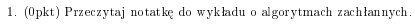

[notatka ale moja](https://aisd-notatki.readthedocs.io/en/latest/greedy/greedy-algos/)

# Zadanie 2

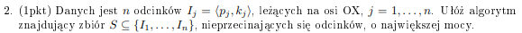

Sortujemy po drugiej współrzędnej. Później bierzemy elementy które kończą się najwcześniej, później te które kończą się po tym i najwcześniej, no i tak dalej....

Algorytm:

```python
def most_segments(S):
    S.sort(x => x.end)
    last_end = inf
    SEGMENTS = {}
    for each segment in S:
        if (segment.start > last_end):
            SEGMENTS.append(segment)
            last_end = segment.end
    return SEGMENTS
```

No i musimy udowodnić że jest to poprawne rozwiązanie.

Weźmy rozwiązanie optymalne !!OPT!! oraz nasze !!ALG!!. Posortujmy je. Teraz, weźmy pierwszy odcinek z !!OPT!! który różni się od tego w !!ALG!!. W sensie jakiś prefix jest taki sam, w końcu gdzieś się rozwiązania różnią. Niech ten odcinek z !!OPT!! to będzie !!S!!.

Jeżeli !!S!! kończy się wcześniej niż odcinek na tej pozycji w naszym algorytmie, to niemożliwe, bo nasz algorytm by go wybrał. Jeżeli kończy się w tym samym miejscu, to nie ma znaczenia. Jeżeli kończy się później, to ilość wybranych odcinków będzie taka sama, albo nasz zbiór będzie lepszy, w razie gdyby jakiś odcinek zaczynał się po zakończeniu naszego i kończył przed zakończeniem tego ze zbioru optymalnego.

# Zadanie 3

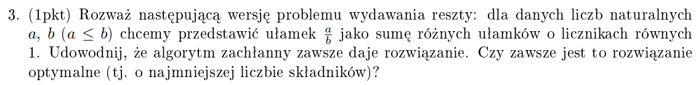
Nasza strategia zachłanna, to branie ułamków !!\frac{1}{1}, \frac{1}{2}, \frac{1}{3}, \frac{1}{4}!! itd. Jeżeli ten ułamek jest !!\leq!! od tego co mamy wydać, no to go wydajemy.

```python
def fractions_1(a, b):
    frac = a/b
    current_denom = 1
    while frac != 0:
        if 1/current_denom <= frac:
            print(f"1/{current_denom}")
            frac -= 1/current_denom
```

Dowód, że algorytm zawsze daje rozwiązanie:
Wiemy, że każdy ułamek da się przedstawić jako sumę różnych ułamków o licznikach równych 1, w przeciwnym wypadku nie istniałby żaden algorytm rozwiązujący ten problem, nie istniałoby także rozwiązanie optymalne.

Dowód:

przypadek podstawowy to próba zmniejszenia ułamka o 1, jeżeli a = b to wypisujemy 1/1 i kończymy. Jeżeli się nie uda, to !!\frac{a}{b} < \frac{1}{1}!!. Kontynuujemy program.

Rozważamy !!\frac{1}{d}!! i wiemy, że !!\frac{a}{b} < \frac{1}{d-1}!!.  
Jeżeli !!\frac{a}{b} < \frac{1}{d}!!, to znaczy że rozważany ułamek się nie mieści. Idziemy dalej, warunek nadal zachodzi. Idziemy tak, aż dojdziemy do przypadku:  
!!\frac{a}{b} \geq \frac{1}{d}!!. Jeżeli jest równe, to wypisujemy ten ułamek i kończymy algorytm, jeżeli !!\frac{a}{b}!! jest większe to mamy:
$$ \frac{1}{d} < \frac{a}{b} < \frac{1}{d-1} $$

Odejmujemy !!\frac{1}{d}!! i mamy:

$$ 0 < \frac{a}{b} - \frac{1}{d} < \frac{1}{d-1} - \frac{1}{d} $$

Udowodnimy, że jest to mniejsze od !!\frac{1}{d}!!.

!!\frac{a}{b} - \frac{1}{d} < \frac{1}{d-1} - \frac{1}{d} = \frac{1}{(d-1)d} < \frac{1}{d}!!

Wiemy zatem, że zawsze po wzięciu ułamka reszta do wydania będzie od niego mniejsza. Korzystając z tego, że każdą resztę da się wydać i że nasz algorytm rozważa największy możliwy mianownik mniejszy od liczby do wydania, zawsze da nam on odpowiedź.

To co robi nasz algorytm, to takie rozważanie sumy ułamków:
!!\frac{1}{1} + \frac{1}{2} + \frac{1}{3} + \frac{1}{4} + .. !!

i branie tylko mieszczących się ułamków, np:
!!0 \cdot \frac{1}{1} + 0 \cdot \frac{1}{2} + 1 \cdot \frac{1}{3} + 0 \cdot \frac{1}{4} + .. !!

Zauważmy na mocy tego co udowodniliśmy, że jak weźmiemy jakiś ułamek, to zostaje nam do wydania !!\frac{a}{b} - \frac{1}{d}!! oraz !!\frac{a}{b} - \frac{1}{d} < \frac{1}{d}!!, więc szukanie tego jak rozbić ten ułamek powinno się odbywać dokłanie od następnego ułamka po !!\frac{1}{d}!!, co jest dokładnie tym co robi nasz algorytm.

Czy jest to optymalne rozwiązanie? Kontrprzykład:
!!\frac{1}{3} + \frac{1}{5} + \frac{1}{7} = (alg) \frac{1}{2} + \frac{1}{24} + \frac{1}{840} + ....!!

# Zadanie 4

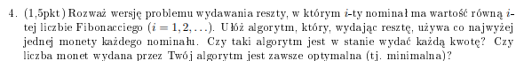

Tematem tego zadania jest [twierdzenie Zeckendorfa](https://en.wikipedia.org/wiki/Zeckendorf%27s_theorem).

Oczywiście zachłanny algorytm bierze największą liczbę jaka się mieści - tworzy to tak zwaną reprezentację Zeckendorfa.

```python
def find_zeckendorf_representation(n):
    while n >= 0:
        # memoizujemy wyniki w drodze do największego, żeby nie liczyć więcej niz raz
        f = find greatest fibonacci number smaller than n
        # możemy skipnąć kolejnego fiba - jak się zmieścił Fi,
        # to znaczy że Fi-1 się nie zmieści - inaczej zmieściłby się Fi+1,
        # a Fi nie byłby największym mieszczącym się
        n -= f
```

Udowodnimy, że:

1. każda liczba ma reprezentację zeckendorfa
2. rozwiązanie jest optymalne

ad 1.  
Indukcyjnie.  
Założenie indukcyjne: każde a < n ma postać Zeckendorfa  
Podstawa = 0, 1, 2, 3, 4:

!!F_0 = 0!!
!!F_1 = 1!!
!!F_3 = 2!!
!!F_4 = 3!!
!!F_4 + F_1 = 4!!

Krok:
Wiemy, że istnieje !!j!! takie, że !!F\_{j+1} > n > F_j!!.
Weźmy te !!F_j!!. Weźmy !!b = n - F_j!!. Z założenia indukcji, !!b!! ma postać Zeckendorfa, bo !!b < n!!. Co więcej, z powyższej nierówności dostajemy, że !!b = n - F_j < F\_{j+1} - F_j = F\_{j-1}!!. Wiemy zatem, że jak weźmiemy do naszej sumy !!F_i!!, to na pewno nie weźmiemy do niej !!F\_{i-1}!!. Mówi nam to, że w sumie nie będziemy mieć dwóch takich samych wyrazów w naszej sumie.

ad 2.
**Taki se dowód, niżej lepszy**

Weźmy rozwiązanie optymalne OPT i naszego algorytmu ALG. Weźmy !!i!! - pierwszy indeks, na którym nasze odpowiedzi się różnią, od największej.

!!y = ALG[i] = F_k!!
!!x = OPT[i] = F_l!!

!!x > y!!: niemożliwe, nasz algorytm wziąłby !!x!!  
!!x = y!!: niemożliwe, wzięliśmy !!i!! na którym się różniły  
!!x < y!!:

Weźmy:  
!!d = y - x!!  
!!sum!! = ile musi wydać jeszcze !!ALG!!  
!!sum + d!! = ile musi wydac !!OPT!!

Zauważmy, że jeżeli sum + x > x (a tak jest oczywiście), to żeby nadrobić !!F_k!! którego OPT nie wziął, będzie musiał wziąć !!F\_{k-1}!!. To dlatego, że !!F\_{n+2} - 1 = \sum\_{i=0}^{n} F_i!! - nie wiem czy wymaga to dowodu, ale byłby prosty. Zatem gdyby OPT nie wziął zarówno !!F_k!! i !!F\_{k-1}!!, to suma wszystkich fibonaczich od !!F\_{k-2}!! w dół nie dałaby rady nadrobić !!F_k!!.

Zatem !!l = k-1!!, !!y = F\_{k-1}!!. Teraz, jeżeli !!F\_{k-2} \in OPT!!, to wymiana !!F\_{k-1}, F\_{k-2}!! na !!F\_{k}!! dałaby lepsze rozwiązanie. Jeżeli !!F\_{k-2}!! nie jest w zbiorze optymalnym, to będziemy musieli je zastępować mniejszymi wyrazami i będzie ich więcej. Ta końcówka dowodu jest taka se, trzeba to zrobić jakoś żeby pokazać, że !!F\_{k-2}!! musi być w tym zbiorze, albo że zbiór będzie wtedy większy, a to za bardzo tego nie pokazuje, machanie łapami.

**ten lepszy dowód**  
Weźmy różnicę zbiorów ALG i OPT.

!!RA = ALG / OPT!!  
!!RO = OPT / ALG!!

Wiemy, że suma w ALG i OPT była taka sama, po usunięciu ich wspólnych elementów, suma RA i RO też musi być taka sama.
Jeżeli RA i RO to zbiory puste, no to udowodniliśmy ALG = OPT. Jeżeli obydwa coś mają, to sprzeczność - weźmy ich największe elementy.

Zauważmy, że największy element w zbiorze musi być większy niż suma pozostałych elementów tego zbioru. To dlatego, że w zbiorach nie będziemy mieć następujących po sobie liczb Fibonacciego, bo wtedy dalibyśmy sobie po prostu ich sumę i byłoby optymalniej. Jako, że !!F\_{n+2} > \sum\_{i = 0}^n Fi!!, to suma będzie mniejsza (jako że max to !!F\_{n+2}!!, a druga maksymalna to !!F_n!!, bo nie ma kolejnych po sobie liczb). Wychodzi nam z tego, że suma wartości w naszych zbiorach będzie z góry ograniczona przez następną po maksymalnej liczbie Fibonacciego w tych zbiorach (max !!F_n!! w którymkolwiek ze zbiorów, to suma mniejsza od !!F\_{n+1}!!).

Jeżeli największą wartością w jednym ze zbiorów jest !!F_j!!, to największą wartością w drugim z nich jest co najwyżej !!F\_{j-1}!!. Zatem w zbiorze z mniejszą wartością, suma będzie na pewno mniejsza od !!F_j!!. Ale jak to, suma będzie mniejsza od !!F_j!!, skoro zbiory mają taką samą sumę, a zbiór z większą wartością **zawiera** !!F_j!!? Sprzeczność.

Jeżeli jeden ze zbiorów jest pusty a drugi nie, to też sprzeczność - no bo nie będą mieć tej samej sumy. Zatem ALG = OPT, co należało udowodnić.

# Zadanie 5

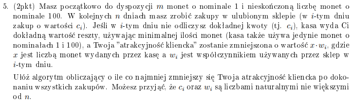

To jest zadanie, w którym trzeba pomyśleć. Kilka obserwacji:  
po pierwsze, albo w dniu płacimy tylko stówkami, albo równo. Zatem albo bierzemy całą karę na klatę, albo nie bierzemy jej w ogóle.Kombinacja stówki + monety tylko zmniejszają nam pulę monet a zwiększają karę - bo jak musimy zapłacić np. 70 i damy kasjerce 100, to dostaniemy 30 kary. Jeżeli damy jej troszku monet, ale mniej niż równo, to o tyle monet więcej będzie musiała nam wydać.
po drugie, !!c_i!! możemy zrobić !!\mod 100!!, jako że stówek mamy nieskończoność i w każdym momencie w sumie jedyna rzecz nad którą się zastanawiamy, to czy wydać monety.

Co tu właściwie chcemy minimalizować? Odpowiedź: karę którą zapłacimy, jeżeli rzucimy stówką.

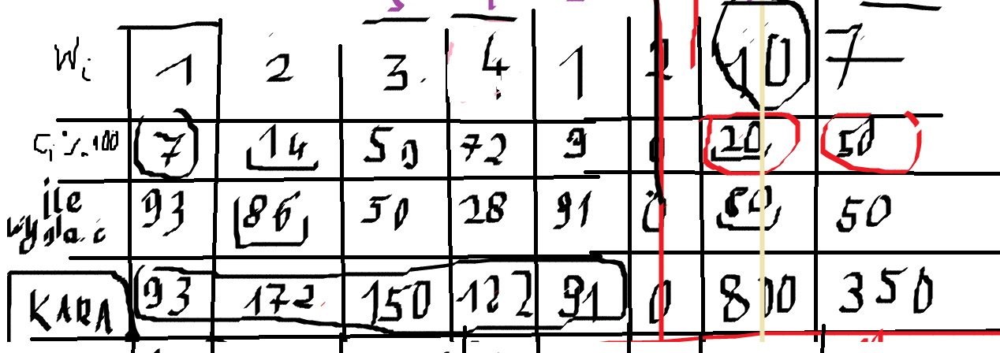

Sory za taki obrazek, dowód że było kminione. Mamy 4 wiersze: wagi, wymagane monety, ile będzie musiał nam wydać pan kasjer, jaką dostaniemy karę jak zapłacimy stówą. Właściwie, obchodzi nas tylko ostatni wiersz - w dniu, gdzie możliwa kara jest najwyższa, chcemy zapłacić równo.

Rozwiązanie: bądźmy tak zachłanni, jak tylko się da. W każdym kroku, jeżeli mamy wystarczająco monet żeby zapłacić,
to płacimy, a ten dzień wrzucamy do kopca minimalnego jako wartość możliwej kary: waga \* ile monet musi nam wydać. Nie musimy wrzucać samego dnia, bo obchodzi nas tylko jaka co najmniej będzie kara, nie obchodzi nas w które dni rzuciliśmy stówką, a w które monetami.
Jeżeli w jakiś dzień nie będziemy mieli wystarczająco !!m!! żeby zapłacić, a możliwa kara jest wyższa niż minimalna w kopcu -
zdejmujemy dzień z kopca, mówimy - dobra, w ten dzień jednak nie wydajemy monet, płacimy stówką. Do puli naszych monet dodajemy
100 - bo to co wydaliśmy już jest zapłacone, teraz tak jakby zabieramy z lady to czym zapłaciliśmy i leci z powrotem do portfela,
rzucamy stówką, dostajemy 100 - tyle ile wydaliśmy tego dnia. Łacznie: 100 - tyle ile wydaliśmy + tyle ile wydaliśmy. Bierzemy tą minimalną karę na klatę, ale gdybyśmy jej nie wzięli, to musielibyśmy zapłacić więcej kary jeżeli dziś rzucimy stówką.

Priorytetem w kopcu mogłaby być teoretycznie waga i dałoby to też spoko odpowiedź, jednak zauważmy, że jeżeli tego dnia, gdzie waga jest mniejsza kasjerka będzie musiała wydać więcej monet, to sumarycznie dostaniemy większą karę. Przykładowo, gdybyśmy mieli zdjąć z kopca dzień z wagą 9, gdzie musimy zapłacić kasjerce jedną monetę, to za ten dzień dostaniemy !!9 \cdot 99!! kary. Załóżmy, że dzisiaj nas nie stać i waga tego dnia to 10, jednak musimy zapłacić kasjerce 99 monet. Wtedy nie pyli się zdejmować z kopca dzień z niższą wagą, bo dostaniemy karę !!9 \cdot 99!!, a jak weźmiemy karę za obecny dzień z większa wagą na klatę, to dostaniemy !!10 \cdot 1!! kary.

```python
def minimal_punishment(W, C, m, n):
    # wartości robimy % 100
    C = C.map(val => val % 100)
    Q = min_heap_mock()
    for i in range(n):
        # zawsze jak nas stać to płacimy
        possible_punishment = W[i]*(100-C[i])
        if m >= C[i]:
            m -= C[i]
            Q.push(possible_punishment)
        elif Q.min().punishment < possible_punishment:
            Q.extract_min()
            # dostajemy x monet którymi płacliliśmy z powrotem,
            # a do tego 100-x od kasjerki za zapłacenie stówką
            m += 100
            Q.push(possible_punishment)
        else:
            # możliwa kara jest mniejsza od minimalnej. chetnie rzucamy stowke
            m += 100 - C[i]

    # przeszliśmy optymalnie przez dni, w kopcu są dni w których zapłaciliśmy równo
    max_punishment = 0
    for i in range(n):
        max_punishment = (100 - C[i]) * W[i]

    min_punishment = max_punishment

    while not Q.is_empty():
        punishment = Q.extract_min()
        # tego dnia zapłaciliśmy - są to zatem wartości kar, których uniknęliśmy
        min_punishment -= punishment

    return min_punishment
```

Dowód poprawności.  
Weźmy rozwiązanie !!OPT!! i !!ALG!!. Zakładamy, że kara jaką dostajemy płacąc w dni które wyznaczy !!OPT!! wyliczonymi monetami jest mniejsza niż !!ALG!!. Zakładam sobie, bez straty ogólności, że nasz algorytm zwraca nam nie tylko minimalną karę, ale też dni w które zdecydował się zapłacić wyliczonymi monetami. W algorytmie tego nie zapisujemy, choć bezproblemowo moglibyśmy - jednak jest to zbędne, ale przyda się do dowodu.

Weźmy pierwszy dzień, w którym OPT zdecydował się zapłacić monetami, a ALG nie. ALG na pewno tego dnia zapłacił monetami, bo zachłannie płacimy każdego dnia. Miał te monety, bo OPT płacił monetami a jest to pierwszy dzień, gdzie ALG nie zapłacił monetami, więc mieli tyle samo. Jeżeli nasz ALG się wycofał z płacenia monetami tego dnia, to znaczy, że później grozi nam kara większa niż kara, którą dostajemy tego dnia. Jeżeli OPT tego dnia zapłacił, a ALG nie, to znaczy że OPT nie stać tego dnia z większa karą na pokrycie zakupu monetami, zatem jego kara jest większa. Zatem OPT nie jest optymalny.

Jeżeli nie istnieje pierwszy dzień gdzie OPT płaci monetami a ALG nie, to znaczy że albo OPT = ALG, albo OPT jest gorszy, bo OPT pokrywa dokładnie te same dni co ALG, ale ALG dodatkowo pokrywa jeszcze co najmniej jeden inny dzień, więc jego kara jest mniejsza.

Disclaimer: nie wiem, czy ten dowód, że OPT wziął dzień którego nie wziął ALG jest wystarczyjąco dobry.

# Zadanie 6

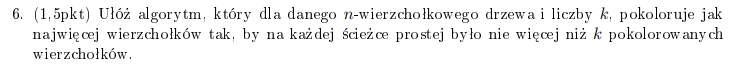

Zauważmy, że dowolna ścieżka jest podścieżką ścieżki, która ma swoje końce w liściach.
Zatem możemy się zajmować tylko ścieżkami, które mają swoje końce w liściach.

No to dla k = 0, nie kolorujemy nic.  
Dla k = 1, kolorujemy dowolny wierzchołek (z każdego wierzchołka można dojść do każdego).  
Dla k = 2, kolorujemy liście.  
Dla k = 3, kolorujemy liście i dowolny wierzchołek.  
Dla k = 4, kolorujemy liście, usuwamy liście, kolorujemy dodatkowo te w nowo-powstałym drzewie.  
Dla k = 5, to co w k = 4 i dowolny wierzchołek  
Pattern chyba widać: kolorujemy !!\lfloor k/2 \rfloor!! "poziomów liści", no i jak k jest nieparzyste to do tego dowolny wierzchołek.

```python
def color_tree(T, k):
    while k > 1 and T is non-empty:
        pokoloruj liście T
        usuń liście z T
        k -= 2
    if k == 1:
        pokoloruj dowolny wierzchołek
```

Przez "liście na k-tym poziomie liści" będę miał na myśli liście, które byłyby liśćmi po usunięciu k-1 razy liści z drzewa.

Poprawności dowodzimy poprzez pokazanie, że każde rozwiązanie optymalne albo nie jest optymalne, albo da się je sprowadzić do rozwiązania naszego algorytmu.
Dla k = 1, kolorujemy dowolny wierzchołek. Jeżeli w rozwiązaniu optymalnym jest pokolorowane więcej niż 1 wierzchołek, weźmy ścieżkę między nimi.
Zawiera ona 2 pokolorowane wierzchołki. Jeżeli ma 0, to jest nieoptymalna. Weźmy jedyny pokolorowany wierzchołek, odmalujmy go i pomalujmy tego,
który wybrał nasz algorytm.

OPT = ALG

Dla k parzystego:
Jeżeli OPT =/= ALG, to znaczy, że są jakieś niepomalowane liście w OPT. Z optymalności OPT, musi być jakiś wierzchołek wewnętrzny, który jest pomalowany.
Weźmy ścieżkę zawierającą k pokolorowanych wierzchołków, zaczynającą się w v. Dla drzewa niebędącego ścieżką, są przynajmniej 2 takie ścieżki. Weźmy je.
Weźmy ich najdłuższy wspólny prefiks. Jeżeli zawiera on pokolorowany wierzchołek wewnętrzny, odkolorujmy go i pomalujmy v. Nie zmieniliśmy
ilości pomalowanych wierzchołków na maksymalnej ścieżce. Jeżeli ten wierzchołek wewnętrzny nie był w wspólnym prefiksie, to znaczy że jedna z tych ścieżek będzie dłuższa od drugiej,
co przeczy temu że obydwie były maksymalne.

Dla k nieparzystego:
To co wyżej, usuwamy wszystkie poziomy liści, zostaje nam drzewo bez pomalowanych wierzchołków, możemy pomalować dowolony i niczego nie zepsujemy.

# Zadanie 7

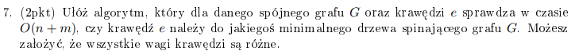

e (u, v) jest w MST na pewno, jeżeli nie jest częścią żadnego cyklu. Z dyskretnej wiemy, że jeżeli mamy cykl C, to jego najcięższa krawędź na pewno nie będzie w MST.
Uruchamiamy BFSa/DFSa z u lub v, bez straty ogólności zakładam że z u. Poruszamy się tylko po krawędziach których waga jest mniejsza od e. Jeżeli na koniec dojdziemy do v,
no to niestety e jest najcięższą krawędzią w cyklu. Jeżeli nie dojdziemy, to są krawędzie lżejsze od e, więc e znajdzie się w MST.

Złożoność !!O(n + m)!!

Nie mam pojęcia dlaczego to jest za 2 punkty, może jednak trzeba udowodnić, że najcięższa krawędź cyklu nie będzie w MST?
Załóżmy nie wprost, że mamy w grafie cykl C i w MST znajduje się najcięższa krawędź tego cyklu. Weźmy krawędź z MST, która została wyrzucona z cyklu. Jest lżejsza od tej najcięższej. Wywalmy najcięższą. Mamy dwa spójne drzewa, usunięcie krawędzi MST je rozspójnia. Dodajemy tą lżejszą. Drzewo jest znów spójne. Mamy lżejsze MST.

# Zadanie 8

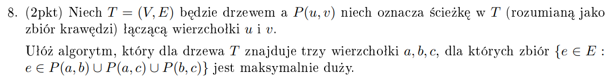

Moja idea, która jeszcze nie wiem czy działa. Rozważmy problem dla dwóch wierzchołków. Będzie to oczywiście najdłuższa ścieżka w drzewie (a -> b). No i teraz dodajemy trzeci wierzchołek. Jak? Szukamy liścia, który jest najbardziej odległy od każdego z wierzchołków na najdłuższej ścieżce. Jakby, szukamy najdłuższej ścieżki kończącej się na najdłuższej ścieżce.

Na początku szukamy najdłuższej ścieżki. Puszczamy BFSa z któregokolwiek wierzchołka. Znajdujemy wierzchołek najbardziej odległy od niego. Musi to być początek/koniec najdłuższej ścieżki. (\*p1) Nazwijmy ten wierzchołek a. Puszczamy drugiego BFSa, teraz z a. Znajdujemy najbardziej odległy od niego wierzchołek. Nazwijmy go b. Ścieżka a do b to najdłuższa ścieżka w drzewie. Znajdujemy sobie dokładnie tę ścieżkę - puszczamy BFSa z a (albo b), dla każdego odkrytego wierzchołka zapisujemy jego poprzednika. Odkrywając wierzchołek b, po poprzednikach dochodzimy do a i mamy wierzchołki z najdłuższej ścieżki. Teraz puszczamy BFSa z każdego liścia poza a/b i sprawdzamy dystans do najbliższego wierzchołka ze ścieżki. Weźmy tego liścia, dla którego ten dystans był najdłuższy. Nazwijmy go c.

Algorytm:

```python
def find_abc(V, E):
    v = random(V)
    distances = BFS(v)
    # take vertice that's furthest away from v
    a = max(vertice => vertice.distance)
    distances = BFS(a)
    b = max(vertice => vertice.distance)

    # modified BFS returns path from b to a
    vertices_on_path = modified_BFS(a, b)

    c_candidates = []
    for each leaf from leaves - [a, b]:
        # and this modification return distance from leaf to closest vertice on longest path
        length = another_BFS_modification(leaf, vertices_on_path)
        c_candidates.append((leaf, length))

    # return vertice that has max distance
    c = max(c_candidates)

    return (a, b, c)

```

Dowód p1 - biorąc randomowy wierzchołek !!w!! i puszczając z niego BFSa, najdalszy od niego wierzchołek !!a!! jest początkiem/końcem najdłuższej ścieżki w drzewie.

Załóżmy nie wprost, że tak nie jest. Weźmy najdłuższą ścieżkę S (!!S_1 \rightarrow S_2!!). Wiemy, że wierzchołek !!a!! na niej nie leży. Weźmy wierzchołek !!v!! najbliższy !!w!!, który należy do S. Załóżmy, że odległość od !!w!! do !!a!! to !!x!!, długość najdłuższej ścieżki to !!y!!, a odległość od !!w!! do !!v!! to !!z!!.

Rozważmy dwa przypadki.  
Pierwszy: !!v!! leży na drodze z !!w!! do !!a!!. Weźmy wierzchołek !!v_2!!, w którym ścieżki się rozdzielają - jedna zaczyna iść w stronę !!a!!, druga w stronę !!S_2!! (czy tam !!S_1!!, bez straty ogólności). Wiemy, że odległość !!v_2 \rightarrow S_2 > v_2 \rightarrow a!!, bo inaczej najdłuższa ścieżka byłaby dłuższa gdyby z !!v_2!! szła do !!a!!. Ale w takim razie, idąc !!w \rightarrow v \rightarrow v_2 \rightarrow S_2!! droga jest dłuższa niż !!w \rightarrow a!!. Zatem !!a!! nie był najdalszym wierzchołkiem. Sprzeczność.

Drugi: !!v!! nie leży na drodze z !!w!! do !!a!!. Wiemy, że ścieżka !!w \rightarrow S_2!! jest krótsza niż ścieżka !!w \rightarrow a!!. Zatem ścieżka !!v \rightarrow S_2!! jest krótsza niż ścieżka !!v \rightarrow a!!. Idąc z !!v!! do !!a!! zamiast do !!S_2!! otrzymujemy dłuższą najdłuższa ścieżkę. Sprzeczność.

Zatem p1 jest prawdziwe.

Dowód poprawności wyboru a, b, c.

Disclaimer: Jeżeli ktoś stąd zgapia rozwiązanie, ten dowód jest chyba zbyt przekminiony i raczej istnieje jakiś dużo lepszy sposób żeby to udowodnić, warto się pogłówkować zanim zagmatwacie się w moim.

Załóżmy nie wprost, że istnieją lepsze wierzchołki d, e, f.

Bez straty ogólności, załóżmy że P(d, e) jest najdłuższą ze ścieżek P(d, e), P(d, f), P(e, f).

Rozważmy dwa przypadki.

|P(d, e)| = |P(a, b)|, zatem P(d, e) jest jedną z najdłuższych ścieżek w drzewie. Jako, że w drzewie istnieje dokładnie jedna droga pomiędzy dwoma dowolnymi wierzchołkami, to P(d, f) !!\cup!! P(e, f) = P(d,e) - P(d, f) !!\cup!! P(e, f). W sensie, że ścieżka z f do d i ścieżka z f do e łącznie zawierają między innymi wszystkie krawędzie ze ściezki P(d, e). Weźmy wierzchołek najbliżej f, który leży na ścieżce P(d, e). Istnieje, bo albo byłaby inna najdłuższa ścieżka, albo nasz graf byłby po prostu ścieżką prostą, a wtedy wystarczy wziąć liście + dowolny wierzchołek. Niech będzie to wierzchołek k. Jako że P(d, e) = P(a, b) = maksymalna ścieżka i d, e, f to lepsze wybory, to żeby zmaksymalizować długość P(f, k) f musi być liściem - inaczej d, e, f nie byłyby najlepsze, bo mamy dodatkową krawędź lecąc od k przez f do liścia. Zatem długość P(f, k) = długość najdłuższej ścieżki od liścia do najdłuższej ścieżki w grafie. Jest to dokładnie to, co znajduje nasz algorytm. Nasze rozwiązanie jest zatem tak samo dobre jak optymalne.

Przypadek drugi - P(d, e) nie jest najdłuższą ścieżką w grafie.

Zauważmy, że d, e, f to liście - inaczej dałoby się więcej krawędzi. Rozważmy dwa podprzypadki.  
Pierwszy jest taki, że ścieżka P(d, e) nie ma wspólnego wierzchołka ze ścieżką P(a, b). Zauważmy, że w dowolnej odnodze drzewa, gdzie wierzchołki nie są wspólne z najdłuższą ścieżką, maksymalna długość ścieżki jest mniejsza bądź równa połowie długości najdłuższej ścieżki - inaczej maksymalna ścieżka weszłaby w tą odnogę i byłaby inna maksymalna ścieżka. Jeżeli P(d, e) jest najdłuższą ze ścieżek pomiędzy d, e, f, to długość ścieżki f -> P(d, e) jest maksymalnie połową długości tej ścieżki. Zatem jeżeli P(d, e) nie ma wspólnego wierzchołka z P(a, b), to maksymalna moc zbioru z wierzchołkow d, e, f to połowa P(a,b) + połowa połowy P(a, b) = 0,75 |P(a, b)|. Zatem d, e, f, są gorszym wyborem niż a, b, c.  
Drugi podprzypadek jest taki, że P(d, e) i P(a, b) mają wspólny co najmniej 1 wierzchołek. Jeżeli f nie leży na P(a, b), to weźmy c = f. Wtedy droga od c do P(a, b) jest dłuższa niż droga od f do P(d, e), bo będziemy musieli wejść na P(d, e) i stamtąd pójść do f. Więc P(a, b) > P(d, e), a dobranie do a, b wierzchołka f doda nam więcej krawędzi niż dobranie go do P(d, e), zatem wybór a, b, c jest optymalniejszy. Jeżeli f leży na P(a, b), to f = a lub f = b (bo f musi być liściem). Załóżmy, że k jest pierwszy wierzchołkiem od f wspólnym z P(d, e). Jeżeli |P(f, k)| < 1/2 |P(a, b)|, to wybór drugiego wierzchołka a/b dawałby długość >= 1/2|P(a, b)|. Byłoby to optymalniejsze. A jednocześnie przeczyłoby założeniu, że P(d, e) jest mniejsze od P(a, b). Zatem jeżeli f jest optymalne, to nie może leżeć na P(a, b). Zatem mamy sprzeczność, bo wiemy też że nie może na niej nie leżeć. Zatem P(d, e) i P(a, b) nie mogą mieć wspólnych wierzchołków. Ale wiemy też, że nie mogą ich nie mieć. Sprzeczność. P(d, e) musi być najdłuższą ścieżką w grafie, jeżeli jest to wybór optymalny. A jeżeli P(d, e) jest najdłuższą ścieżką w grafie i wybór d, e, f jest optymalny, to jest on tak samo dobry jak nasz.

# Zadanie 9

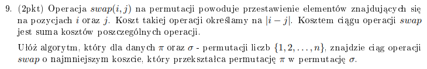

Na początku zauważmy, że jeżeli na !!i!!-tym indeksie jest coś, co powinno się znaleźć na !!j!!-tym, to za przesunięcie !!i!!-tego na !!j!!-ty zawsze zapłacimy !!|i - j|!!, niezależnie od tego, czy będziemy przesuwać po 1 małym swapie w stronę !!j!!, czy od razu zamienimy je miejscami. Jedyne czym musimy się martwić, to przesuwanie elementów w taki sposób, że zwiększamy ich odległość od miejsca w którym mają się docelowo znaleźć.

Znajdźmy zatem pierwszy element z lewej, który chce zostać przesunięty jak najbardziej w prawo. Teraz znajdźmy pierwszy po nim element, który chce trafić na jego pozycję lub przed jego pozycję. Zamieńmy je miejscami. Zauważmy, że jest to zamiana optymalna - obydwa elementy zbliżają się przez to do swojego celu. Całość powtarzamy aż dostaniemy permutację którą mamy osiągnąć.

Udowodnimy dwie rzeczy:  
po pierwsze, algorytm zawsze się zakończy. Bierzemy pierwszy element, który chce zostać przesunięty jak najbardziej w prawo. Jeżeli takiego nie ma, to znaczy że !!\pi = \sigma!!. Zatem taki element zawsze istnieje. Znajdujemy pierwszy po nim element, który chce trafić na jego pozycję lub przed jego pozycję. Taki element też zawsze istnieje, w przeciwnym wypadku wszystkie elementy, które są po nim albo są na swoim miejscu, albo chcą zostać przesunięte w prawo, albo chcą zostać przesunięte w lewo, ale za nasz wybrany element, nie przed niego. Zatem jeśli wszystkie elementy przed nim są na swoim miejscu, to ten element też jest na swoim miejscu. Jeżeli wszystkie przed nim chcą zostać przesunięte w prawo, to sprzeczność, bo żaden nie chce zostać przesunięty w lewo. Jeżeli elementy za naszym wybranym chcą zostać poprzestawiane, ale żaden nie chce iść na indeks wybranego lub przed niego, to znaczy, że da radę te elementy za wybranym poswapować tak, żeby trafiły na swoje pozycje. Sprzeczność, bo to nasz element chciał zostać przesunięty najbardziej w prawo. Zatem nasz algorytm zawsze znajdzie dwie liczby, które powinne zostać wyswapowane, aż otrzymamy taką permutację jaką chcieliśmy. Koniec dowodu.

Po drugie, musimy udowodnić, że nasz algorytm optymalnie wywołuje te swapy.
Załóżmy, że istnieje algorytm, który generuje mniejszy koszt całkowity niż nasz. Oznaczałoby to, że istnieje przynajmniej jedna para elementów, które nasz algorytm zamienia miejscami, ale inny algorytm mógłby uzyskać mniejszy koszt zamieniając je w innej kolejności lub z innymi elementami.  
Jednak nasz algorytm, dla każdej pary elementów !!(i, j)!! w każdym kroku minimalizuje odległość między docelowymi miejscami dla !!i, j!!. Więc nasz koszt nie może być mniejszy, skoro na każdym kroku minimalizuje odległości i wykorzystujemy każdą odległość !!|i-j|!! do przysunięcia dwóch elementów o !!|i-j|!! bliżej ich miejsca docelowego.  
Wydaje mi się, że to słaby dowód, ale nie mam pojęcia co więcej można na ten temat powiedzieć.

# Zadanie 10

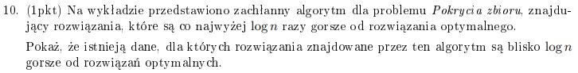

Weźmy zbiory !!{S_1, S_2, ..., S\_{n+1}}!!. Zdefinujmy je tak, że !!cena(S_i) = \frac{1}{n-i+1}!! i !!S_i = \\{ i\\}!!. Uniwers !!U = \\{1, 2, ..., n\\}!!. Weźmy !!S\_{n+1} = U!! i ustalmy jego cenę jako !!1 + \epsilon!!. Nasz algorytm najpierw wybierze cenę !!1/n!! czyli !!S_1!!, bo cena !!S\_{n+1}!! to !!\frac{1+\epsilon}{n}!!. Mamy pokryty jeden element. Cena !!S\_{n+1}!! zmienia się na !!\frac{1+\epsilon}{n-1}!!. Jest to cena trochę wyższa niż cena !!S_2!!. Lecimy tak po kolei, biorąc zachłannie każdy zbiór po kolei. Łącznie, zapłacimy !!\sum\_{i=1}^n \frac{1}{n-i+1} = 1 + \frac{1}{2} + \frac{1}{3} + ... + \frac{1}{n}!!, podczas gdy optymalnym wyborem było wybranie !!S\_{n+1}!!, który za !!1 + \epsilon!! pokrywa cały zbiór. Zatem nasz koszt jest większy od optymalnego o !!\sum\_{i=1}^n \frac{1}{n-i+1} \approx \log n!!. Jest to koszt około !!\log n!! razy gorszy.
