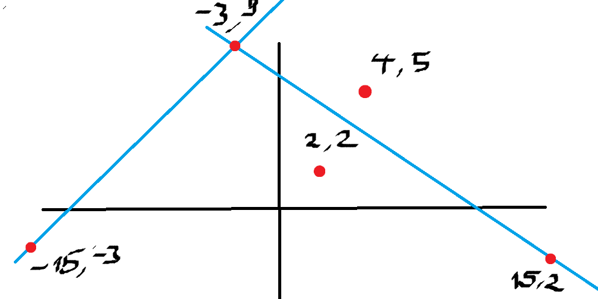

# Zadanie 1


Ze wzoru Eulera wiemy, że !!\sum\_{i=1}^n \frac{1}{i} \approx \log n!!, as !!n!! approaches infinity.

!! T(n) = 2T(\frac{n}{2}) + \frac{n}{\log n} = !!  
!! = 2(2\*T(\frac{n}{4}) + \frac{n/2}{\log \frac{n}{2}}) + \frac{n}{\log n} =!!  
!! = 4T(\frac{n}{4}) + \frac{n}{\log \frac{n}{2}} + \frac{n}{\log n} =!!  
!! = n \cdot 1 + \sum\_{i=1}^{\log n} \frac{n}{\log 2^i} = !!  
!! = n + n \sum\_{i=1}^{\log n} \frac{1}{\log 2^i} = !!  
!! = n + n \sum\_{i=1}^{\log n} \frac{1}{i} = (euler)!!  
!! = n + n \log\log(n) \approx !!  
!! \approx n \log\log(n) !!

# Zadanie 2


Disclaimer: w moim rozwiązaniu przechodzimy przez piekło dla strywializowania problemu (a przynajmniej piekło dla mnie, bo nie miałem rozwa :(). Co więcej, nie wiem czy przejście przez piekło nie jest grzybable.

Oczywiście zaczynamy od próby zrozumienia o co chodzi.


Kolorkami zaznaczyłem zbiory punktów (!!q!!) na trzech prostych, które są widoczne z p, ten jasnozielonkawy to !!x = 0!!. Zatem te 3 proste są widoczne z p. Teraz, w zadaniu musimy znaleźć wszystkie proste które są widoczne z punktu !!(0, +\infty)!!.

Na co musimy zwrócić uwagę?  
Proste z największym i najmniejszym współczynnikiem kierunkowym na pewno będą widoczne. Teraz najważniejsza rozkmina - jakie proste jeszcze będą widoczne? Posortujmy po `b`. Na pewno prosta z największym będzie widoczna. Mamy takie szczypce z prostych ze skrajnymi współczynnikami kierunkowymi i prostą przechodzącą przez nie. Teraz, żeby kolejna prosta mogła być widoczna, to jej punkt przecięcia z tą prostą z największym `b` musi być w środku "szczypiec".

Już tłumaczę. Umieśćmy nasze proste jako punkty w układzie współrzędnym, zaznaczmy sobie te skrajne i ten z największym b. Tzn, dla prostej (y = ax + b) wstawiamy na układ współrzędnych punkt (a, b). Przeprowadźmy przez nie proste.


Każdy punkt odpowiada prostej z zadania - tzn. są to punkty dla prostych !!y = -15x - 3!!, !!y = -3x + 9!!, !!y = 15x - 2!!.
Tak się one mają na wykresie (niebieski i czerwony to "szczypce"):


Rozważmy dodatkową prostą, np. !!y = 2x + 2!!.


Jak widzimy, przecinają się poza "szczypcami", nie są widoczne. Rozważmy teraz prostą !!y = 4x + 5!!.




Ledwo bo ledwo, ale przecinają się w "szczypcach", będzie widoczna.

Teraz ważna obserwacja - jak wyrazić proste, które łączą np. !!(-3, 9)!! i !!(15, -2)!!? Oczywiście obliczamy sobie prostą przechodzącą przez dwa punkty, będzie to !!y = \frac{11}{18} x + 7.1666667!!. Wyliczone współczynniki tej prostej są niczym innym jak ich punktem przecięcia. To znaczy, proste !!y = -3x + 9!! i !!y = 15x - 2!! przecinają się w punkcie !!P(\frac{11}{18}, 7.166667)!!. No i teraz nasz nowy punkt leży "nad" tą prostą, prosta będzie przechodziła pomiędzy prostymi !!(-3, 9)!! i !!(15, -2)!! nad ich punktem przecięcia, więc będzie widoczna. Troche lipnie wytłumaczone, ale nie umiem lepiej. Prosta !!(4, 5)!! będzie widoczna i updatujemy nasze proste.


Teraz, jeżeli jakaś prosta będzie pod tym pomarańczowym wykresem, to będzie się przecinała z innymi prostymi pod widocznymi prostymi, więc nie będzie widoczna. W tym momencie dochodzimy do tego o co chodziło mi na samym początku. Wykminienie i pokazanie (jak ktoś umie to pokazać dokładniej i łatwiej to błagam, powiedzcie mi) o co tu chodzi to big brain, ale samo rozwiązanie jest absolutnie trywialne.
Wystarczy przedstawić nasze proste jako punkty i znaleźć ich górną otoczkę wypukłą.

Do znalezienia otoczki górnej wykorzystamy monotone chain convex hull algorithm, algos z wiki.

```python
def find_upper_convex_hull(points):
    points = sorted(set(points))

    if len(points) <= 1:
        return points

    def cross(o, a, b):
        return (a[0] - o[0]) * (b[1] - o[1]) - (a[1] - o[1]) * (b[0] - o[0])

    upper = []
    for p in reversed(points):
        while len(upper) >= 2 and cross(upper[-2], upper[-1], p) <= 0:
            upper.pop()
        upper.append(p)

    return upper


def find_visible_lines(lines):
    points = map(lambda x: (x.a, x.b), lines)
    return find_upper_convex_hull(lines)
```

# Zadanie 3


# Zadanie 6


# Zadanie 8


