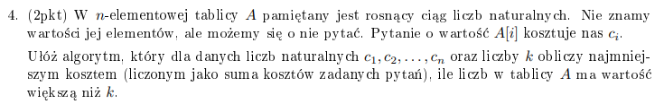
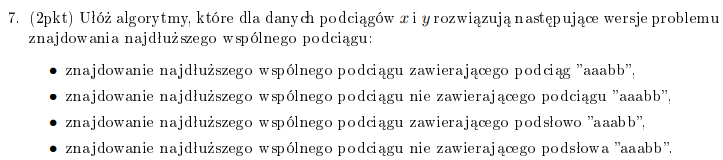

# Zadanie 4



Wyrobienie intuicji:

Rozważamy każde drzewo binarne, tak jakby. Za każdym razem zakładamy przypadek pesymistyczny - musimy szukać dalej, idąc najdroższą ścieżką.  
Dla drzew 2-wierzchołkowych, będzie to suma ich kosztów, bo którykolwiek z nich nie byłby rootem, to i tak zakładamy pesymistyczny przypadek - musimy sprawdzić, czy ten wierzchołek, który jest po lewo/prawo już spełnia warunki naszego zadania (bo root nie spełniał, pesymistycznie). W tym momencie wiemy, jaki jest minimalny koszt sprawdzenia przedziału !![i, i+1]!!.  
Dla drzew 3-wierzchołkowych, !![i, j (=i+1), k (=i+2)]!!, rozważamy każdy wierzchołek jako roota. Jeżeli !!i!! jest rootem, to sprawdzenie minimalnego kosztu to koszt !!i!! + minimalny koszt na przedziale !![j, k]!!. Jeżeli !!j!! jest rootem, to sprawdzenie minimalnego kosztu to koszt !!j!! + maksymalny z minimalnych kosztów na przedziale !![i, i]!! oraz !![k, k]!!. Bierzemy maksymalny z minimalnych, bo pesymistycznie zakładamy, że tam właśnie bedziemy musieli pójść. Jeżeli !!k!! jest rootem, sprawdzenie to koszt !!k!! + minimalny koszt sprawdzenia !![i, j]!!.  
No i tak robimy cały czas - na przedzale !![1, n]!!, każdy wierzchołek rozważamy jako roota, a minimalny koszt sprawdzenia jego prawego i lewego poddrzewa znamy, z tym że zakładamy że będziemy zmuszeni pójść do tego poddrzewa, które jest droższe.

Rozwiązujemy to dynamicznie - najpierw liczymy wszystkie przedziały o długości 1 (po prostu cena sprawdzenia tego elementu), później cena sprawdzenia przedziałów o długości dwa i tak dalej, typowo dynamicznie.

```python
def find_minimal_way(A, C):
    dp = arr[n x n]
    roots = arr[n x n]

    # prep - na przekątnej są koszty przedziału o długości 1, [i, i], jest to ich koszt
    for i in range(1, n+1):
        dp[i][i] = C[i]
        roots[i][i] = i

    for length in range(1, n+1):
        for start in range(1, n-length+2):
            min = math.infinity
            root = -1
            for i in range(start, start+length):
                # zakladam se ze pod przekatna sa zera,
                # bo nie chce mi sie dodawac warunku if left > right
                cost = C[i] + max(dp[l][i-1], dp[i+1][r])
                if cost < min:
                    min = cost
                    root = i
            dp[start][start+length] = min
            roots[start][start+length] = root

    result_queries = []
    def retrieve_queries(start, end):
        if start > end:
            return
        root = roots[start][end]
        result_queries.append(root)

        retrieve_queries(start, root - 1)
        retrieve_queries(root + 1, end)

    return dp[1][n], retrieve_queries(1, n)
```

Działa to w !!O(n^3)!!. Imo spoko, ale podobno raczej nieakceptowalne w grupach ambitniejszych i trzeba użyć jakiejś [optymalizacji Knutha](https://cp-algorithms.com/dynamic_programming/knuth-optimization.html), żeby to śmigało w !!O(n^2)!!.

# Zadanie 7



1. Robimy tablicę 3d - w 3 wymiarze przechowujemy najdłuższe podciągi zawierające jakiś fragment `aaabb` (przykładowy wzorzec, działa dla dowolnego T), np. `dp[3][7][2]` będzie przechowywać wartość najdłuższego wspólnego podciągu na indeksach !![3, 7]!!, zawierającego w sobie podciąg `aa`.
   Nasz warunek dynamiczny dla takiego problemu będzie wyglądał:

    1. kiedy !!x[i] \neq y[j]!! - robimy to co zwykle:
       $$ dp[i][j][k] = max(dp[i][j-1][k], dp[i-1][j][k]) $$

    2. kiedy !!x[i] = y[j] \neq T[k]!! i na indeksach [i-1, j-1] istnieje podciąg zawierający podciąg T o długości k, tj. !!dp[i-1][j-1][k] > 0!!:
       $$ dp[i][j][k] = dp[i-1][j-1][k] + 1 $$

    3. to co wyżej, ale na indeksach [i-1, j-1] podciąg T o długości k ma długość 0, tj. nie istnieje:
       $$ dp[i][j][k] = dp[i-1][j-1][k] $$

    4. kiedy !!x[i] = y[j] = T[k]!!:
       $$ dp[i][j][k] = dp[i-1][j-1][k-1] + 1 $$

2. Rozwiązanie podobne do tego co wyżej, będziemy przechowywać w 3 wymiarze długość ciągu który nie zawiera fragmentu tego `aaabc`.

    k = 1:

    1. kiedy !!x[i] \neq y[j]!! lub !!x[i] = y[j] = T[k]!!:
       $$ dp[i][j][1] = max(dp[i][j-1][k], dp[i-1][j][k]) $$

    2. kiedy !!x[i] = y[j] \neq T[k]!!:
       $$ dp[i][j][k] = dp[i-1][j-1][k] + 1 $$

    dla k > 1:

    2. kiedy: !!x[i] \neq y[j]!!:
       $$ dp[i][j][k] = max(dp[i][j-1][k], dp[i-1][j][k]) $$
    3. kiedy !!x[i] = y[j] \neq T[k]!!:
       $$ dp[i][j][k] = dp[i-1][j-1][k] + 1 $$
    4. kiedy !!x[i] = y[j] = T[k]!!:
       $$ dp[i][j][k] = max(dp[i-1][j-1][k-1] + 1, dp[i-1][j-1][k]) $$

3. zawierające podsłowo "aaabb", teraz nasze k będzie wyznaczało jaki jest najdłuższy wspólny podciąg kończący się na k pierwszych liter słowa. dp[i][j][K] to będzie najdłuższy wspólny podciąg kończący się naszym słowem, zakładam, że K to jego długość, a dp[i][j][k+1] to najdłuższy wspólny podciąg zawierający podsłowo

    k >= 1:

    1. !!x[i] = y[j] = T[k]!!, przy czym musimy jeszcze tutaj wziąć pod uwagę, że jak k > 1 to trzeba sprawdzić czy T[i-1][j-1][k-1] > 0
       $$ dp[i][j][k] = dp[i-1][j-1][k-1] + 1 $$

    2. wpp - normalnie
       $$ dp[i][j][k] = max(dp[i][j-1][k], dp[i-1][j][k]) $$

    k = K + 1:

    1. !!x[i] = y[j]!! oraz !!dp[i-1][j-1][k] > 0 \vee dp[i][j][k-1] > 0!!
       $$ dp[i][j][k] = max(dp[i-1][j-1][k] + 1, dp[i][j][k-1]) $$

    2. wpp - normalnie

4. nie zawierające podsłowa "aaabb".
    1. !!x[i] \neq y[j]!!
       $$ dp[i][j][k] = max(dp[i][j-1][k], dp[i-1][j][k]) $$
    2. !!x[i] = y[j] = s[k]!!
       $$ dp[i][j][k] = dp[i-1][j-1][k] \text{ if } k = 1 $$
       $$ dp[i][j][k] = max(dp[i-1][j-1][k-1] + 1, dp[i-1][j-1][k]) $$
       tutaj chodzi o to, że jak k = 1, to nie chcemy żeby na to się kończyło więc skipujemy, a jeśli k > 1 to albo bierzemy LCS niekończący się na T[1..k-1] i doklejamy do niego, albo pomijamy rozważaną literkę
    3. !!x[i] = y[j] = s[-1]!!, w sensie ostatnia literka słowa którego nie może być
       $$ dp[i][j][k] = max(dp[i-1][j-1][n-k-1] + 1, dp[i-1][j-1][k]) $$
       tutaj z kolei rozważamy ostatnia literkę zakazanego słowa, więc bierzemy albo najdłuższy podciąg który nie zawiera całego wzorca do przedostatniej literki, albo pomijamy
    4. !!x[i] = y[j] \neq s[k] \neq s[K-1]!!, w sensie rozważana literka nie jest literką na którą nie ma się kończyć ani ostatnią
       $$ dp[i][j][k] = dp[i-1][j-1][K] + 1 $$
       tutaj po prostu bierzemy podciąg niekończący się na szukany wzorzec i dodajemy kolejną literkę
