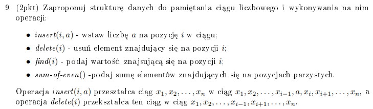
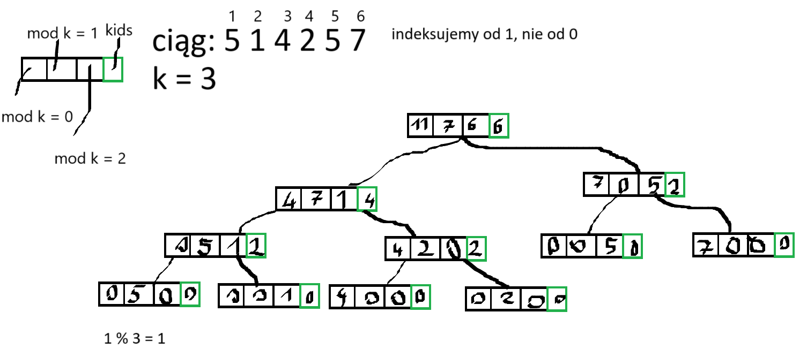

# Opis

Tutaj będzie parę zadań pod kątem egzaminu.

# 6/9



My robimy egzaminowe rozszerzenie, zamiast sum-of-even zrobimy sum-of-k, tzn. suma co k-tego elementu, dla jakiegoś ustalonego k.

Robimy drzewo AVL, bo inaczej drzewo by się nam strasznie rozrosło :(

Idea jest taka, że nasz ciąg będzie przechowywany tylko w liściach. Wierzchołki wewnętrzne będą służyły do zapamiętywania sum, będziemy sobie zapamiętywać sumy wszystkich indeksów modulo k. Będziemy też pamiętać ile dzieci ma każdy wierzchołek.

Tak będzie wyglądał wierzchołek:

```
Node {
    tab[k] = {0}
    kids = 0
    father_pointer = null
}
```

Teraz trzeba coś narysować.


To będzie coś takiego. Liście to taka komórka, gdzie w tab jest tylko wartość tego elementu ciągu za który odpowiada, wyżej sumy itd.

Teraz implementacja operacji.

-   find(i, T)

    Tutaj będziemy to robić tak, że jeżeli i jest mniejsze od ilości dzieci w lewym poddrzewie, to tam szukamy tego elementu. Jeżeli jest większe, to szukamy w prawym poddrzewie dziecka, które jest na pozycji (ilość dzieci w lewym - i).

```python
find(i, T):
    if i == 0:
        return T # zwracamy węzeł, to będziemy mogli z tego później korzystać przy innych operacjach
    if i <= T.left.kids:
        return find(i, T.left)
    return find(T.left.kids - i, T.right)
```

-   insert(i, a, T):
    Tutaj robimy to tak, że dochodzimy do i-tego liścia i robimy z niego węzeł wewnętrzny, którego jednym z dzieci jest obecna wartość tego liścia, a drugim obecnie wstawiany element. Musimy oczywiście po tym dostosować wartości w tablicach od liścia do korzenia i wykonać potrzebne rotacje, żeby drzewo nam się nie rozrosło.

```python
insert(i, a, T):
    leaf = find(i, T)
    leaf.left = Node(i + 1, leaf.tab[i % k])
    leaf.right = Node(i, a)
    leaf.tab = {0}
    leaf.kids = 2
    leaf.tab = #sum of left and right childs tabs

    #no i tutaj musimy poprawić wartość tablic aż do korzenia i coś porotować jak trzeba,
    #rotując będziemy musieli wykonać jakieś 3 update tablic, coś takiego
```

-   delete(i)
    Idea podobna do wstawiania.

```python
delete(i):
    leaf = find(i)

    # i lecimy do korzenia z updejtami tablic/rotacjami,
    # jeżeli ojciec tego liścia miał 2 dzieci to ojciec staje się liściem, a wartością
    # tego liścia jest wartość drugiego z jego dzieci, ten nieusuwany, bo nie chcemy sytuacji
    # gdzie wierzchołek wewnętrzny ma tylko 1 dziecko -
    # wtedy ten wierzchołek może po prostu być liściem
```

-   sum-of-k

```python
sum-of-k(T):
    return T.tab[0]
```

No i mamy drzewko AVL, które ma 2n wierzchołków, zatem operacje nadal będą w !!O(\log n)!!, a sum-of-k mamy w !!O(1)!!.

# Zadanko z szeregowaniem

To zadanie z zachłanniaków, szeregowanie zadań z terminami i zyskami, każde zadanie zajmuje jedną jednostkę procesora. Modyfikacja jego jest taka, że jedno z zadań wymaga dwóch jednostek procesora.

Obserwacja.
Nie opłaca się robić zadań szybciej niż trzeba, więc zadanie z największym terminem wykonujemy w tym właśnie terminie, wybieramy oczywiście to najbardziej opłacalne (zakładając, że mamy kilka kończących się w tym samym momencie)

Zadanie z maksymalnym terminie wykonujemy zatem w tym terminie. Jakie zadanie wykonujemy w terminie max-1? Oczywiście to najoptymalniejsze, które wtedy się kończy. Zatem to zadanie wykonujemy zachłannie od końca.

Jak poradzić sobie z zadaniem, które wymaga dwóch jednostek procesora? Trywialnie.  
Wydupcamy to zadanie. Liczymy maksymalny zysk, jaki możemy uzyskać bez tego zadania. Zapisujemy. Następnie, liczymy od nowa, ale z tym zadaniem. Wykonujemy je oczywiście w ostatnim możliwym terminie, pozostałe zadania wykonujemy na takiej zasadzie jak poprzednio. Porównujemy otrzymane wyniki i zwracamy ten większy.

Dowód poprawności pozostawiam jako ćwiczenie dla uważnego czytelnika.

# Superciąg trzech stringów

Jest to rozwinięcie problemu SCS. Rozważmy problem dla dwóch stringów, użyjemy do tego LCSa. Obserwacja jest taka, że literki z LCSa pojawią się tylko raz, a pozostałe musimy przepisać.

```python
def SCS(s1, s2):
    lcs = LCS(s1, s2)
    i = 0
    j = 0
    scs = ""
    for letter in lcs:
        while s1[i] != letter:
            scs += s1[i]
            i += 1
        while s2[j] != letter:
            scs += s2[j]
            j += 1
        scs += letter
        i += 1
        j += 1
```

Rozszerzamy problem do 3 stringów. LCSa liczy się na dokładnie takiej samej zasadzie, tylko mamy tablicę 3d.

```python
def lcs-3(s1, s2, s3):
    dp = 3d arr
    for i to len(s1), j to len(s2), k to len(s3):
        init dp to zeros

    for i to len(s1):
        for j to len(s2):
            for k to len(s3):
                if s1[i] == s2[j] == s3[k]:
                    dp[i][j][k] = dp[i-1][j-1][k-1]
                else:
                    dp[i][j][k] = max(dp[i-1][j][k], dp[i][j-1][k], dp[i][j][k-1])

    m = len(s1)
    l = len(s2)
    n = len(s3)
    lcs = ""

    while m > 0, n > 0, l > 0:
        temp = dp[m][l][n]
        if temp == dp[m-1][l][n]:
            m -= 1
        #.. same for l, n

        else:
            lcs += s1[m]
    return lcs
```

No i SCS-3 to będzie dokładnie ten sam algorytm co dla 2 stringów, tylko z dodaniem 3.

# Wydawanie reszty Fibonaccim

[lista 2](https://aisd-notatki.readthedocs.io/en/latest/listy/2/), zadanie 4
