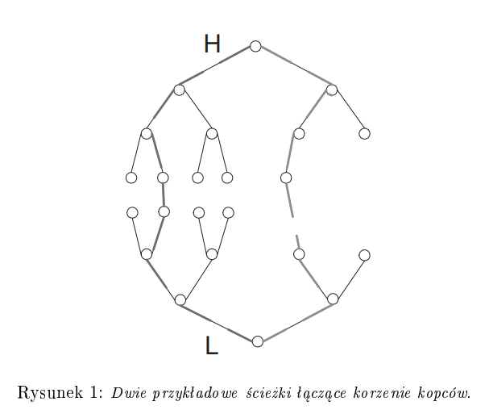
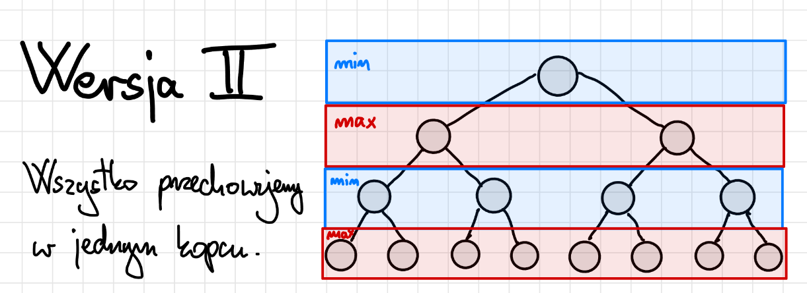

# Opis

Kopiec min-maxowy to kopiec, w którym możemy jednocześnie znaleźć/usunąć minimlany i maksymalny element. Giga się nadaje do stworzenia kolejki priorytetowej. Istnieją dwa rodzaje kopców min-maxowych.

## Rodzaj pierwszy: szczepione dupami

Jak wskazuje nazwa tego rodzaju, są to dwa kopce - minimalny i maksymalny, "sklejone" liśćmi.

Obrazek ze skryptu KLo

W takim kopcu:

-   kopiec L uporządkowany jest malejąco, a H rosnąco
-   dodatkowy warunek: klucze wszystkich ścieżek z L do H są uporządkowane niemalejąco.

insert(x):  
Ogólnie to zakładając że kopiec jest na n elementów i jest miejsce, to nawet proste. Jeśli nasz kopiec zawiera nieparzystą liczbę elementów, to wstawiamy go do kopca H, a jak nie to do L, na takiej zasadzie jak dodajemy do normalnego kopca. Decyzja czy element przesuwamy niżej czy wyżej. Zatem, jak wstawialiśmy do kopca H, to x jest jakimś elementem na ścieżce. Ścieżka musi być uporządkowana niemalejąco, więc jeśli x jest większy bądź równy następnemu elementowi ścieżki, to przesuwamy go wyżej w stronę korzenia H. Inaczej zamieniamy x z następnym elementem na ścieżce i przesuwamy go wyżej w stronę korzenia L. Chodzi o to, żeby po dodaniu nowego elementu zachowany był dodatkowy warunek (tj. klucze wszystkich ścieżek z L do H są uporządkowane niemalejąco).

usuwanie minimalnego (maks analogicznie):  
Wiadomo, że minimalny element jest w korzeniu L. Usuwamy minimalny i wstawiamy w jego miejsce y - ostatni element kopca L, jeżeli L i H były równoliczne, albo ostatni element kopca H, jeśli był on większy. y przesuwamy niżej. Jeśli przesunęliśmy go aż do liścia, to musimy sprawdzić czy nie powinien być on wyżej - jeśli tak, tj. liść z H, kolejny element ścieżki, jest mniejszy niż y, to zamieniamy y z tym liściem i w kopcu H przesuwamy y wyżej.

## Rodzaj drugi: w jednym kopcu

Tutaj przechowujemy w jednym kopcu zarówno kopiec minimalny i maksymalny.

Obrazek z notatek <a href="https://github.com/Ph0enixKM/AiSD-Dla-Opornych/blob/master/1%20Kopce%20Binarne.pdf" target="_blank">AiSD dla opornych</a>

Po więcej informacji na jego temat odsyłam do AiSD dla opornych, link w adnotacji do obrazka. Może dodam coś więcej na jego temat jak się okaże, że się przyda na egzaminie.
