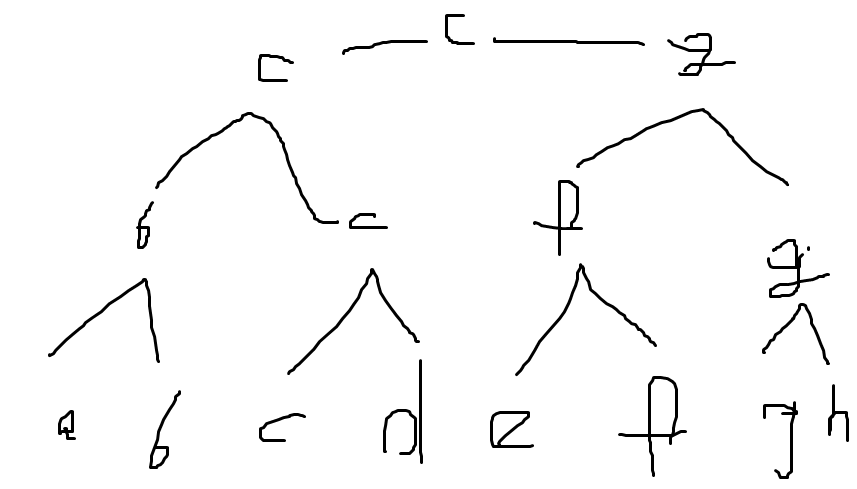
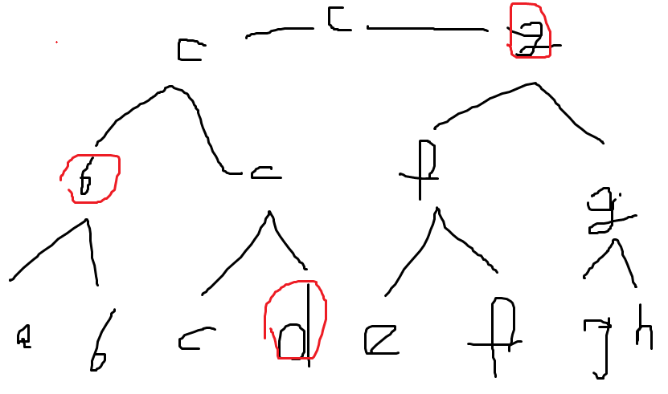
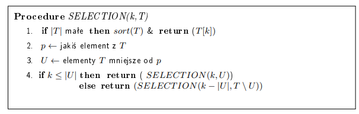
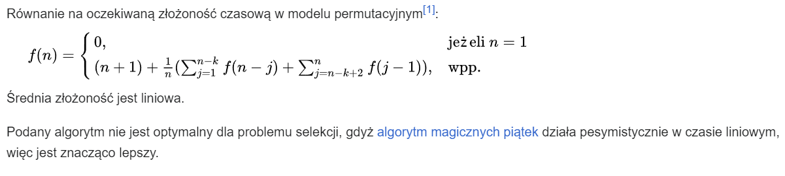

# Opis

Mamy problem - jest nim wybór k-tego co do wielkości elementu w zbiorze.
Mamy więc daną tablicę T, w której mamy !!n!! elementów. Dostajemy też liczbę !!k \in [1, n]!!. Bez zmniejszania ogólności zakładamy, że elementy tablicy T są różne. W naszych algorytm będziemy stosować tylko porównania.

No więc mamy sobie zbiorek i mamy odpowiedzieć na pytanie: jaka liczba w tym zbiorze jest k-ta co do wielkości? Np. druga, trzecia, czwarta?

# Podejście pierwsze - dla ludzi normalnych

Sortujemy nasz zbiór i wybiermy k-ty element. Koszt to oczywiście koszt sortowania - !!O(n \cdot \log n)!!

# Podejście lepsze

Da radę to ogarnąć w !!O(n)!!.

### Szczególne przypadki

Jeżeli k = 1, a więc po prostu szukamy minimum - koszt to !!n - 1!! porównań.

Jeżeli k = 2, to wystarczy !!n - 2 + \lceil \log n \rceil!!. Dlaczego?

Otóż najpierw szukamy elementu minimalnego:

Znajdujemy minimum w n-1. Obserwacja: element drugi co do wielkości musiał przegrać z elementem pierwszym. Może on bowiem przegrać maksymalnie jedno porównanie (minimalny element 0). Zatem gdyby element drugi co do wielkości nie przegrał z elementem minimalnym, tylko jakimś innym, to by znaczyło że może przegrać co najmniej dwa porównania - to, które przegrał i to, które byłoby z elementem minimalnym. Kandydatów na drugiego co do wielkości gnoja szukamy zatem wśród tych elementów, które przegrały z elementem minimalnym.

Stąd bierze się dodatkowe !!\lceil \log n \rceil - 1!! porównań. Mamy zatem !!n - 1 + \lceil \log n \rceil - 1 = n - 2 + \lceil \log n \rceil!!

### Przypadek ogólny

Zastosujemy sobie metodę [dziel i zwyciężaj](https://aisd-notatki.readthedocs.io/en/latest/divide-and-conquer/dac-algos/).  
Nasz plan jest taki:  
jeśli !!|T|!! jest niewielka, możemy zastosować podejście dla normalnych ludzi, tzn. posortowanie i wybranie k-tego elementu.  
W innym przypadku:  
chcemy podzielić zbiór T na dwa mniej więcej równe podzbiory względem jakiegoś elementu !!T[i]!!, takich że do jednego z tych zbiorów dodajemy element !! \leq T[i] !!, a do drugiego !! > T[i] !!. Chcemy, żeby te zbiory były mniej więcej równe - wybór tego elementu !!T[i]!! jest tą nietrywialną częścią naszej procedury, zaraz się tym zajmiemy. Zakładając, że mamy element !!T[i]!! dzielący nam tablicę T mniej więcej na pół, konstruujemy nasze zbiory tak jak napisałem wyżej, załóżmy że są to zbiory !!U!! - mniejsze/równe !!T[i]!! oraz !!V!! - większe od !!T[i]!!. No i mając takie zbiory lecimy rekurencyjnie - jeżeli !!k \leq |U|!!, to oznacza, że wystarczy wybrać k-ty co do wielkości element ze zbioru !!U!!. W przeciwnym wypadku, wystarczy wybrać !!k - |U|!!-ty element co do wielkości w zbiorze !!V!!. Procedura KLo-wa:

No i teraz musimy się zastanowić, jak wybrać to !!p!! (u mnie !!T[i]!!), żeby te zbiorki były mniej więcej równe. Zastosujemy procedurę magicznych piątek. Polega ona na tym, że dzielimy tablicę T na kawałeczki po 5 elementów, po czym wybieramy ich mediany, po czym wybieramy medianę tych median. Do wyliczenia mediany z 5 elementów używamy czegokolwiek, to się wyliczy do stałej. Później, żeby wybrać medianę median używamy procedury selection(), żeby wybrać środkowy element ze zbioru tych median. I tutaj można się zgubić, bo wyliczamy medianę w selection a później użymamy tej procedury w wyliczaniu mediany, siwy dym. Pan Loryś tutaj sprytnie pominął dowód poprawności procedury selection, prawdopodobnie dlatego, że ze względu na cyrki jakie się tutaj dzieją nie jest ona poprawna, ja też się do tego dowodu nie przymierzam.  
Złożoność tego to podobno !!O(n)!!.

Lemat: Jeżeli !!p!! wybieramy za pomocą magicznych piątek, to każdy ze zbiorów !!U!! i !!V!! zawiera nie mniej niż !!\frac{3}{10}n - 4!! elementów.
Dowód jest w notatkach a mi sie nie chce, TODO maybe

Koszt procedury:
!!T(n) \leq T(\lceil \frac{n}{5} \rceil) + T(7n/10 + 4) + O(n)!!

!!T(n)!! jest w !!O(n)!!.

To był sposób deterministyczny na wybór !!p!!, teraz poznamy zrandomizowane.

#### Algorytm Hoare'a

!!p!! wybieramy losowo.

#### LazySelect

TODO albo i nie, ciezkie to sie wydaje a metoda deterministyczna jest spk
