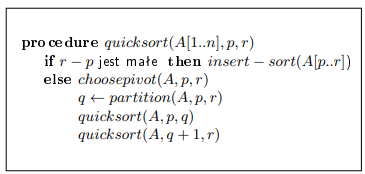
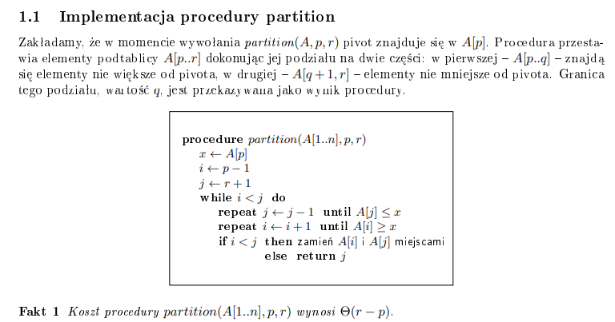

# Opis

Ta notatka podsumowuje najpopularniejsze algorytmy sortujące, ze szczególnym pochyleniem nad algorytmami, nad którymi pan Loryś szczególnie się pochylił prowadząc wykład.

# Algorytmy !!O(n^2)!!

Nie są dla nas zbyt ważne.

### Sortowanie bąbelkowe (bubble sort)

Najprostszy istniejący algorytm sortujący. Polega na przechodzeniu po zbiorze, porównując ze sobą każde dwa elementy i zamieniając je, jeśli są w złej kolejności.

```python
def bubble_sort(tab):
    for i in range(len(tab)):
        for j in range(len(tab)- i - 1):
            if (tab[j] > tab[j+1]):
                tab[j], tab[j+1] = tab[j+1], tab[j]
    return tab

```

Moja ocena algorytmu: !!9/10!!. Prosty i fajny. -1 punkcik za złożoność.

### Sortowanie przez wstawianie (insertion sort)

Polega na przechodzeniu po kolejnych elementach, a będac na indeksie i+1-ym, wszystko do i powinno być posortowane. Zatem rozważając i+1-y element, idziemy z nim do tyłu, szukając dla niego odpowiedniego miejsca (takiego że tab[k-1] <= tab[i] i tab[k+1] >= tab[i]).

```python
def insertion_sort(tab):
    for i in range(1, len(tab)):
        key = tab[i]
        j = i - 1
        for k in range(i, 0, -1):
            if tab[k-1] > key:
                tab[k] = tab[k-1]
                j = k - 1
            else:
                break
        tab[j + 1] = key
    return tab
```

Moja ocena algorytmu: !!6/10!!. Jest trochę bardziej skomplikowany niż bubble sort, a tak samo głupi (!!O(n^2)!!). Lepiej użyć bubble sorta.

### Sortowanie przez selekcję (selection sort)

Polega na przechodzeniu po tablicy i znajdowaniu minimum (lub maximum, ale zakładam że bierzemy sobie minimum), które po zakończeniu przejścia wstawiamy na początek tablicy. Wtedy zawsze początku mamy już posortowane elementy i skupiamy się na nieposortowanej części.

```python
def selection_sort(tab):
    for i in range(len(tab)):
        for j in range(i, len(tab)-1):
            if tab[j+1] < tab[i]:
                tab[i], tab[j+1] = tab[j+1], tab[i]

    return tab
```

Moja ocena algorytmu: !!8/10!!. Mniej skomplikowany niż insertion sort, ale nadal nie tak fajny jak bubble sort, mimo tego że to praktycznie ten sam algorytm.

# Algorytmy !!O(n \log n)!!

Są dla nas ważne.

### Sortowanie przez kopcowanie (heap sort)

Jak napisałem w notatce o kopcach, gdzie dostępna jest także cała implementacja kopca:

Szybki algorytm sortujący przy użyciu kopca, O(n log n). Na chłopski rozum - robimy kopiec minimalny z tablicy (O(n)), a później usuwamy z niego korzeń i dodajemy go do tablicy posortowanych. Usunięcie zakłada przywrócenie własności kopca (log n). Tak robimy aż skończy nam sie kopiec.

```python
    def heap_sort(self, tab: List[int]) -> List[int]:
        self.heapify_fast(tab)
        sorted_list = []
        original_size = self.size
        for _ in range(original_size):
            sorted_list.append(self.extract_min())
        return sorted_list
```

Moja ocena algorytmu: !!9/10!!. Ale tylko zakładając, że mamy już zaimplementowany kopiec, inaczej ocena drastycznie spada. +1 punkcik za złożoność.

### Sortowanie przez scalanie (merge sort)

Używa strategii dziel i zwyciężaj, został wspomniany w notatce na temat tej metody. Polega na dzieleniu tablicy na połówki, tak długo aż dojdziemy do tablicy 1-elementowej, która już jest posortowana. Następnie musimy ją zmergować.

```python
# żywcem z geeksforgeeks
def merge(arr, left, mid, right):
    n1 = mid - left + 1
    n2 = right - mid

    L = [0] * n1
    R = [0] * n2

    for i in range(n1):
        L[i] = arr[left + i]
    for j in range(n2):
        R[j] = arr[mid + 1 + j]

    i = 0
    j = 0
    k = left

    while i < n1 and j < n2:
        if L[i] <= R[j]:
            arr[k] = L[i]
            i += 1
        else:
            arr[k] = R[j]
            j += 1
        k += 1

    while i < n1:
        arr[k] = L[i]
        i += 1
        k += 1

    while j < n2:
        arr[k] = R[j]
        j += 1
        k += 1

def merge_sort(arr, left, right):
    if left < right:
        mid = (left + right) // 2

        merge_sort(arr, left, mid)
        merge_sort(arr, mid + 1, right)
        merge(arr, left, mid, right)
```

Dzielenie tablicy to !!\log n !!, scalamy w !!n!!, wychodzimy !!O(n \log n)!!

Moja ocena algorytmu: !!8/10!!. O ile idea jest prosta, to trzeba się trochę pierniczyć z tym mergem, ale za to spoko złożoność.

### Sortowanie szybkie (quicksort)

[filmik Computerphile, fajny, 3min](https://www.youtube.com/watch?v=XE4VP_8Y0BU)  
Także korzysta ze strategii dziel i zwyciężaj. Żeby uniknąć najgorszego przypadku, musimy dobrze wybierać pivota, a także dobrze dzielić naszą tablicę. W notatkach pana Lorysia jest to fajnie opisane, więc posłużę się jego pseudokodami, a jak ogarniemy jak dobrze dzielić/wybierać pivota to wrzucę działającą implementację w Pythonie.

Więc generalnie tak będzie wyglądać nasza procedura quicksort:


A tak partition:
  
Co się tutaj dzieje? Otóż: dla prostoty zapisujemy w !!x!! wartość pivota, a następnie analizujemy !!A[p \dots r]!!. W każdym obrocie pętli while, szukamy elementu który jest mniejszy od pivota a jest po jego prawej stronie oraz elementu, który jest od pivota większy, a jest po lewej. Jeżeli takie elementy znaleźliśmy, to zamieniamy je miejscami. Jeśli !!i \geq j!!, to zwracamy !!j!!. Wiemy, że w !!A[p \dots j]!! znajdują się elementy !!\leq A[p]!!, a w !!A[j+1 \dots r]!! elementy !! \geq A[p]!!.

Teraz ważne pytanie, na które nie ma jednoznacznej odpowiedzi - w jaki sposób wybierać pivota? Dla prostoty możemy wybierać zawsze pierwszy/ostatni element, ale wtedy, tak jak było pokazane w filmiku Computerphile, algorytm może nam się zkwadracić.

Warto wspomnieć, że każda z wybranych metod ma swoje wady i zalety.

Metoda 1 to wybór deterministyczny, czyli pierwszy/ostatni element.  
Zalety: prostota  
Wady: dla posortowanych w jakimś stopniu danych łatwo się kwadraci

Metoda 2 to wybór losowy.  
Zalety: prostota, nie obchodzi nas w jakim stanie przychodzą dane  
Wady: nadal może się zkwadracić, ale szansa jest zaniedbywalnie mała

Metoda 3 to mediana.  
Jednak nie z całego zbioru - wyliczenie tego jest nieopłacalne złożonościowo w algorytmie. Wybieramy 3 losowe elementy i wybieramy ich medianę. To znacząco zmniejsza szansę na zkwadracenie się algorytmu - musielibyśmy trafić np. na 3 bardzo małe wartości w sortowanej tablicy, szansa na zkwadracenie jest tym mniejsza im większy jest zbiór, a tym samym tym większa im mniejszy jest zbiór - ale jak zbiór jest mały, to bardzo nie ucierpimy na tym kwadracie.

Teraz implementacja, a później niestety analiza złożoności.

```python
import random

def quicksort(tab):
    # używamy metody 3
    def choose_pivot(tab, p, r):
        p1, p2, p3 = list(map(lambda _: random.randint(p, r), [None]*3))
        if p1 > p2 and p2 > p3:
            return p2
        if p2 > p1 and p1 > p3:
            return p1
        return p3

    def partition(tab, p, r, pivot):
        x = tab[pivot]
        i = p - 1
        j = r + 1

        while i < j:
            while True:
                j -= 1
                if tab[j] <= x:
                    break
            while True:
                i += 1
                if tab[i] >= x:
                    break
            if i < j:
                tab[i], tab[j] = tab[j], tab[i]
            else:
                return j


    def quicksort2(tab, p, r):
        if p < r:
            pivot = choose_pivot(tab, p, r)
            q = partition(tab, p, r, pivot)
            quicksort2(tab, p, q)
            quicksort2(tab, q+1, r)

    quicksort2(tab, 0, len(tab)-1)
```

Moja ocena algorytmu: !! 4/10 !!. Przesadnie skomplikowany, trzeba wierzyć na słowo że działa szybko bo dowód jest nietrywialny.

#### Analiza złożoności

!!O(n \log n)!!
[filmik](https://www.youtube.com/watch?v=UHGRbzqHlN8)  
to co jest w notatkach KLo niestety nie kumam ;(

# Algorytmy o lepszej złożoności

Nie istnieją. Chyba, że to co chcemy posortować spełnia jakieś dodatkowe założenia. Zatem takie algorytmy są, jednak nie osiągną lepszej złożoności dla jakichś losowych danych o których nic nie wiemy.

# Sortowanie przez zliczanie (counting sort)

Dostajemy dane !!A[1 \dots n]!!, liczby te są z przedziału !!<1 \dots k>!!. Idea jest taka, że po prostu robimy sobie pomocniczą tablicę !!pom!! o długości !!k!! i dla każdego elementu !!A[i]!!, !!pom[A[i]]!!++. Po tym mamy tablicę z informacją, ile mamy których elementów. Teraz musimy zrobić sztuczkę magiczkę: robimy sobie w tej tablicy pomocniczej sumy prefixowe, tj. Przykład:

A = [4, 1, 1, 2, 3, 2, 4, 4]  
pom = [2, 2, 1, 3]  
pom po posumowaniu: [2, 4, 5, 8]
ta tablica oznacza teraz - jedynki są do 2 indeksu włącznie, później są dwójki do 4 indeksu włącznie, później do 5 są trójki, a dalej do ósmego są czwórki. W ten sposób wiemy, na których indeksach tablicy wynikowej umieścić nasze liczby.

Odtworzenie posortowanej tablicy: tworzymy tablicę B n-elemntową (tyle co w A) i lecimy po tablicy A. Pierwszy element to 4, więc na indeksie pom[4] odczytujemy, że powinien się znaleźć na indeksie ósmym. Zatem B[8] = 4. Ale też musimy powiedzieć naszemu algorytmowi, że kolejna czwórka będzie indeks wcześniej (na B[7], zakładając że będzie, a w naszym przypadku będzie - gdyby nie było, to i tak nie zaglądamy już do tej komórki i nic sobie nie popsujemy). Zatem robimy pom[4]-- i lecimy dalej po tablicy A, aż dojdziemy do końca. B jest posortowaną tablica.

```python
def counting_sort(tab, k):
    # zakładam, że indeksy będą od 0 do k-1
    pom = [0]*k
    for i in range(len(tab)):
        pom[tab[i]] += 1
    for i in range(1, k):
        pom[i] += pom[i-1]

    B = [0]*len(tab)

    for i in range(len(tab)):
        B[pom[tab[i]]-1] = tab[i]
        pom[tab[i]] -= 1

    return B
```

Złożoność tego czegoś to takie O z kreską w środku od !!n + k!!. ;)

Moja ocena algorytmu: !! 10/10 !!. Fajny algorytm. Brak wad.

# Sortowanie kubełkowe (bucket sort)

Służy do sortowania liczb z przedziału !! [ 0, 1)!!. Dzielimy ten przedział na n równych odcinków (kubełki), umieszczamy liczby w odpowiadających im kubełkach, sortujemy poszczególne kubełki i je łączymy. Plus jest taki, że jak jest to w postaci list wiązanych to to połączenie po prostu polega na podpięciu ostatniego elementu !!i!!-tego kubełka z pierwszym elementem !!i+1!!, chyba. W środku kubełki sortujemy np. insertion sortem. Podobno to ma oczekiwaną złożoność !!O(n)!!, ale ja tego nie kupuję.

Moja ocena algorytmu !!1/10!!. Jakiś pseudoalgorytm na kiju i niby ma taką złożoność, zresztą kto potrzebuje sortowania liczb z przedziału !![0, 1)!!. Szanujmy się i nie mówmy o tym algorytmie, nawet nie wrzucam implementacji.

# Sortowanie leksykograficzne (radix sort)

Porównanie dwóch ciągów (stringów): robimy to tak, że jeśli mamy słowa !!s!! i !!t!! o długości !!p!! i !!q!!, bez straty ogólności zakładam !!p \leq q!!, to:  
!!s \leq t!! wtedy, gdy pierwsza (od lewej) liczba w !!s!! jest mniejsza od liczby na tej pozycji w !!t!! (np. "101", "102"), albo kiedy !!s!! jest prefiksem !!t!! i !!t!! jest dłuższe (np. "100" i "1001").

### ciągi jednakowej długości

radix-sort polega na zastosowaniu counting sorta dla każdego indeksu ciągu, tzn:

```python
def radix_sort(A):
    for i in range (d, 0, -1):
        counting_sort(A, i) # sortuje po i-tym indeksie
```

Złożoność to !!O(d(n+k))!!, gdzie d to długość ciągu, a n+k to counting sort.

### ciągi o różnych długościach

Możemy zrobić to co w ciągach jednakowej długości, tylko dodać padding przy słowach krótszych od najdłuższego, jako paddingu używamy jakiegoś chara który na pewno nie wystąpi w słowie i traktujemy go jako minimalna wartość (takie 0 w liczbach).

Inny sposób z notatek KLo:


TODO: zreferować to i ogarnąć lepiej, ale już nie chce mi sie tego sortowania ;(
