# Opis

Nie będę tłumaczył czym jest prefiks i sufiks. Poprzez !!w \sqsubset s!! będę oznaczał, że !!w!! jest prefiksem !!s!!, a przez !!w \sqsupset s!!, że !!w!! jest sufiksem. Dla słowa !!X!!, przez !!x_i!! będziemy oznaczać !!i!!-tą literę słowa !!X!!, a przez !!X_k!! k-literowy prefiks słowa !!X!!.

Problem który chcemy rozwiązać, to znalezienie wszystkich wystąpień słowa !!P!! w słowie !!T!!.

# Sposób naiwny

Polega na sprawdzeniu, dla każdego indeksu słowa T, czy w tym miejscu zaczyna się słowo !!P!!. Koszt to !!O((n-m+1)m)!!, gdzie !!n!! to długość !!T!!, a !!m!! słowa !!P!!.

# Karp-Rabin

Najlepiej pokazać jego działanie na przykładzie.
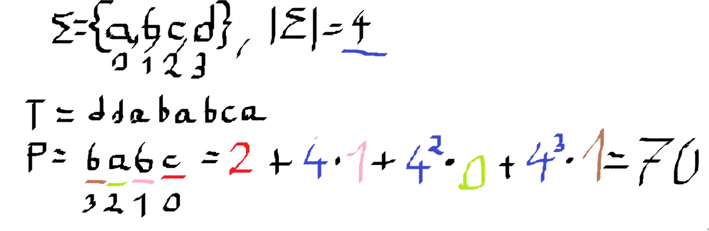

Nasz wzorzec P to `babc`, a tekst T to `ddababca`. Ciąg jest haszowany jako liczby o podstawie wielkości naszego alfabetu - 4. Mnożymy wartość liczby (a = 0, b = 1, c = 2, d = 3) razy 4^pozycja we wzorcu.
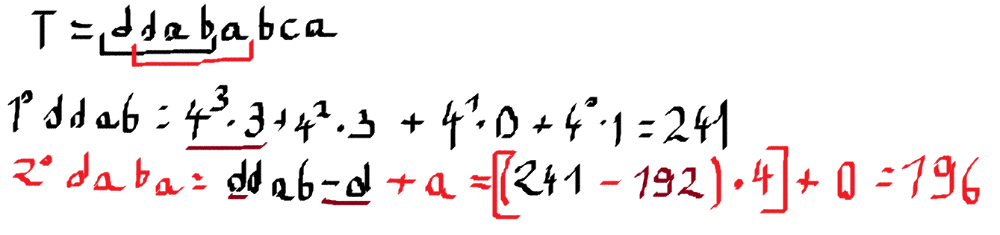

Przesuwamy się o pole w prawo, jako że hasz nie pasuje. Obecnie rozpatrywany ciąg przesuwamy o 1 w prawo - dlatego musimy odjąć !!4^3\*3!!, jako że wywalamy to pierwsze !!d!! z lewej, które w sumie !!1!! miała właśnie taką wartość. Po przesunięciu, żeby zgadzały się podstawy haszujące, musimy przemnożyć to co nam zostało z poprzedniego hasza razy 4 (w ten sposób wartości `aba` są przemnożone kolejno przez 3, 2 i 1 potęgę czwórki). No i dodajemy 0, jako że !!4^0\*0!! to 0.

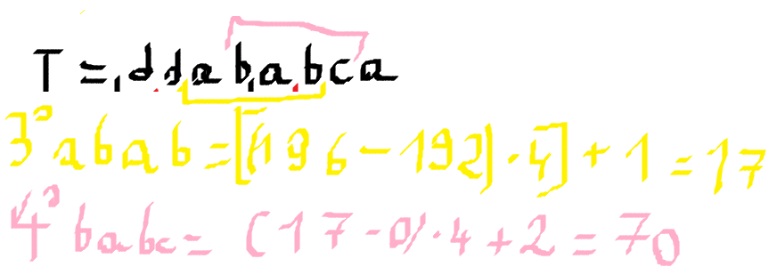
No i tak se lecimy dalej aż hasz będzie równy haszowi wzorca.

Algorytm z [programiz](https://www.programiz.com/dsa/rabin-karp-algorithm):

```python
def search(pattern, text, q):
    m = len(pattern)
    n = len(text)
    p = 0
    t = 0
    h = 1
    i = 0
    j = 0

    for i in range(m-1):
        h = (h*d) % q

    for i in range(m):
        p = (d*p + ord(pattern[i])) % q
        t = (d*t + ord(text[i])) % q

    for i in range(n-m+1):
        if p == t:
            for j in range(m):
                if text[i+j] != pattern[j]:
                    break
```

Złożoność to około !!O(n+m)!!

# Automaty skończone

To takie coś, co w notatkach KLo wygląda strasznie, ale na obrazku jest łatwe do zrozumienia.

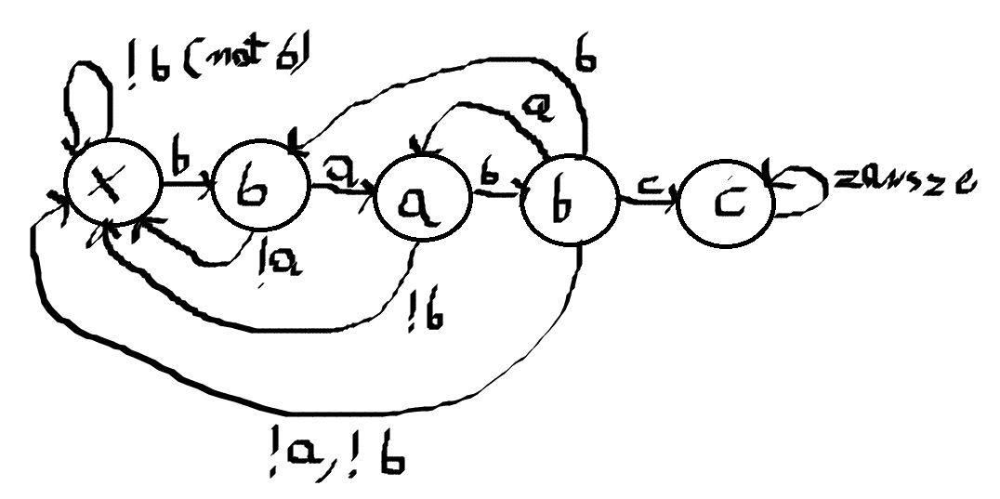
Szukamy wzorca `babc`. Przykład wyszukania go w tekście `ddabab _ _ _ _`

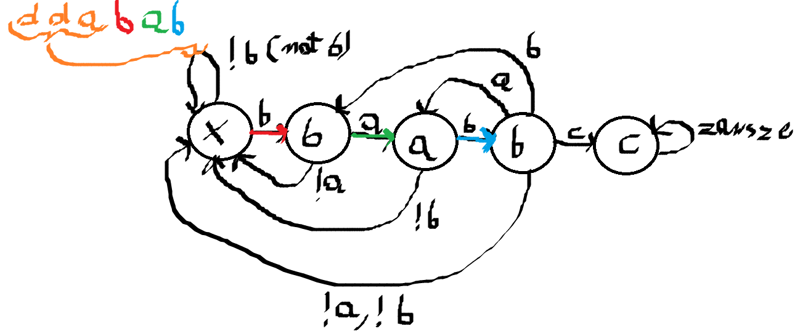
Rozważymy teraz przypadki różnych kontynuacji tego tekstu: `c`, `abcd`, `babc`, `dddd`.

Przypadek `c`:
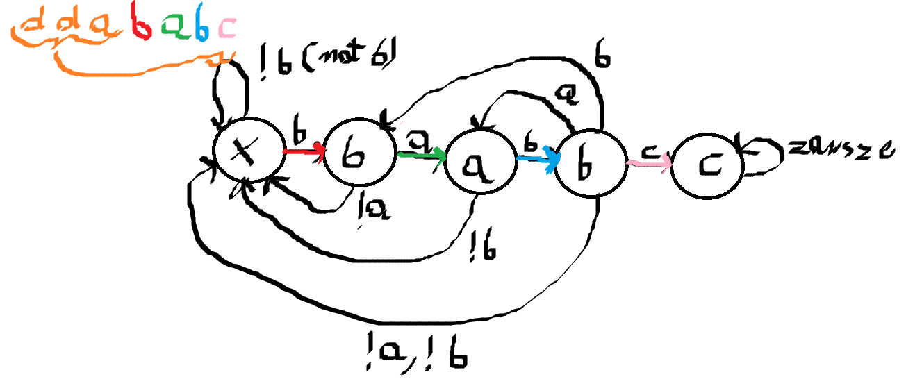

Przypadek `abcd`:
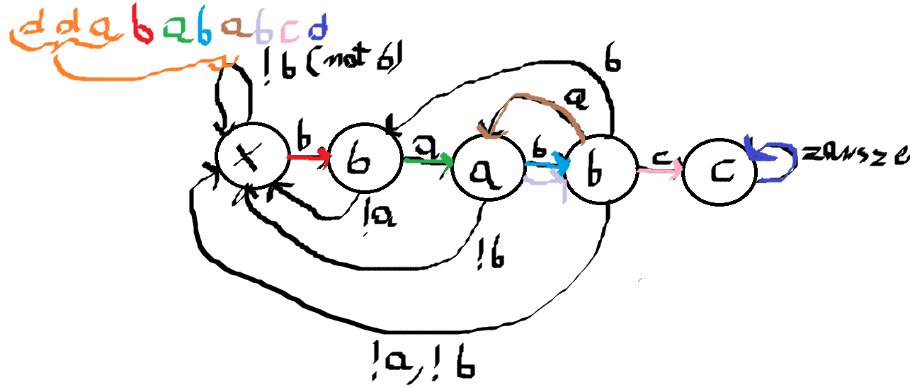  
Widzimy, że wzorzec został zaburzony przy `baba`, ale to drugie `ba` już jest początkiem naszego wzorca i automat poleciał dalej do b, c, i przy d nadal do c.

Przypadek `babc`:
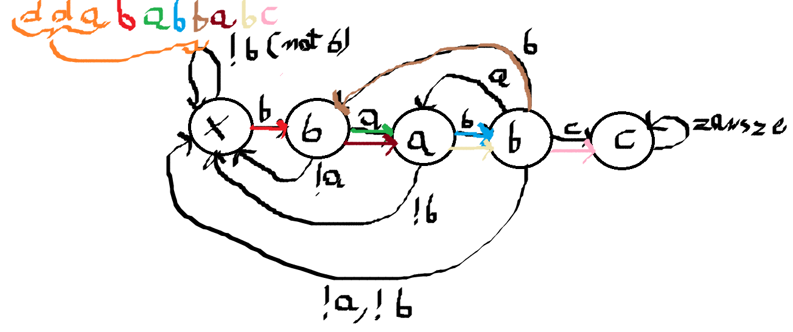  
Jak widzimy, nasz automat od razu przerzucił nas do b jak początkiem było b i od razu wykrył nasz wzorzec.

Przypadek `dddd`:
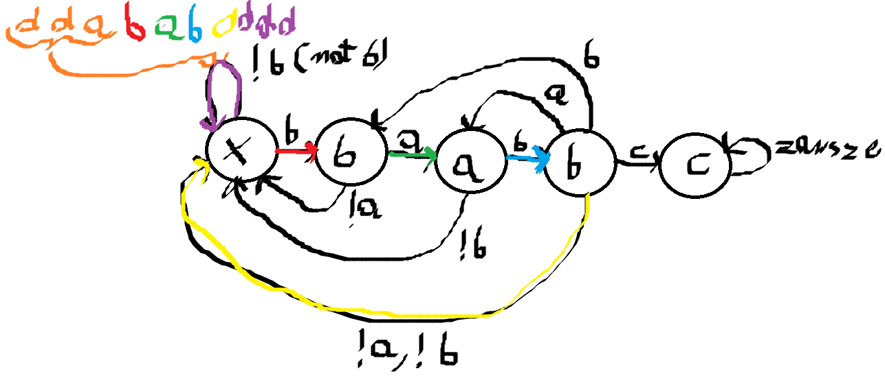
No i tutaj zostaliśmy przerzuceni na sam początek, jako że od d wzorzec się zacząc nie może i tam kręciliśmy się chwilę w kółko.

Oczywiście wzorzec został wykryty, jeśli na końcu działania automatu jesteśmy w `c`.
Jego czas to !!O(n)!! - dostajemy input i przechodzimy przez niego tylko raz.

# Algorytm KMP (Knutha-Morrisa-Pratta)

Warto obejrzeć na 2x [filmik Abdula Bari](https://www.youtube.com/watch?v=V5-7GzOfADQ), fajnie tłumaczy :)

To troche jak te automaty, ale bez pierniczenia się z automatami - ogarniamy to elegancko na tablicy. Na początku wyznaczamy sobie tablicę, która mówi nam na który indeks mamy wrócić przy missmatchu. Konstruujemy ją w sposób który można sobie samemu wygłówkować, ja podam algorytm:

```python
def get_where_to_go_back(P):
    m = len(P)
    t = 0
    i = 1
    out = [0]*m
    while i < m:
        # jeżeli mamy matcha, to out += 1 i sprawdzamy kolejną literkę ze wzorca
        if P[i] == P[t]:
            out[i] = out[i-1] + 1
            t += 1
        else:
            # jeżeli nie mamy matcha, to ustawiamy wzorzec na sam początek
            t = 0
            # ale jeszcze zanim przesuniemy i do przodu, sprawdzamy czy może ten moment
            # który przerwał nam nasz wzorzec nie zaczyna go już od nowa
            if P[i] == P[t]:
                t = 1
                out[i] = 1
        i += 1

    return out

def KMP(T, P):
    prefixy = get_where_to_go_back(P)
    i = 0 # text index
    j = 0 # pattern index

    while i < len(T):
        if P[j] == T[i]:
            i += 1
            j += 1

        if j == len(P):
            print(f"found pattern, {i-j}")
            j = prefixy[j-1]
        # mismatch
        elif i < len(T) and P[j] != T[i]:
            if j != 0:
                j = prefixy[j]
            else:
                i += 1
```

Działa w !!O(n+m)!! - !!m!! to wyznaczenie tej tablicy pomocniczej, a później !!n!! to znalezienie wzorca.

# Algorytm Boyera-Moore'a

Nie chce mi sie :( TODO jak znajdę jakieś zadanie w którym jest potrzebny  
[jakis artykul](http://www.algorytm.org/przetwarzanie-tekstu/algorytm-bm-boyer-moorea.html)

# Shift-AND

Bardzo fajny i prosty algorytm.
Algorytm:

```python
def shiftand(P, T):
    P_bit_tab = mock()
    state = "0"*len(P)
    for c in T:
        state <<= 1 #bitshift jeden w lewo
        state += 1 # dodajemy jedynkę
        state &= P_bit_tab[c]

```

Przykład:
Szukamy `babc` w `ddababbabc`.

Na początku przygotowujemy tablicę bitową wystąpień literek z naszego wzorca:  
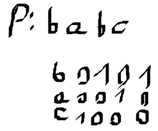

Później analizujemy nasz tekst, `-` to `0`, `+` to `1`. W każdym rzędzie robimy trzy rzeczy: na początku bitshift, później dodajemy jedynkę, później andujemy.  
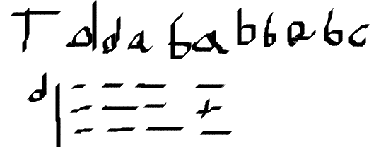

Przy czwartej literce, `b` (początek naszego wzorca) w końcu wypluwa coś co nie jest samymi zerami:  
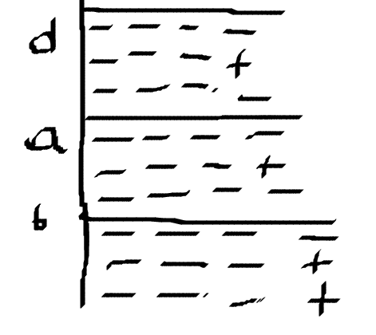

No i później idzie kolorowo, aż się pusje:  
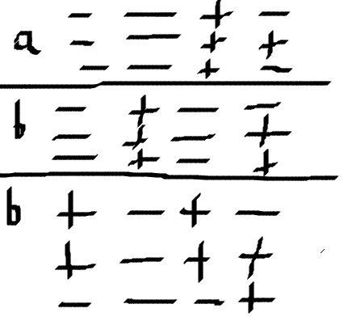

Za to później już znajdujemy wzorzec. Krok zakończył się i na początku jest `1`, co znaczy, że znaleźliśmy wzorzec.  
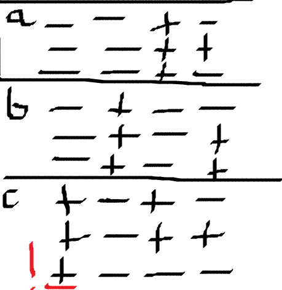

Koszt to O(n + koszt stworzenia tych tablic z 1 zdjęcia).

# Algorytm KMR (Karpa-Millera-Rosenberga)

Złożoność !!O(n \log n)!!. Szkoda czasu. A tak serio to TODO jak będzie zadanko z tym.
