# Opis

Jest to pierwsza struktura danych jaką poznamy, która jest drzewem zbalansowanym. Największą wadą BST jest to, że może się straaasznie rozrastać i nijak nie idzie tego fajnie kontrolować.

AVL nie ma fajnego rozwinięcia skrótu, bo pochodzi od nazwisk autorów. Żeby zapamiętać możemy to rozwijać np. jako Ain't Very Long (like BST in worst case scenarios). :) W sumie to jeszcze nie wiem czy to prawda, ale brzmi fajnie.

**Definicja**  
BST jest AVL, jeżeli dla każdego wierzcholka, wysokość jego lewego i prawego poddrzewa różni się o maksymalnie 1.

# Wysokość

$$ h < 1.4405 \cdot \log(n + 2) $$
!!n!! to oczywiście liczba wierzchołków naszego drzewa AVL

Dowodzik:
Skorzystamy z faktu [Fakt 1], że liczba wierzchołków w dowolnym drzewie binarnym jest o 1 mniejsza, niż liczba pustych wskaźników. Dowód chyba był na dyskretnej, ja natomiast narysowałem sobie drzewo binarne i okazało się, że faktycznie tak jest, więc to musi być prawda.

Zdefinujmy funkcję !!h_m(i)!! jako liczbę pustych wskaźników w minimalnym drzewie AVL o wysokości !!i!!.

!!h_m(1)!! oraz !!h_m(2)!!:
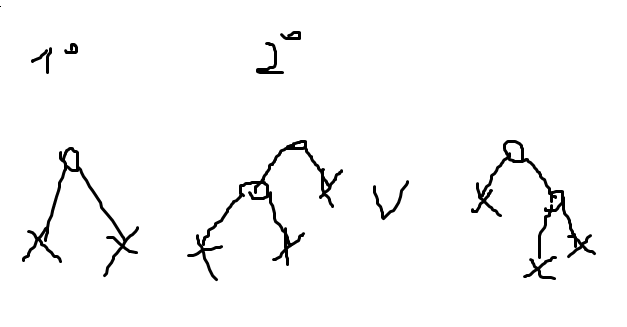

Dla !! h \leq 3!!:  
wiemy, z minimalności naszego drzewa, że jedno z poddrzew korzenia to minimalne drzewo AVL o wysokości !!h-1!!, a drugie to minimalne drzewo AVL o wysokości !!h-2!!. Każdy pusty wskaźnik należy do tych poddrzew. Zatem:  
!!h_m(i) = h_m(i-1) + h_m(i-2)!!  
Więc !!h_m(i) = Fib(i+2)!!, takie przesunięcie bo !!h_m(1) = Fib(3)!!, !!h_m(2) = Fib(4)!!, itd.
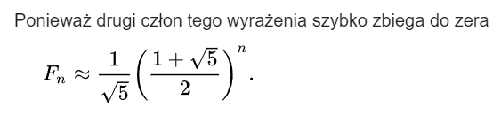

Korzystając z tego wzorku, wychodzi nam nierówność:
!! n + 1 > \frac{1}{\sqrt{5}}(\frac{1+\sqrt{5}}{2})^{h+2} - 1!!

To natomiast po kilku prostych przekształceniach i użyciu Wolframa przekształca się do tezy.

# Operacje na drzewie AVL

Omówimy sobie po pierwsze rotacje, które są potrzebne by drzewo AVL zachowywało swoją kluczową własność, a następnie wstawianie i usuwanie z drzewa.

### Rotacje

KLo:
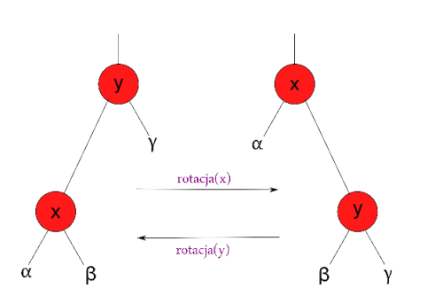

Zauważmy, że taka rotacja nie zmienia porządku elementów w drzewie - przy rotacji x, y wędruje na prawą stronę, bo jest większy. Gamma jest większa od y, więc nadal jest po prawej. Alfa jest mniejsza od x, więc nadal jest z lewej. Beta jest mniejsza od y, bo jest z lewej y w lewym drzewie, więc trafia do lewego poddrzewa y. Taką rotację wykonujemy w !!O(1)!!.

### Wstawianie elementu

Wstawiamy nowy element i nastąpiło zaburzenie własności AVL. Niech M będzie pierwszym węzłem na drodze od wstawioneg elementu, na którym nastąpiło naruszenie równowagi - bo to nie zawsze musi być jakaś trywialna sytuacja, że to zaburzenie wystąpiło u dziadka wstawianego elementu.
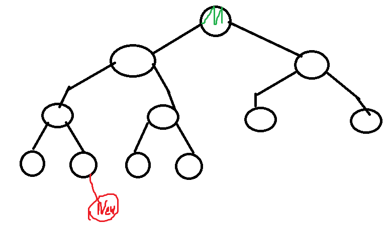

Na obrazku widzimy, że dodano ten czerwony element, co zaburzyło równowagę w drzewie zakorzenionym w M (zielony). Widzimy, że bez tego czerwonego drzewa już nie są równej długości - gdyby liście z prawego podrzewa M miały synów, to dodanie czerwonego nie zaburzyłoby równowagi. No i procedura balansująca musi rozpatrywać 4 przypadki, a tak właściwie to 2 i dwa do nich symetryczne. Rozważamy sobie tylko przypadek, że zaburzenie wystąpiło tak jak na obrazku w lewym poddrzewie M. Mamy tutaj dwa podprzypadki:

1. Zwiększyła się wysokość lewego poddrzewa. Oznaczmy jego korzeń jako L.  
   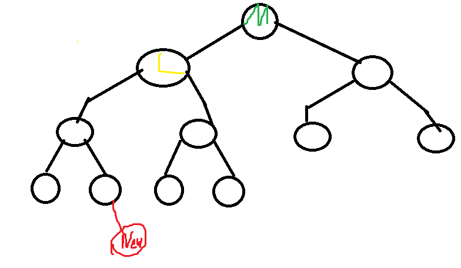

    W takim wypadku potrzebujemy wykonać jedną rotację - M z L.  
     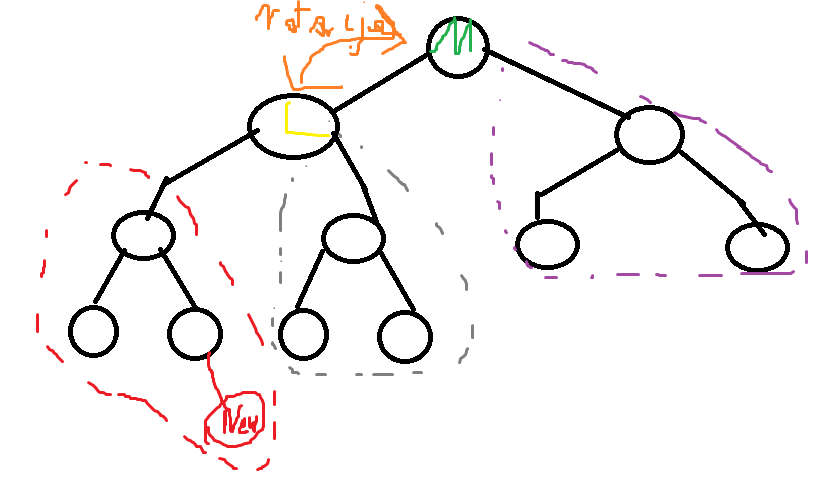

    Po rotacji:
    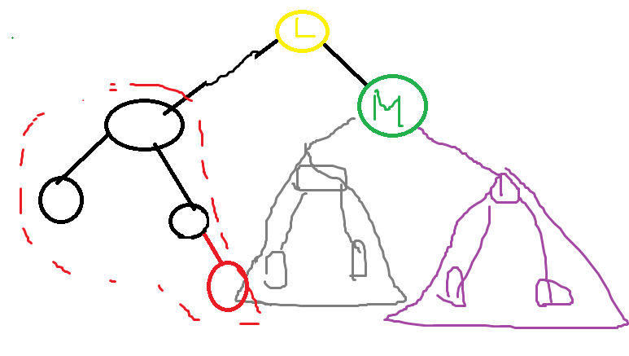
    Jupi, drzewo AVL!

2. Zwiększyła się wysokość prawego poddrzewa - potrzeba dwóch rotacji.
   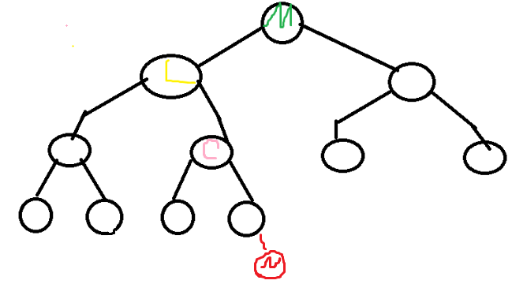
   Najpierw musimy zrotować C i L, a następnie C i M.  
   **Przed pierwszą rotacją**:  
   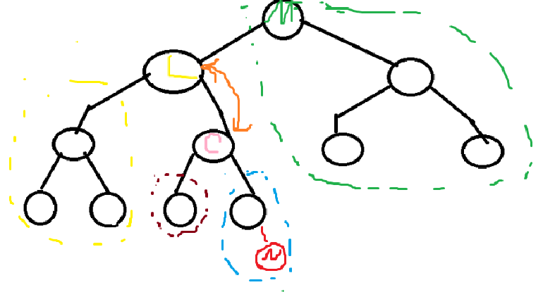  
   **Po pierwszej rotacji (C/L)**:  
   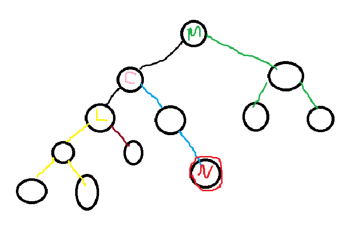  
   **Po drugiej rotacji (C/M)**:
   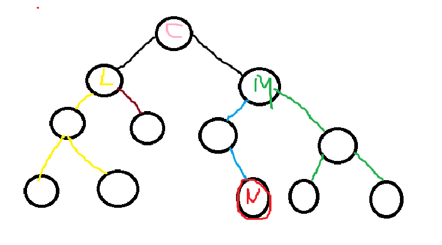
   i równowaga przywrócona :) Możemy zauważyć, że po 1 rotacji mamy sytuację, gdzie to lewe poddrzewo powoduje nierównowagę, tak jak w poprzednim rozważanym przez nas przypadku i robimy dokładnie to samo co wtedy. Nie wiem czy do czegoś się ta obserwacja kiedyś przyda.

### Usuwanie elementu

Usuwanie nie jest zbyt skomplikowane, ale może być kosztowne i trzeba trochę pogłówkować jakie przypadki/ewentualne edge case'y mogą wystąpić, raczej przy implementowaniu, na wykładzie zostało omówione raczej pobieżnie, ja też rozrysuję z 2/3 przypadki.
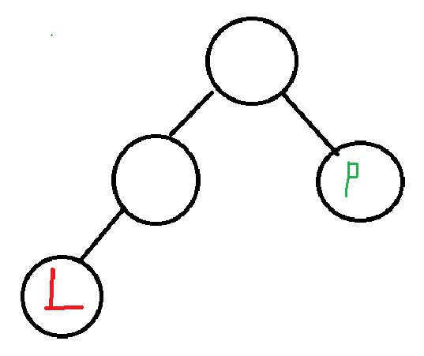

Pierwszy przypadek to usuwanie liścia. Jak widać, usunięcie L jest spoko, zakładając że to całe poddrzewo. Jeżeli jest to jakieś poddrzewo, no to wysokość spadnie o 1 i to już może zaburzyć równowagę AVL, zatem zawsze po usunięciu musimy zadbać o przywrócenie poprawnej struktury. Usunięcie P na pewno zaburzy strukturę i będziemy musieli ją przywrócić.

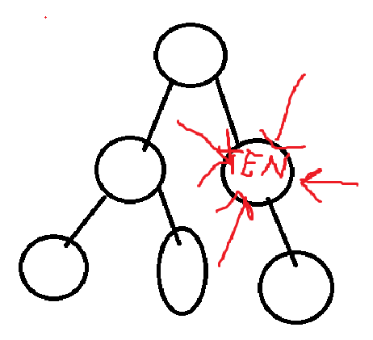

Drugi przypadek to usuwanie wierzchołka wewnętrznego, ale takiego se przy końcu. Na obrazku został ten wierzchołek który chcemy usuwać został intuicyjnie oznaczony czerwonym słowem "TEN", a także wskazują na niego strzałki. Oczywiście usunięcie go to po prostu nadpisanie go prawym synem. Gdyby miał lewego syna, to moglibyśmy nadpisać go lewym synem i nadal wszystkie własności BST zostałyby zachowane.

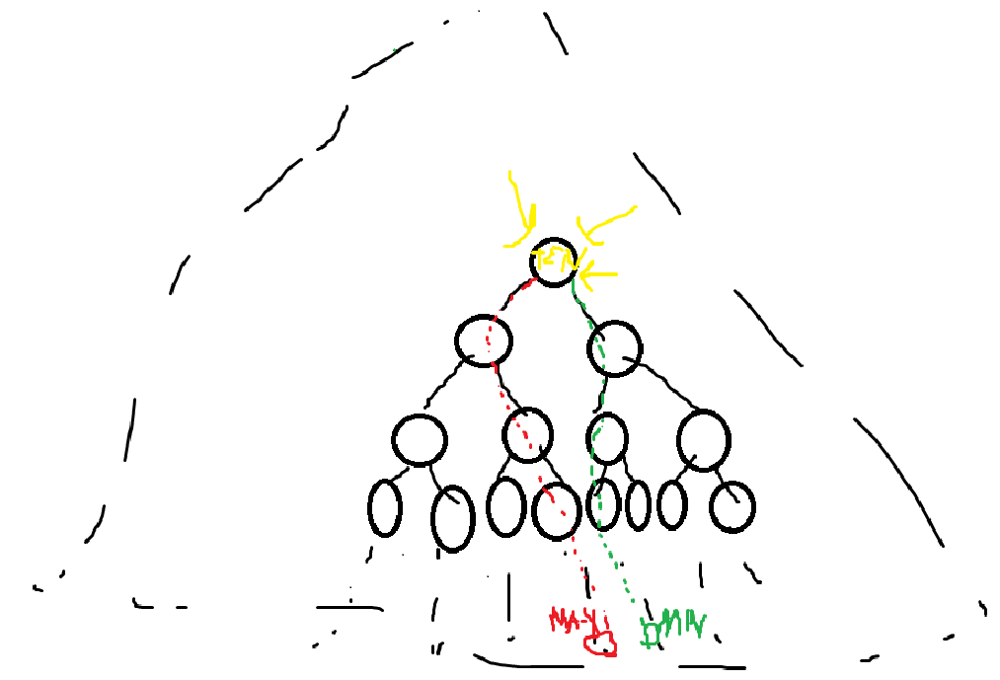

Trzeci przypadek to wierzchołek superwewnętrzny, w samym środku drzewa, gałęzie, trawa, liście, las do okoła. Zauważmy, że żeby usunąć taki wierzchołek, możemy go nadpisać albo **maksymalnym elementem lewego poddrzewa** (na czerwono), albo **minimalnym elementem prawego podrzewa** (na zielono). Nie zaburzy nam to własności BST, bo nadpisując maksymalnym, wszystkie elementy tego lewego poddrzewa będą od niego mniejsze, a że był w lewym poddrzewie, to wszystkie elementy prawego poddrzewa będą od niego większe. Takie samo rozumowanie dla minimalnego.

No i generalnie usuwanie może być bardzo kosztowną operacją, bo być może będziemy musieli przywracać równowagę w bardzo wielu węzłach, maksymalnie nawet w logarytmie n. Może wystąpić taka heca, że mamy drzewo minimalne i usuwamy coś z krótszego poddrzewa, i to na pewno zaburza własność AVL, później przywrócenie tej własności w jednym miejscu psuje ją w innym i musimy dużo razy przywracać tą równowagę. Prawdopodobnie dlatego, nikt nigdy z sukcesem nie zaimplementował drzewa AVL i jest tylko ideą. (to oczywiście żart)

**Wszystkie operacje na drzewie AVL możemy wykonać w czasie !!O(\log n)!!**
