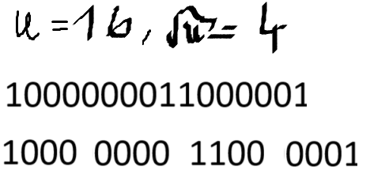
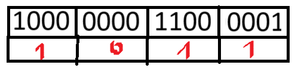

# Opis

Jest to drzewo wspaniałe, ale nieco skomplikowane. Operacje na nim są wykonywane w czasie !!O(\log \log n)!!. Zdefiniujemy operacje słownikowe, a także operacje poprzednik i następnik, mówiące jaki jest następny/poprzedni klucz po/przed podanym. Może przechowywać wartości do jakiegoś U (rozmiar uniwersu).

Polecam do zrozumienia [slajdy ze Stanfordu](https://web.stanford.edu/class/archive/cs/cs166/cs166.1166/lectures/14/Slides14.pdf). Ja tutaj przejdę mniej więcej tymi samymi krokami co tam.  
Warto też spojrzeć na notatkę [AiSD dla Opornych](https://github.com/Ph0enixKM/AiSD-Dla-Opornych/blob/master/18%20van%20Emde%20Boas.pdf), ale może po przeczytaniu kawałka o wektorach bitowych i grupowanych wektorach, żeby załapać intuicję i wiedzieć jak dojść do stworzenia rozwiązania jakim jest drzewo van Emde Boasa.

# Wektory bitowe

Krok pierwszy do zrozumienia idei van Emde Boasa. Jest to zwyczajnie "słownik bitowy". Np. mamy 16 bitów, find(5) -> sprawdzamy czy 5 bit jest zapalony, insert(8) -> zapalamy 8 bit, delete(10) -> gasimy 10 bit. Operacje są wykonywane w czasie stałym, użyta pamięć to O(U) = O(16), w naszym przypadku. A co w przypadku operacji np. is_empty? No cóż, musimy przejść cały wektor, czas O(n). Co w przypadku następnika i poprzednika? Kurde, pesymistycznie też O(n).

# Grupowany wektor bitowy

Disclaimer: po angielsku to tiered bitvector, nie wiem jak po polsku, a że będziemy dzielić na grupy to tak go nazwałem

Chcemy, żeby operacje, które wykluczają wektor bitowy ze zbioru fajnych struktur działały szybciej. Idea jest taka: dzielimy wektor bitowy na !!\sqrt{U}!! grup !!\sqrt{U}!!-elementowych, mamy zatem U elementów. To nie muszą koniecznie być pierwiastki, jednak wykazano że dla podziału na pierwiastki struktura jest najszybsza.

Tworzymy sobie dodatkową tablicę pomocniczą o wielkości !!\sqrt{U}!!, która będzie nam mówić, która z grup coś w sobie zawiera.

W jaki sposób dzielimy liczbę, żeby np. dodać ją do takiej struktury? Numer grupy to !!grp(x) = \lfloor \frac{x}{\sqrt{U}} \rfloor!!. Miejsce w grupie to !!grp-index(x) = x \mod \sqrt{U}!!. Przykładowo, dla 15, numer grupy to 3, miejsce w grupie to również 3.

W jaki sposób wykonywać na tym operacje słownikowe?

insert(x) - structure[grp(x)][grp-index(x)] = 1, structure.summary[grp(x)] = 1, tj. zapalamy bit w odopowiedniej grupie na odpowiednim miejscu, a w tablicy z podsumowaniem zaznaczamy, że w danej grupie coś jest.

delete(x) - structure[grp(x)][grp-index(x)] = 0, sprwadzamy czy w structure[grp(x)] jakiś bit jest zapalony, jeśli nie to structure.summary[grp(x)] = 0.

find(x) - structure[grp(x)][grp-index(x)] == 1 - sprawdzamy czy bit jest zapalony.

max(structure) - v = max(structure.summary), max(structure[v])

min(structure) - analogicznie

succesor(x) - znajdujemy maksa w structure[grp(x)], jeżeli jest większy od x to szukamy succesora na przedziale structure[grp(x)][grp-index(x) + 1] do structure[grp(x)][max-index]. Jeżeli nie jest większy, to szukamy succesora tej grupy w tablicy podsumowującej i bierzemy jej minimum.

predecessor(x) - analogicznie

is-empty - sprawdzamy, czy tablica summary jest samymi zerami

Jak szybkie to jest?
Mniej więcej !!O(\log n)!!, przede wszystkim dlatego, że jakieś dwie operacje są w tym czasie. Musimy je zoptymalizować. Min/max zajmuje !!\log n!!, is-empty zajmuje !!\log \log n!!. Te operacje niszczą nam czas wykonania pozostałych. Niedźwiedź ze mną (bear with me), ogarnięcie tych grupowych wektorów oznacza praktycznie ogarnięcie drzew van Emde Boasa.

Jak możemy przyspieszyć min/max? Ano, poprzez przechowywanie ich poza naszą strukturą xD Teraz wstawienie elementu będzie się wiązało z sprawdzeniem czy nie jest większy/mniejszy od min/maxa i jak tak to ich zamiana, a min/maxa wstawiamy zamiast tej wartości do naszej struktury. Wstawienie do pustej struktury będzie w O(1) - wystarczy wstawić to jako min/maxa. Sprawdzenie czy jest puste to sprawdzenie czy istnieje min/max. Min/max oczywiście O(1), bo mamy je podane na tacy. Usuwanie jest mniej oczywiste, jeżeli usuniemy min/maxa, to musimy znaleźć nowego - będzie to poprzednik/następnik tych wartości.

# At last, drzewa van Emde Boasa

Jest to stuktura będąca rekurencyjną wersją grupowanych wektorów bitowych. To znaczy, że dla uniwersu o rozmiarze U, będziemy mieć !!\sqrt{U}!! grup, każda z nich będzie drzewem van Emde Boasa, gdzie rozmiar uniwersu to !!\sqrt{U}!!.

Jak będą wyglądać operacje?

find(x) - proste, sprawdzamy min/maxa i idziemy niżej do drzewa które może zawierać x, aż go znajdziemy lub nie znajdziemy. **Działa w !!O(\log \log n)!!.**

insert(x) - rozważamy edge case'y, tj. 0 elementów, 1 element - dla 0 wstawiamy wartość do min i max, dla 1 elementu wstawiamy odpowiednio jako minimum lub maksimum. Dla dowolnego x, jeżeli jest mniejszy od min lub większy od max, to podmieniamy je i robimy insert(min) lub insert(max). Jak już wstawiamy do drzewa, to znajdujemy jego miejsce korzystając z funkcji !!grp!! oraz !!grp-index!! i w tablicy podsumowującej zapalamy, że w danej grupie coś jest. **Działa w !!O(\log \log n)!!.**

delete(x) - rozważamy edge case'y, 0 elementów - nie da się usunąć, 1/2 elementy - usuwamy z min/maxa, więcej elementów a usuwamy min/maxa - musimy znaleźć kolejnego min/maxa z drzewa i go wyciągnąć (prosimy tablicę podsumowującą o minimum, usuwamy jej minimum i wstawiamy jako min). Jeżeli po prostu usuwamy element, który nie jest przypadkiem szczególnym, no to w odpowiednim miejscu gasimy bit i jeżeli trzeba to updatujemy tablicę podsumowującą. **Działa w !!O(\log \log n)!!.**

min/max/is-empty - **O(1)**

successor(x) - dość intuicyjny, jeżeli drzewo puste lub x = max, no to następnika nie będzie. inaczej szukamy sobie drzewka, w którym jest x, jeżeli x jest mniejszy od maksa w tym drzewku to szukamy tam następnika, jak nie jest to szukamy w następniku tego drzewa, wybranego z tablicy summary, gdzie bierzemy minimum. **Działa w !!O(\log \log n)!!.** Poprzednik działa analogicznie.

Złożoność wyraża się wzorem !!T(U) = O(\sqrt{U}) + O(1) = O(\log \log n)!!, co może się przydać na 1 części egzaminu.
