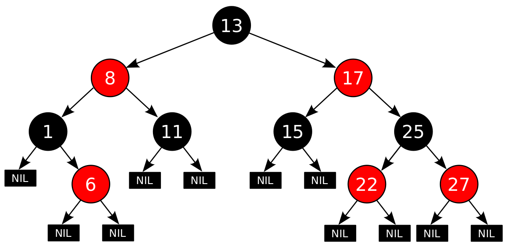
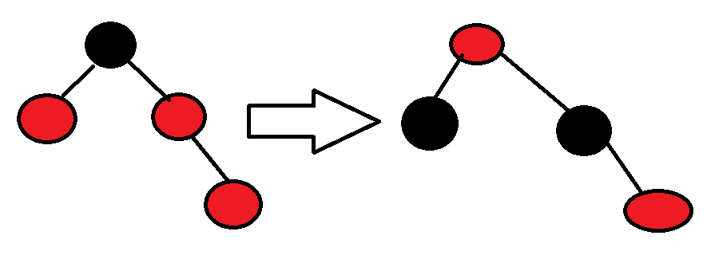
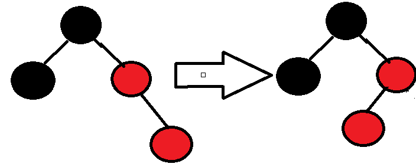
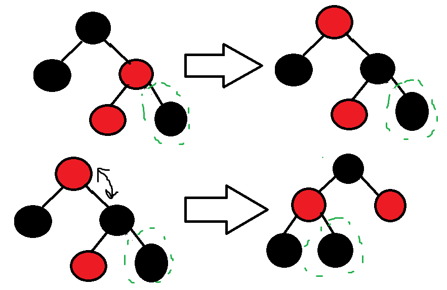

# Opis

Drzewo czerwono-czarne to takie BST spełniające dodatkowe warunki:

1. każdy wierzchołek jest czerwony lub czarny (stąd wzięła się nazwa)
2. każdy liść jest czarny
3. jeśli wierzchołek jest czerwony, to jego obaj synowie są czarni
4. na każdej ścieżce prowadzącej z danego wierzchołka do liścia jest jednakowa liczba czarnych wierzchołków

Liczbę czarnych wierzchołków na ścieżce z wierzchołka !!x!! (nie włącznie) do liścia nazywamy _czarną wysokością_ wierzchołka !!x!! i oznaczamy !!bh(x)!!.

Czerwono-czarne drzewo o n wierzchołkach wewnętrznych ma wysokość nie większą niż !!2\log(n+1)!!.

Fotka poglądowa żeby wiedzieć jaki odcień czerwieni i czerni stosować w swoich implementacjach:
  
Są to kolejno rgb(255, 0, 0) dla czerwonego oraz rgb(0, 0, 0) dla czarnego.

# Operacje

### Wstawianie

Jak w normalnym BST. Nowy wierzchołek jest zawsze czerwony. Jedyna własność drzewa czerwono-czarnego jaka może zostać zaburzona przy wstawianiu, to własność 3 - 1 oczywiste, 2 - nowy wierzchołek ma 2 czarne liście (nulle), 3 - może zostać zaburzony, 4 - liczba czarnych wierzchołków na ścieżce pozostaje taka sama.

Musimy zatem przywrócić drzewu własność 3. Jeżeli została ona zaburzona, to znaczy, że ojciec nowego wierzchołka (**!!x!!**) jest czerwony.
Idea jest taka, że będziemy zmieniać kolory wierzchołków, żeby przenieść zaburzenie na przodków wstawianego wierzchołka oraz rotacje (poznane w drzewach AVL) do likwidacji tego zaburzenia (maks 2 rotacje). Przy tym, musimy zadbać by nie zaburzyć pozostałych własności drzewa czerwono-czarnego.

Musimy rozważyć następujące przypadki:

1. wujek !!x-a!! jest czerwony.
   
   dziadka !!x-a!! malujemy na czerwono, ojca i wujka na czarno
   oczywiście to jest jakieś poddrzewo, ojciec dziadka !!x-a!! mógł być czerwony, więc musimy wywołać procedurę rekurencyjnie na ojcu dziadka
2. wujek !!x-a!! jest czarny i !!x!! jest prawym synem.
   
   rotujemy
   i teraz to nadal nie jest czerwono-czarne drzewo (znaczy jest, dosłownie, ale nie spełnia własności) - otrzymujemy w ten sposób przypadek 3
3. wujek !!x-a!! jest czarny i !!x!! jest lewym synem.
   
   zamieniamy kolorkami dziadka i ojca po czym walimy rotacje, na zielono dodałem jednego gnoja względem przypadku 2, żeby było widać dlaczego potrzebna jest ta rotacja - bez niego mogłoby się wydawać że wystarczy krok 1

### Usuwanie

Jak w BST. Trzeba rozważyć przypadki i przywrócić własności drzewa. TODO
