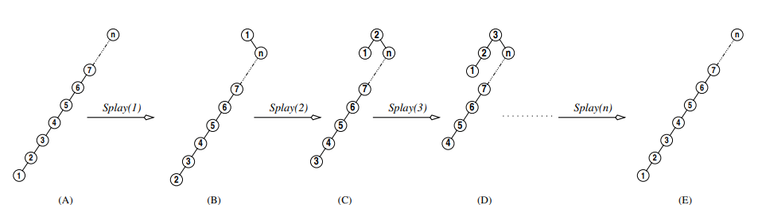
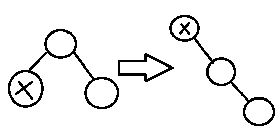
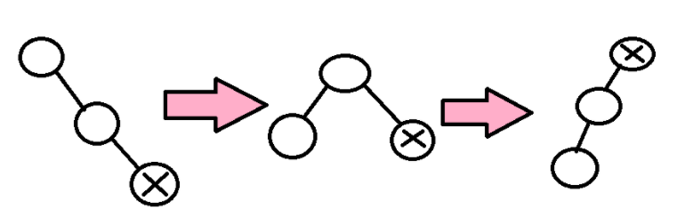
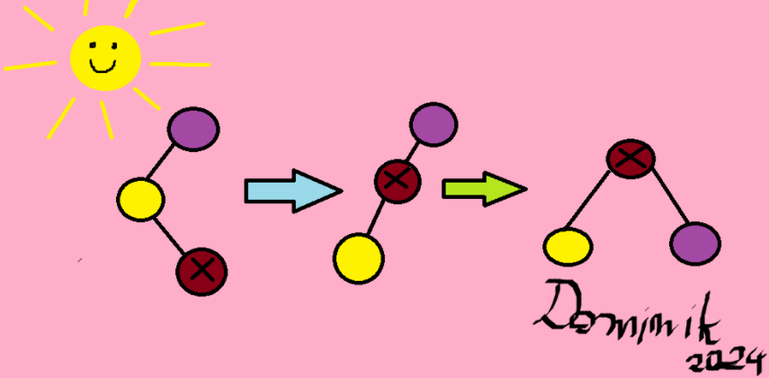

# Opis

Drzewa splay to tak zwane drzewa samoorganizujące się. Oparte są na BST. Drzewa te podczas wykonywania operacji automatycznie zmieniają swoją strukturę, stosując pewną heurystykę. Nie wymaga dodatkowych informacji we wierzchołkach, jak drzewa zbalansowane. Istotną różnicą jest to, że pojedyncze operacje słownikowe mogą być kosztowne, jednak zamortyzowany koszt ciągu operacji jest niski.

Idea tych drzew jest cache'owata. Nie mamy drzewa zbalansowanego. To co chcemy osiągnąć, to bardzo szybki dostęp do wierzchołków, o które ostatnio pytano.

# Operacje

Rozważymy typowe operacje słownikowe, tj. find, insert, delete, a także operację !!join(S_1, S_2)!!, która łączy !!S_1!! z !!S_2!!, zakładając, że każdy klucz w !!S_1!! jest nie większy od każdego klucza w !!S_2!!. Dodatkowo, rozważymy operację !!split(i, S)!!, która dzieli drzewo S na dwa takie, że każdy klucz w pierwszym jest nie większy od !!i!!, a w drugim nie mniejszy od !!i!!.

Bazą tych wszystkich operacji jest operacja splay (💅), która jest główną ideą naszego drzewa, prawdopodobnie też od tego wzięła się jego nazwa. Idea jest taka, że chcemy móc przesunąć klucz !!i!!, który jest parametrem operacji które będziemy rozważać do korzenia. Wykonujemy to oczywiście przy pomocy rotacji.

!!Splay(j, S)!! - przeorganizuj !!S!! tak, żeby jego korzeniem stał się wierzchołek zawierający klucz !!k!! taki, że w !!S!! nie ma elementu leżącego między !!k!! i !!j!!. Zatem jeżeli w !!S!! jest !!j!!, to operacja 💅 przesunie !!j!! do korzenia. Jeśli nie ma, to do korzenia trafi minimalny element większy od !!j!!, lub maksymalny mniejszy od !!j!!.

# Implementacja !!splay(S, x)!!

Możemy to zaimplementować przy użyciu rotacji. Stosujemy na !!x!! rotacje tak długo, aż znajdzie się w korzeniu. Jednak taka implementacja powoduje, że niektóre ciągi operacji słownikowych byłyby wykonywane w czasie **KWADRATOWYM** od długości ciągu:
przykład 1 z KLo  


Tutaj splay(1) wykonuje n-1 operacji, splay(2) też, splay(3) n-2 i tak dalej, mamy więc !!n-1 + n-1 + n-2 + n-3 + ... + 1!!. Wygląda to jak liczba porównań wykonywanych przez bubble sort, czyli faktycznie musi być kwadratowe.

Rozważamy inny sposób implementacji, 3 przypadki:

1. !!x!! ma ojca, ale nie ma dziadka -> !!rotate(x)!!
   
2. !!x!! ma ojca !!p(x)!! oraz dziadka, !!x!! i ojciec są lewymi bądź prawymi synami swoich ojców (obydwaj) -> !!rotate(p(x)); rotate(x)!!
   
3. !!x!! ma ojca i dziadka, !!x!! jest lewym synem a ojciec prawym, albo na odwrót -> !!rotate(x); rotate(x)!!.
   

# Operacje

#### join

```python
def join(S1, S2):
    # S1 - drzewo, wszystkie elementy mniejsze od S2

    # max będzie w root, a że to BST, to prawe poddrzewo roota będzie puste
    splay(S1, math.infinity)
    S1.right = S2
```

#### split

```python
def split(i, S):
    splay(S, i)
    # i jest w root, elementy mniejsze od i w lewym poddrzewie, większe w prawym
    return (S.left, S.right)
```

#### insert

```python
def insert(i, S):
    splay(S, i)
    # w root jest wartość najbliższa i
    if i <= S:
        # dodaj i jako root lewego poddrzewa
    if i > S:
        # dodaj i jako root prawego poddrzewa
```

#### delete

```python
def delete(i, S):
    # i trafi do roota, zwracamy polaczone lewe i prawe poddrzewo, bez i
    t1, t2 = split(S, i)
    join(t1, t2)
```

#### find

```python
def find(i, S):
    splay(S, i)
    # zwracamy, czy i znajduje się teraz w root - jeśli tak,
    #  to znaleźliśmy i wartość jest w root, jak nie jest to znaczy że nie ma
    return S.root == i
```
