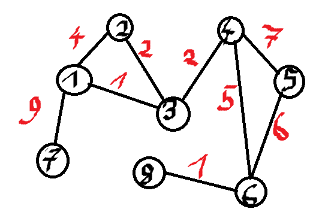
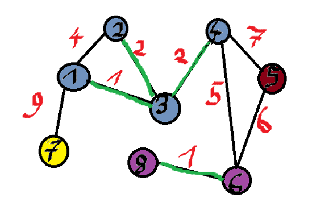
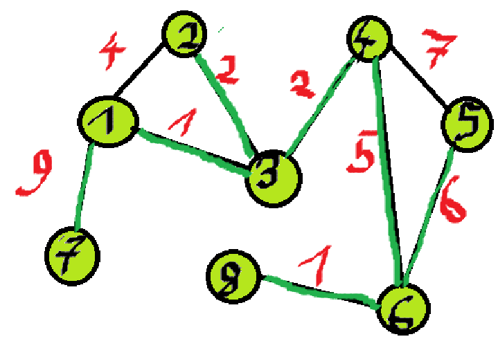

# Opis

Union-find / disjoint-set, po polsku struktura zbiorów rozłącznych. Wrzucam do drzew, bo będziemy implementować tę strukturę drzewiaście.

Mamy zbiór skończony !!U!! oraz ciąg !!\sigma!! instrukcji union oraz find.

!!Union(A, B, C)!! - !!A, B!! - rozłączone podzbiory !!U!!; wynikiem operacji jest utworzenie zbioru !!C!! takiego, że !!C!! to suma zbiorów !!A!! i !!B!!, oraz usunięcie zbiorów !!A!! i !!B!!

!!Find(i), i \in U!! - znajdź podzbiór, do którego należy !!i!!.

Chcemy stworzyć strukturę, która umożliwia szybkie wykonanie ciągu !!\sigma!!.

# Przykład - znajdowanie MST - Kruskal

Znajdźmy MST takiego grafu:


Początkowo każdy wierzchołek jest oddzielnym zbiorem, !!S_i!! dla !!i!!-tego wierzchołka. Sortujemy krawędzie i rozważamy krawędzie od najmniejszej.

!!MST = \\{\\}!! - zbiór krawędzi, które bierzemy do MST.

Mamy krawędzie (1, 3) oraz (8, 6) z wagą 1.  
Robimy !!Find(1)!! oraz !!Find(3)!!. Nie są w jednym zbiorze, zatem robimy !!Union(1, 3)!!. Znika zbiór !!S_1!! oraz !!S_3!!, pojawia się, dajmy na to zbiór !!S_9 = \\{1, 3\\}!! - implementując nie bedziemy tworzyć nowych zbiorów, ogarniemy to jakoś sprytniej, ale tak lepiej widać co się dzieje. Dodajemy (1, 3) do MST.  
Druga krawędź z wagą 1 - (8, 6). !!Find(8) \neq Find(6)!!, zatem !!Union(6, 8)!!. Znika !!S_6!! oraz !!S_8!!, pojawia się !!S\_{{10}} = \\{6, 8\\}!!. Dodajemy (8, 6) do MST.

Następnie mamy krawędzie o wadze 2 - (2, 3) oraz (3, 4).  
!!Find(2) \neq Find(3)!!, znika !!S_2!! i !!S_9!!, pojawia się !!S\_{{11}} = Union(2, 9) = \\{1, 2, 3\\}!!. Dodajemy (2, 3) do MST.  
!!Find(3) \neq Find(4)!!, znika !!S\_{11}!! oraz !!S\_{4}!!, pojawia się !!S\_{12} = Union(11, 4) = \\{1, 2, 3, 4\\}!!. Dodajemy (3, 4) do MST.

W tym momencie nasze zbiory to:  
!!S_5 = \\{5\\}!!  
!!S_7 = \\{7\\}!!  
!!S\_{10} = \\{6, 8\\}!!  
!!S\_{12} = \\{1, 2, 3, 4\\}!!  
!!MST = \\{ (1, 3), (8, 6), (2, 3), (3, 4)\\}!!


Lecim dalej. Mamy krawędź o wadze 4 - (1, 2).  
!!Find(1) = Find(2)!! - nie robimy nic, 1 i 2 są w tym samym zbiorze.

Waga 5 - (4, 6).  
!!Find(4) \neq Find(6)!! - znika !!S\_{12}!! oraz !!S\_{10}!!. Pojawia się !!S\_{13} = Union(12, 10) = \\{1, 2, 3, 4, 6, 8\\}!!. Dodajemy (4, 6) do MST.

Waga 6 - (5, 6).  
!!Find(5) \neq Find(6)!! - !!S\_{14} = Union(5, 13) = \\{1, 2, 3, 4, 5, 6, 8\\}!!.  
Dodajemy do MST (5, 6).

Waga 7 - (4, 5).  
!!Find(4) = Find(5)!! - nie robimy nic.

Waga 9 - (1, 7).  
!!Find(1) \neq Find(7)!! - !!S\_{15} = Union(7, 14) = \\{1, 2, 3, 4, 5, 6, 7, 8\\}!!.  
Dodajemy do MST (1, 7).

!!|U| = |S\_{15}|!! - zatem możemy przerwać nasz algorytm. Tak czy siak byśmy go przerwali, bo skończyły nam się krawędzie, ale jakby była np. jeszcze krawędź o wadze 10 (3, 7), moglibyśmy to skipnąć.


# Implementacja

Prostym rozwiązaniem do reprezentacji rodziny zbiorów używamy sobie tablicy !!n!!-elementowej, takiej że !!i!!-ty element zawiera nazwę !!i!!-tego zbioru. Wtedy Find jest w czasie stałym, a Union w kwadratowym. Modyfikujemy to rozwiązanie.

1. wprowadzamy nazwy wewnętrzne zbiorów, użytkownik nie musi ich znać, bo ważne jest tylko sprawdzenie czy elementy należą do tego samego zbioru, może to być zbiór `alkjsalkgsjlkgalskf` (ale nie musi, mogą też być inne nazwy).
2. wykonując union, podłączamy mniejszy zbiór do większego.

Realizacja:

```python
def Find(i):
    return ExtName[R[i]]

def UNION(I, J, K):
    # przypisujemy nazwy wewnętrzne zbiorów
    A = IntName[I]
    B = IntName[J]

    # upewniamy się że a jest mniejszym ze zbiorów
    if Size[A] > Size[B]:
        A, B = B, A

    # mergowanie:
    el = List[A]  # zaczynamy od 1 elementu w A
    while el != 0:
        R[el] = B  # updatujemy, że jest on teraz w B
        last = el
        el = Next[el]  # przechodzimy do kolejnego elementu w A

    Next[last] = List[B]  # podpinamy ostatni element A do B
    List[B] = List[A]  # update głowy listy
    Size[B] = Size[A] + Size[B]  # i zwiększamy rozmiar

    IntName[K] = B  # K dostaje wewnętrzną nazwę B
    ExtName[B] = K  # B dostaje nazwę zewnętrzną K
```

W ten sposób ciąg !!\sigma!! o długości liniowej wykonujemy w !!n \log n!!.

# No i teraz - dlaczego union-find wsadziłem do drzew?

Bo kurde robimy drzewami to. Elementy składowe to:  
las drzew (każdy podzbiór to drzewo), wierzchołki wewnętrzne mają wskaźnik na ojca, nie mają na dzieci.  
Drugi element składowy to tablica !!Element[1..n]!!, gdzie !!i!!-ty element to wskaźnik na wierzchołek zawierający !!i!!.  
Ostatni element to tablica !!Root!! - tablica zawierająca wskaźniki na korzenie drzew odpowiadających zbiorowi !!I!!.

Teraz zajmiemy się realizacją Uniona i Finda. Union(A,B,C) - będziemy łączyć drzewa odpowiadające A i B w jedno i nadawać mu nazwę C w korzeniu. Natomiast Find polega na przejściu od wierzchołka wskazywanego przez !!Element[i]!! do korzenia i odczytaniu nazwy drzewa z tego korzenia. Oczywiście przy Union podwieszamy mniejsze drzewo do większego. Find będzie sprytne i proste - po drodze do !!i!! do korzenia będziemy sobie zbierać wierzchołki i wszystkie podwieszamy bezpośrednio do korzenia, kiedy do niego dotrzemy.

Wierzchołek !!v!! będzie zawierał następujące informacje:  
!!v.father!! - wskaźnik na ojca  
!!v.size!! - ile wierzchołków jest w drzewie którego korzeniem jest !!v!!  
!!v.name!! - jaka jest nazwa zbioru do którego należy

```python
def InitForest(n):
    for i in range(n):
        v = ALLOCATE_NODE()
        v.size = 1
        v.name = i
        v.father = None
        Element[i] = v
        Root[i] = v

def Union(i, j, k):
    if Root[i].size <= Root[j].size:
        i, j = j, i
    large = Root[j]
    small = Root[i]
    small.faather = large
    large.size += small.size
    large.name = k
    Root[k] = large

def Find(i):
    vs = []
    v = Element[i]
    while v.father != None:
        vs.append(v)
        v = v.father
    for w in vs:
        w.father = v
    return v.name
```

Łączny czas !!m!! operacji to !!O(m \alpha(m, n))!!, gdzie !!n!! to !!|U|!!, a !!\alpha!! to bardzo wolno rosnąca odwrotność funkcji Ackermanna (zazwyczaj !!\alpha(m, n) < 6!!). Jest to złożoność którą oceniam jako fajna.
